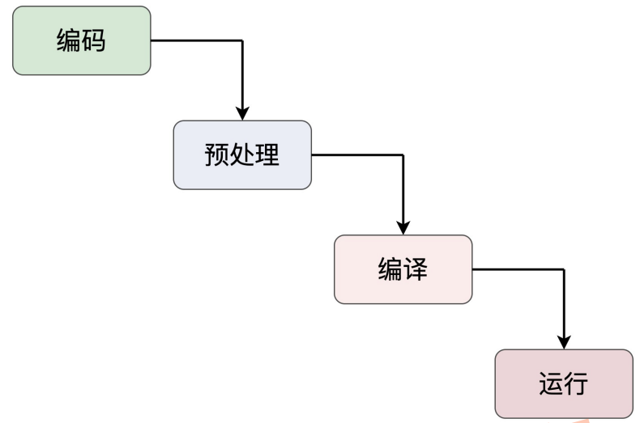

#### `C++`程序生命周期

>  “瀑布模型”，它定义了软件或者是**项目的生命周期**——从**需求分析**开始，经过**设计**、**开发**、**测试**等阶段，直到**最终交付**给用户

* `C++`程序从“诞生”到“消亡”
  * 编码（`Coding`）、预处理（`Pre-processing`）、编译（`Compiling`）和运行 （`Running`）

* 

