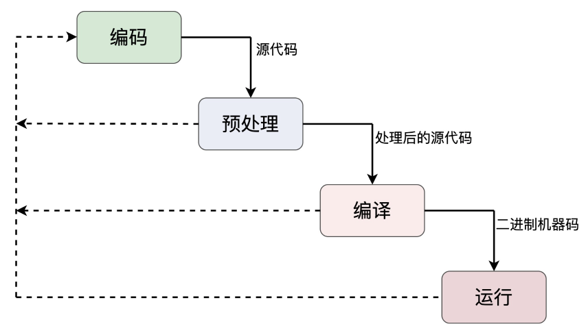
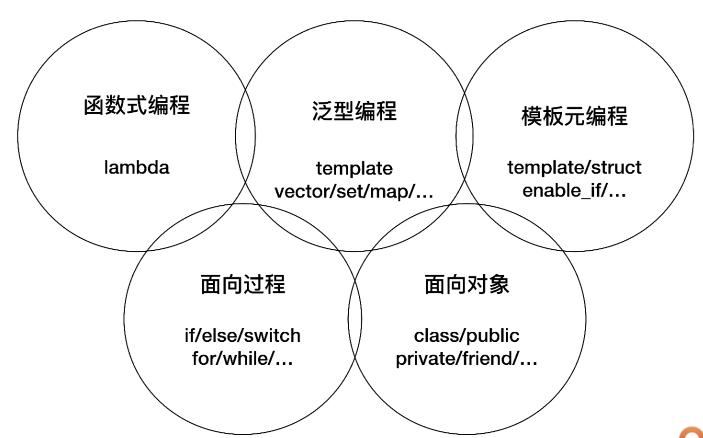

#### `C++`程序生命周期

>  “瀑布模型”，它定义了软件或者是**项目的生命周期**——从**需求分析**开始，经过**设计**、**开发**、**测试**等阶段，直到**最终交付**给用户

* `C++`程序从“诞生”到“消亡”
  * 编码（`Coding`）、预处理（`Pre-processing`）、编译（`Compiling`）和运行 （`Running`）

* 

##### 编码

* 编码阶段是 C++ 程序生命周期的起点，也是最重要的阶段，是后续阶段的基础，直接决定了 C++ 程序的“生存质量”
* 最基本的要求是遵循语言规范和设计文档，再高级一点的话，还有代码规范、注释规范、设计模式、编程惯用法，等等

##### 预处理

* 相对于下一个阶段“编译”而言的，在编译之前，**预先处理一下源代码**，既有点像是编码，又有点像是编译，是一个**中间阶段**
* 预处理器（`Pre-processor`）。它的输入是编码阶段产生的源码文件，输出是经过“预处理”的源码文件

* “预处理”的目的是文字替换，用到的就是各种预处理指令，比如 #include、#define、#if 等，实现“预处理编程”
  * 都以符号“#”开头，虽然是 C++ 程序的一部分，但严格来说不属于 C++ 语言的范畴，因为它走的是**预处理器**

##### 编译

* “编译”和“链接（Linking）”

* 经过预处理的源码——要经过**编译器**和**链接器**的“锤炼”，生成可以在计算机上运行的**二进制机器码**
  * C++ 编译器要**分词**、**语法解析**、**生成目标码**，并尽可能地去**优化**
  * 编译器还会根据 C++ 语言规则检查程序的**语法、语义是否正确**，发现错误就会产生“编译失败”。这就是最基本的 C++**“静态检查”**
* 依据 C++ 语法检查各种类型、函数的定义，以编译器为目标进行编程
  * 以编译器为目标进行编程，有意识地**控制编译器的行为**
  * **“模板元编程”**

##### 运行

* **“静态的程序”**被**载入内存**，由 CPU 逐条语句执行，就形成了**“动态的进程”**

* 常做的是 `GDB` 调试、日志追踪、性能分析等，然后收集动态的数据、调整设计思路，再返回编码阶段，重走这个“瀑布模型”，实现“**螺旋上升式**”的开发

> 在**“编码”“预处理”“编译”**这前面三个阶段多下功夫，消灭 Bug，优化代码，尽量不要让 Bug 在“运行”阶段才暴露出来

#### 编程范式

* 一种**“方法论”**，就是指导你编写代码的一些思路、规则、习惯、定式和常用语

* 支持**“面向过程”“面向对象”“泛型”“模板元”“函数式”**
  * “面向过程”“面向对象”是基础，支撑着后三种范式
  * 
* 面向过程
  * 核心思想是“命令”，通常就是顺序执行的语句、子程序（函数），把**任务分解**成若干个**步骤**去执行，最终达成目标
  * 源自它的前身——C 语言的那部分，比如变量声明、表达式、分支 / 循环 / 跳转语句，等等。

* 面向对象
  * 核心思想是**“抽象”和“封装”**，倡导的是把**任务分解**成一些**高内聚低耦合的对象**，这些对象互相通信协作来完成任务
  * 强调**对象之间的关系和接口**，而不是**完成任务的具体步骤**
  * 面向对象范式包括 class、public、private、virtual、this 等**类相关的关键字**，还有**构造函数**、**析构**函数、**友元**函数等概念

* 泛型编程
  * `STL`（标准模板库）纳入到 C++ 标准以后才逐渐流行起来的新范式，核心思想是“**一切皆为类型**”，或者说是“**参数化类型**”“**类型擦除**”
  * 使用模板而不是继承的方式来**复用代码**，所以运行效率更高，代码也更简洁
  * 泛型的基础就是 template 关键字，然后是庞大而复杂的标准库，里面有各种泛型容器和算法，比如 vector、map、sort，等等
  * 类似的是模板元编程，核心思想是“**类型运算**”，操作的数据是**编译时可见的“类型”**，所以也比较特殊，代码**只能由编译器执行**，而不能被运行时的 CPU 执行
    * 以库的方式来使用，比如 type_traits、enable_if 等

* 函数式
  * 核心思想是“**一切皆可调用**”，通过一系列连续或者嵌套的函数调用实现对数据的处理
  * `C++98`有`bind1st/bind2nd`等函数对象，`C++11`引入`Lambda`表达式

> 建议：
>
> 常用的范式是“**过程 + 对象 + 泛型**”，再加上少量的“函数式”，慎用“模板元”

