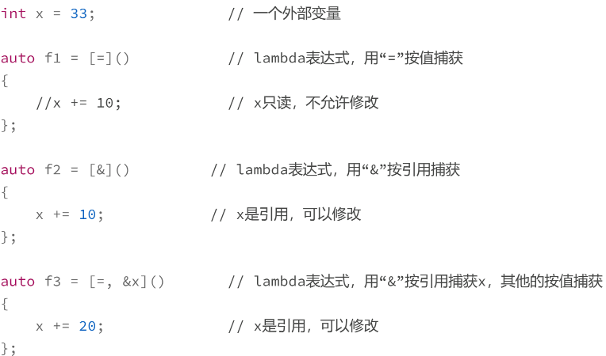

#### `C++`函数的特殊性

* 目的

  * 封装执行的细节，简化程序的复杂度
  * 有入口参数，有返回值，形式上和数学里的函数很像，所以就被称为“函数”

* 语法层面

  * 有**函数类型**，但**不存在对应类型的变量**，不能直接操作，只能用**指针去间接操作（即函数指针）**

* 用法

  * 所有的**函数都是全局**的，**没有生存周期**的概念（`static`、名字空间的作用很弱，只是简单限制了应用范围，避免名字冲突）

  * 函数也都是平级的，不能在函数里再定义函数，也就是**不允许定义嵌套函数**、函数套函数

  * ```cpp
    void my_square(int x)   // 定义一个函数
    {
        cout << x * x << endl;   // 函数的具体内容
    }
    
    auto pfunc = &my_square; // 只能用指针去操作函数，指针不是函数
    (*pfunc)(3);           // 可以用*访问函数
    pfunc(3);             // 也可以直接调用函数指针
    ```

* 在面向过程编程范式里，**函数和变量**虽然是程序里最关键的**两个组成部分**

  * 但却因为没有值、没有作用域而**不能一致地处理**

#### `lambda`表达式

* ```cpp
  auto func = [](int x)    // 定义一个lambda表达式
  {
      cout<<x*x<<endl;      // lambda表达式的具体内容
  };
  
  func(3);                 // 调用lambda表达式
  ```

* 用赋值方式，将**变量**存入一个函数

*  `lambda` 表达式是一个变量，可以**“按需分配”**，随时随地在调用点“就地”定义函数，限制**作用域和生命周期**，实现**函数的局部化**

  * 函数对象的一种简化形式，一个好用的“语法糖”

* 和普通函数的区别：可**捕获外部变量**

  * ```cpp
    int n = 10;// 一个外部变量
    auto func = [=](int x)     // lambda表达式，用“=”值捕获
    {
        cout << x * n << endl;
        // 直接操作外部变量
    };
    
    func(3);// 调用lambda表达式
    ```

* **闭包**

  * 活的代码块、活的函数
  * 在出现时被定义，但因为**保存定义时捕获的外部变量**，就可以**跳离定义点**，把这段代码“打包”传递到其他地方去执行，而仅凭函数的入口参数是无法做到这一点的
  * 可以像数学题一样，逐步求解
    * 

#### 使用注意事项

* 形式

  * 特殊的形式`“[]”`，术语叫“`lambda` 引出符”（`lambda introducer`）

  * 引出符后面，就可以像普通函数那样，用**圆括号声明入口参数**，用**花括号定义函数体**

  * `auto f1 = [](){};       // 相当于空函数，什么也不做`

  * 三个括号**“排排坐”**

  * 函数体中会有很多语句；良好的缩进格式

    * ```cpp
      auto f2 = []()     // 定义一个lambda表达式
      {
          cout << "lambda f2" << endl;
          auto f3 = [](int x)// 嵌套定义lambda表达式
          {
              return x * x;
          }; // lambda f3      // 使用注释显式说明表达式结束
          cout << f3(10) << endl;
      }; // lambda f2       // 使用注释显式说明表达式结束
      ```

  * 在 `lambda` 表达式赋值的时候，总是使用 `auto` 来推导类型

    * 每个`lambda`表达式都有一个独特类型，该类型只有编译器才知道，无法直接写出来

* 尽量**“匿名”使用** `lambda` 表达式

  * 

#### 变量捕获

* `“[=]”`表示按值捕获所有外部变量，表达式内部是值的拷贝，并且不能修改；
* `“[&]”`是按引用捕获所有外部变量，内部以引用的方式使用，可以修改；
* 在`“[]”`里明确写出外部变量名，指定按值或者按引用捕获
  * 

* 外部变量 `upvalue`，在表达式之前的所有出现变量，不论局部还是全局
  * 使用“[=]”按**值捕获**的时候，lambda 表达式使用的是变量的**独立副本**
  * 用“[&]”的方式**捕获引用**就存在风险，当 lambda 表达式在离定义点**“很远的地方”被调用**的时候，引用的**变量可能发生了变化**，甚至可能会失效，导致难以预料的后果

* **就地使用**“[&]”来减少代码量，保持整洁
  * **非本地调用**、**生命周期较长**的 `lambda` 表达式应慎用“[&]”捕获引用
  * **“[]”**里**显式写出**变量列表
  * 

* 泛型`lambda`
  * 简化了的**模板函数**
  * 
* 泛型函数的时候非常方便，摆脱了冗长的模板参数和函数参数列表

