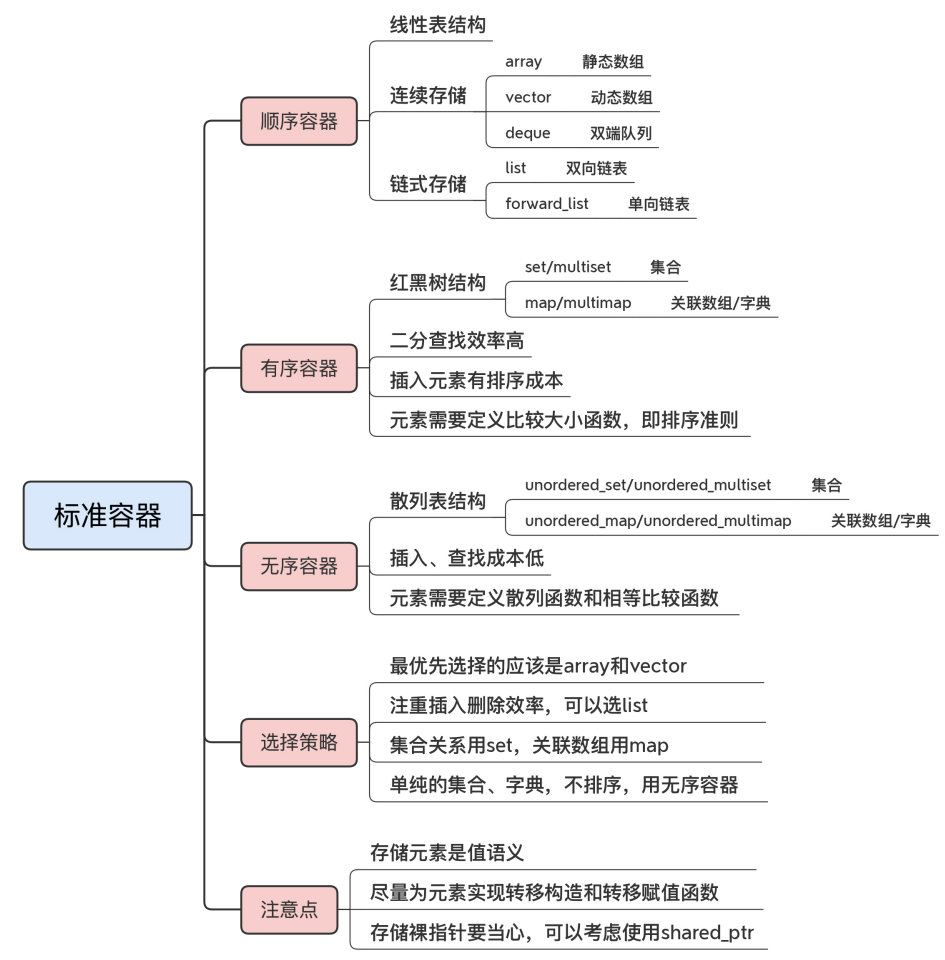
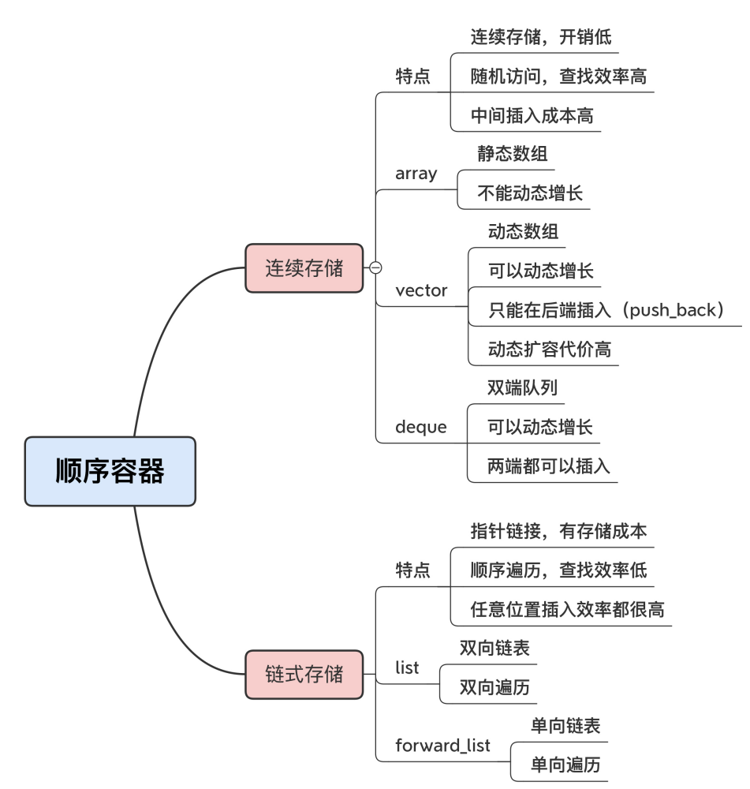

#### 容器通用特性

* 值语义

  * 存储的元素拷贝、副本，而不是引用

* 容器操作元素的很大一块**成本**就是**值拷贝**

  * 为元素实现**转移构造**和**转移赋值**函数

  * 加入容器时使用`std::move()`来转移，减少元素复制成本

  * ```cpp
    Point p; // 一个拷贝成本很高的对象
    v.push_back(p); // 存储对象，拷贝构造，成本很高
    v.push_back(std::move(p)); // 定义转移构造后就可以转移存储，降低成本
    ```

* 直接使用`emplace`操作函数，“就地”构造函数，免去构造后拷贝、转移的成本

  * `v.emplace_back(...);`  

* 存放元素指针？

  * 间接保存元素，不能利用容器自动销毁元素的特性，必须手动管理元素的生命周期，容易出错
  * 使用`shared_ptr`替代，共享语义与容器的值语义一样

#### 容器具体特性

* 顺序容器、有序容器和无序容器
* 

##### 顺序容器

* 线性表`array、vector、deque、list、 forward_list`

* 存储结构，这 5 种容器又可以再细分成两组

  * 连续存储的数组：`array`、`vector` 和 `deque`
  * 指针结构的链表：`list` 和 `forward_list`

* `array` 和 `vector` 直接对应 `C` 的内置数组，内存布局与 `C` 完全兼容，所以是开销最低、速 度最快的容器

  * 区别在于能否动态增长

  * ```cpp
    array<int, 2> arr; // 初始一个array，长度是2
    assert(arr.size() == 2); // 静态数组的长度总是2
    
    vector<int> v(2); // 初始一个vector，长度是2
    for(int i = 0; i < 10; i++) {
    	v.emplace_back(i); // 追加多个元素
    }
    assert(v.size() == 12); // 长度动态增长到12
    ```

* `deque` 也是一种可以动态增长的数组，双端队列

  * ```cpp
    deque<int> d; // 初始化一个deque，长度是0
    d.emplace_back(9); // 末端添加一个元素
    d.emplace_front(1); // 前端添加一个元素
    assert(d.size() == 2)  // 长度动态增长到2  
    ```

* 当 `vector` 的容量到达上限的时候`（capacity）`，它会再分配一块两倍大小的新内存，然后 把旧元素拷贝或者移动过去。

  * 使用 `vector` 的时候 最好能够**“预估”容量**，使用 `reserve` 提前分配足够的空间，**减少动态扩容**的拷贝代价

* `deque`、`list` 的的扩容策略就“保守”多了，只会按照**固定的“步长”**（例如 `N` 个字节、一个节点）去增加容量

  * 在短时间内插入大量数据的时候 就会频繁分配内存，效果反而不如 `vector` 一次分配来得好

* 首选`array`和`vector`，速度最快、开销最小，数组形式最易使用
* 剩下的 `deque`、`list` 和 `forward_list` 则适合对**插入删除性能比较敏感**的场合，如果还很在 意空间开销，那就只能选择非链表的 `deque` 



##### 有序容器

* 在插入容器后就被按照某种规则**自动排序**，所以是“有序”的

  * 使用红黑树 -- 最好查找性能的二叉树

* 四种有序容器：`set/multiset` 和 `map/multimap`

  * set 是集合，map 是关 联数组（在其他语言里也叫“字典”）
  * 有 `multi` 前缀的容器表示可以容纳重复的 `key`，内部结构与无前缀的相同，所以也可以认为 只有两种有序容器

* 怎么有序

  * 如何判断两个元素“先后顺序”

  * 定义容器时，必须指定`key`的比较函数，默认为`less`，小于关系

  * ```cpp
    template<
    	class T // 模板参数只有一个元素类型
    > class vector; // vector
    
    template<
        class Key, // 模板参数是key类型，即元素类型
        class Compare = std::less<Key> // 比较函数
    > class set; // 集合
    
    template<
        class Key, // 第一个模板参数是key类型
        class T, // 第二个模板参数是元素类型
        class Compare = std::less<Key> // 比较函数
    > class map; // 关联数组
    ```

  * `C++` 里的 `int`、`string` 等基本类型都支持比较排序，放进有序容器里毫无问题。但很多自义类型没有默认的比较函数，要作为容器的 `key` 就有点麻烦

* 重载“<”或自定义模板参数

  * ```cpp
    bool operator<(const Point& a, const Point& b)
    {
    	return a.x < b.x; // 自定义比较运算
    }
    set<Point> s; // 现在就可以正确地放入有序容器
    s.emplace(7);
    ```

  * ```cpp
    set<int> s = {7, 3, 9}; // 定义集合并初始化3个元素
    
    for(auto& x : s) { // 范围循环输出元素
    	cout << x << ","; // 从小到大排序，3,7,9
    }
    auto comp = [](auto a, auto b) // 定义一个lambda，用来比较大小
    {
    	return a > b; // 定义大于关系
    };
    
    set<int, decltype(comp)> gs(comp) // 使用decltype得到lambda的类型
    std::copy(begin(s), end(s), // 拷贝算法，拷贝数据
    	inserter(gs, gs.end())); // 使用插入迭代器
    
    for(auto& x : gs) { // 范围循环输出元素
    	cout << x << ","; // 从大到小排序，9,7,3
    }
    ```

* 如何选择

  * 集合关系就用 `set`，关联数组就用 `map`

* **实时插入排序**，那么选择 set/map 是没问题的

* `非实时`，那么最 好还是用 `vector`，全部数据**插入完成**后再**一次性排序**

##### 无序容器

* `unordered_set/unordered_multiset、unordered_map/unordered_multimap`

* 内部数据结 构：它不是红黑树，而是**散列表**（也叫哈希表，`hash table`）

  * ```cpp
    using map_type = // 类型别名
    	unordered_map<int, string>; // 使用无序关联数组
    
    map_type dict; // 定义一个无序关联数组
    
    dict[1] = "one"; // 添加三个元素
    dict.emplace(2, "two");
    dict[10] = "ten";
    
    for(auto& x : dict) { // 遍历输出
    	cout << x.first << "=>" // 顺序不确定
    		<< x.second << ","; // 既不是插入顺序，也不是大小序
    }
    ```

  * ```cpp
    template<
    	class Key, // 第一个模板参数是key类型
    	class T, // 第二个模板参数是元素类型
    	class Hash = std::hash<Key>, // 计算散列值的函数对象
    	class KeyEqual = std::equal_to<Key> // 相等比较函数
    > class unordered_map;
    ```

  * 要求 `key` 具备两个条件，一是可以计算 `hash` 值，二是能够执行相等比较操作

    * 第一个 是因为散列表的要求，只有计算 hash 值才能放入散列表，第二个则是因为 hash 值可能会 冲突，所以当 hash 值相同时，就要比较真正的 key 值

  * ```cpp
    bool operator==(const Point& a, const Point& b)
    {
    	return a.x == b.x; // 自定义相等比较运算
    }
    
    auto hasher = [](const auto& p) // 定义一个lambda表达式
    {
    	return std::hash<int>()(p.x); // 调用标准hash函数对象计算
    };
    ```

  * ```cpp
    unordered_set<Point, decltype(hasher)> s(10, hasher);
    
    s.emplace(7);
    s.emplace(3);
    ```

* 选择

  * 如果只想要单纯的集合、字典，**没有排序需求**，就应该用**无序容器**，没有比较排序的成本，它的速度就会非常快

> 等价`(equivalent)`与相等`(equality)`
>
> * 等价 == `!(x<y) && !(x>y)`
>   * 基于次序关系，对象不一定相同
> * 相等 == `==`
>   * 两个对象完全相同