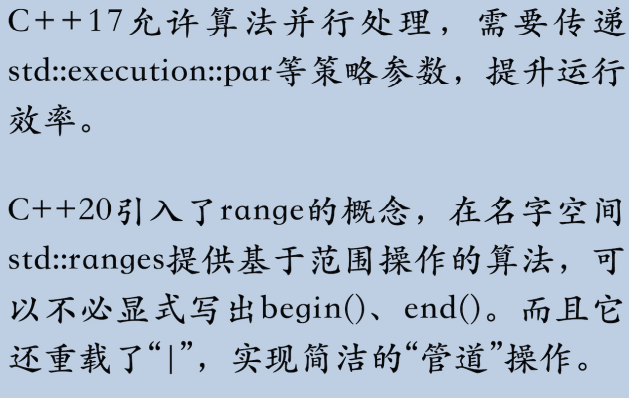

#### 算法：工作在容器上的一些泛型函数

> 对容器内的元素实施的各种操作

* 本质上都是`for or while`

  * 通过遍历来逐个处理容器中的元素

  * `count`算法，统计某个元素的出现次数，可以用`range_for`实现

    * ```cpp
      vector<int> v = {1,3,1,7,5}; // vector容器
          auto n1 = std::count( // count算法计算元素的数量
          begin(v), end(v), 1 // begin()、end()获取容器的范围
      );
      
      int n2 = 0;
      for(auto x : v) { // 手写for循环
          if (x == 1) { // 判断条件，然后统计
          	n2++;
      	}
      }
      ```

  * 为何不直接使用循环，而非要调用算法来“多此一举”

    * **更高层次上的抽象和封装**
    * 函数内部实现比我自己更好

  * ```cpp
    auto n = std::count_if( // count_if算法计算元素的数量
        begin(v), end(v), // begin()、end()获取容器的范围
        [](auto x) { // 定义一个lambda表达式
        	return x > 2; // 判断条件
        }
    ); // 大函数里面套了三个小函数
    ```

#### 认识迭代器

* 另一种形式的“智能指针”，强调对数据的访问；而不是生命周期管理

* 使用全局函数`begin()、end()`，更加方便，返回常量迭代器

  * `auto iter3 = std::begin(v); // 全局函数获取迭代器，自动类型推导`

* 与指针类似，可以前进与后退，但不一定支持`++、--`

  * `distance()`，计算两个迭代器之间的距离；

  * `advance()`，前进或者后退 `N` 步

  * `next()/prev()`，计算迭代器前后的某个位置

  * ```cpp
    array<int, 5> arr = {0,1,2,3,4}; // array静态数组容器
    
    auto b = begin(arr); // 全局函数获取迭代器，首端
    auto e = end(arr); // 全局函数获取迭代器，末端
    
    assert(distance(b, e) == 5); // 迭代器的距离
    
    auto p = next(b); // 获取“下一个”位置
    assert(distance(b, p) == 1); // 迭代器的距离
    assert(distance(p, b) == -1); // 反向计算迭代器的距离
    
    advance(p, 2); // 迭代器前进两个位置，指向元素'3'
    assert(*p == 3);
    assert(p == prev(e, 2)); // 是末端迭代器的前两个位置
    ```

##### 最有用的算法

* 手动循环替代

  * ```cpp
    vector<int> v = {3,5,1,7,10}; // vector容器
    
    for(const auto& x : v) { // range for循环
    	cout << x << ",";
    }
    auto print = [](const auto& x) // 定义一个lambda表达式
    {
    	cout << x << ",";
    };
    
    for_each(cbegin(v), cend(v), print);// for_each算法
    
    for_each( // for_each算法，内部定义lambda表达式
        cbegin(v), cend(v), // 获取常量迭代器
        [](const auto& x) // 匿名lambda表达式
        {
        	cout << x << ",";
        }
    );
    ```

  * 要做的事件：**遍历**容器元素 + **操纵**容器元素

* 排序

  * ```cpp
    auto print = [](const auto& x) // lambda表达式输出元素
    {
    	cout << x << ",";
    };
    
    std::sort(begin(v), end(v)); // 快速排序
    for_each(cbegin(v), cend(v), print); // for_each算法
    ```

    * `sort()`够快，但不够稳定，全排所有元素
      * 成本比较高，比如 `TopN`、中位数、最大最小值等

  * 要求排序后仍然保持元素的**相对顺序**，应该用 `stable_sort`，它是稳定的

  * 选出前几名（`TopN`），应该用 `partial_sort`

  * 选出前几名，但**不要求再排出名次**（`BestN`），应该用 `nth_element`

  * 中位数（`Median`）、百分位数（`Percentile`），还是用 `nth_element`

  * 按照某种规则把元素**划分成两组**，用 `partition`

  * 第一名和最后一名，用 `minmax_element`

  * ```cpp
    // top3
    std::partial_sort(
    	begin(v), next(begin(v), 3), end(v)); // 取前3名
    
    // best3
    std::nth_element(
    	begin(v), next(begin(v), 3), end(v)); // 最好的3个
    
    // Median
    auto mid_iter = // 中位数的位置
    	next(begin(v), v.size()/2);
    std::nth_element( begin(v), mid_iter, end(v));// 排序得到中位数
    cout << "median is " << *mid_iter << endl;
    
    // partition
    auto pos = std::partition( // 找出所有大于9的数
    	begin(v), end(v),
    	[](const auto& x) // 定义一个lambda表达式
    	{
    	return x > 9;
    	}
    );
    for_each(begin(v), pos, print); // 输出分组后的数据
    
    // min/max
    auto value = std::minmax_element( //找出第一名和倒数第一
    	cbegin(v), cend(v)
    );
    ```

  * 最好在顺序容器 `array/vector` 上调用

  * 如果是 `list` 容器，应该调用成员函数 `sort()`，它对**链表结构做了特别的优化**

* 查找

  * 有序容器上二分查找`lower_bound`，返回**第一个**“大于或等于”值的位置

  * ```cpp
    decltype(cend(v)) pos; // 声明一个迭代器，使用decltype
    
    pos = std::lower_bound( // 找到第一个>=7的位置
    	cbegin(v), cend(v), 7
    );
    found = (pos != cend(v)) && (*pos == 7); // 可能找不到，所以必须要判断
    assert(found); // 7在容器里
    
    pos = std::lower_bound( // 找到第一个>=9的位置
    	cbegin(v), cend(v), 9
    );
    found = (pos != cend(v)) && (*pos == 9); // 可能找不到，所以必须要判断
    assert(!found); // 9不在容器里
    ```

  * **“大于等于值的最后一个位置”**`upper_bound`

    * 返回第一个**大于**值的元素

      * ```cpp
        pos = std::upper_bound(   // 找到第一个大于9的位置
        	cbegin(v),cend(v),9
        );
        ```

    * 两个函数构成一个区间

      * 区间往前就是所有**比被查找值小**的元素，往后就是所有比 **被查找值大**的元素
      * ` begin < x <= lower_bound < upper_bound < end`

  * 对于有序容器`set/map`

    * 等价函数`find/lower_bound/upper_bound`

    * `find` 与 `binary_search` 不同，它的返回值不是 `bool` 而是**迭代器**

      * ```cpp
        multiset<int> s = {3,5,1,7,7,7,10,99,42}; // multiset，允许重复
        
        auto pos = s.find(7); // 二分查找，返回迭代器
        assert(pos != s.end()); // 与end()比较才能知道是否找到
        
        auto lower_pos = s.lower_bound(7); // 获取区间的左端点
        auto upper_pos = s.upper_bound(7); // 获取区间的右端点
        
        for_each( // for_each算法
        	lower_pos, upper_pos, print // 输出7,7,7
        );
        ```

  * 用于未排序的容器，适应范围更广

    * 查找区间的` find_first_of/find_end`，或许更应该叫作 `search_first/search_last`

    * ```cpp
      vector<int> v = {1,9,11,3,5,7}; // vector容器
      
      decltype(v.end()) pos; // 声明一个迭代器，使用decltype
      pos = std::find( // 查找算法，找到第一个出现的位置
          begin(v), end(v), 3
      );
      assert(pos != end(v)); // 与end()比较才能知道是否找到
      
      pos = std::find_if( // 查找算法，用lambda判断条件
          begin(v), end(v),
      	[](auto x) { // 定义一个lambda表达式
      		return x % 2 == 0; // 判断是否偶数
      	}
      );
      assert(pos == end(v)); // 与end()比较才能知道是否找到
      
      array<int, 2> arr = {3,5}; // array容器
      pos = std::find_first_of( // 查找一个子区间
      	begin(v), end(v),
      	begin(arr), end(arr)
      );
      assert(pos != end(v)); // 与end()比较才能知道是否找到
      ```

> `equal_range`算法可以一次性得到`[lower_bound,upper_bound]`区间，减少一次函数调用
>
> 