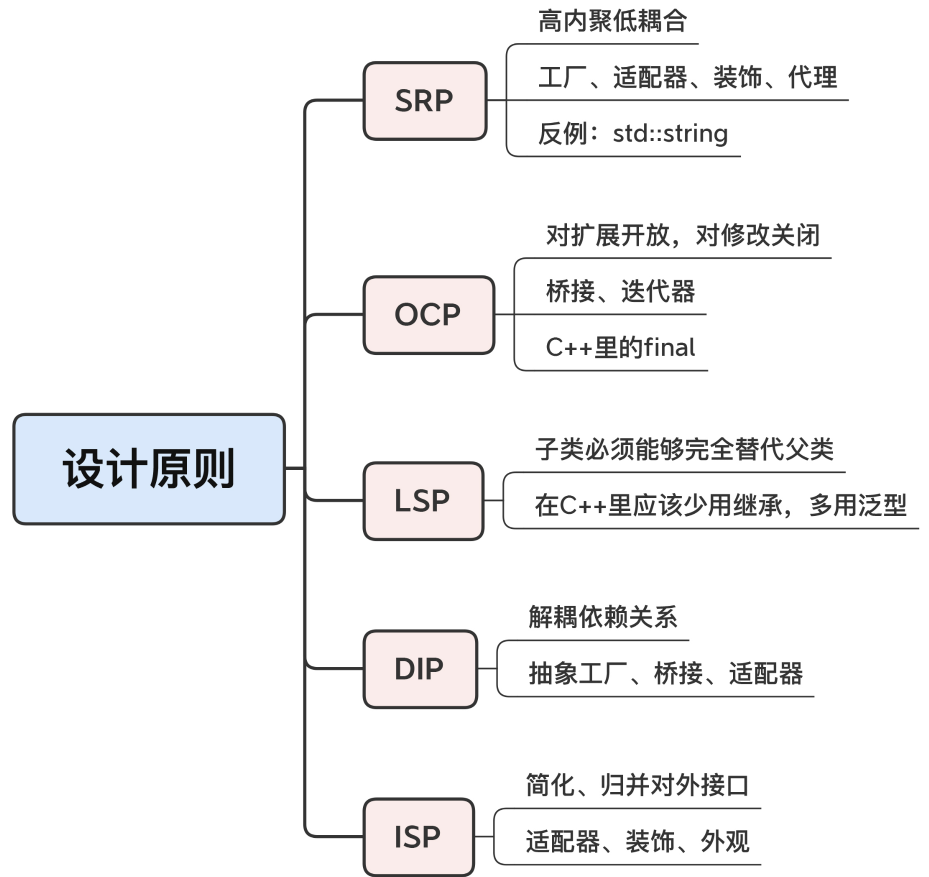

#### 为何存在

* 系统地描述了一些软件开发中的**常见问题**、**应用场景**和对应的**解决方案**，给出了专家级别的**设计思路**和**指导原则**
* 面向对象是主流编程范式，使用**设计模式**可以比较容易地得到**良好的面向对象设计**

#### 分类

* 根据设计目的
  * 创建型模式、结构型模式和行为模式

#### 重点

* 关注它的**参与者**、**设计意图**、**面对的问题**、**应用的场合**、**后续的效果**等**代码之外**的部分，它们通常比实现代码更重要
* 模式发现问题、分析问题、解决问题的思路是“活”的，适用性更广泛，这种思考“What、Where、When、Why、How”并逐步得出结论的过程，才是设计模式专家经验的真正价值

#### 设计原则

* 设计“设计模式”的模式
  * 更一般的思想指导
* `SOLID`
  * `SRP`，单一职责`（Single Responsibility Principle）`
    * 不要做多余的事，高内聚低耦合
    * 设计类时，缩小“粒度”，功能明确单一，不要设计出“大而全”的类
      * 得到很多小对象
    * 应用设计模式来组合、复用它们
      * 使用工厂来分类创建对象、使用适配器、装饰、代理来组合对象、使用外观来封装批量的对象
    * 反例：`string`字符串类
      * 集成了字符串和字符容器双重身份，复杂，难以使用
      * 将其当做字符串，字符容器则是`vector<char>`
  * `OCP`，开闭`（Open Closed Principle）`
    * 对扩展开放，对修改关闭
    * **做好封装**
      * 比如桥接模式让接口保持稳定，而另一边的实现任意变化
      * 又比如迭代器模式让集合保持稳定，改变访问集合的方式，只需要变动迭代器
      * `final`关键字，有效防止子类修改
  * `LSP`，里氏替换`（Liskov Substitution Principle）`
    * 子类必须能够完全替代父类
    * 子类不能改变、违反父类定义的行为
    * 不建议多用继承，多用泛型编程
  * `ISP`，接口隔离`（Interface-Segregation Principle）`
    * 尽量简化、归并给外界调用的接口
    * 大多数结构型模式都可以用来实现接口隔离
      * 比如使用适配器来转换接口
      * 使用装饰模式来增加接口
      * 使用外观来简化复杂系统的接口
  * `DIP`，依赖反转，有的时候也叫依赖倒置`（Dependency Inversion Principle）`
    * 上层要避免依赖下层的实现细节，下层要反过来依赖上层的抽象定义 == 解耦
    * 模板方法模式可以算是比较明显的依赖反转的例子，父类定义主要的操作步骤，子类必须遵照这些步骤去实现具体的功能
    * 存在上下级调用关系的设计模式都可以算成是依赖反转，比如抽象工厂、桥接、适配器

* 另外两个
  * `DRY（Don’t Repeate Yourself）`和 `KISS（Keep It Simple Stupid）`
  * 代码尽量保持简单、简洁，避免重复的代码
    * 用宏代替字面值，用 lambda 表达式就地定义函数，多使用容器、算法和第三方库

