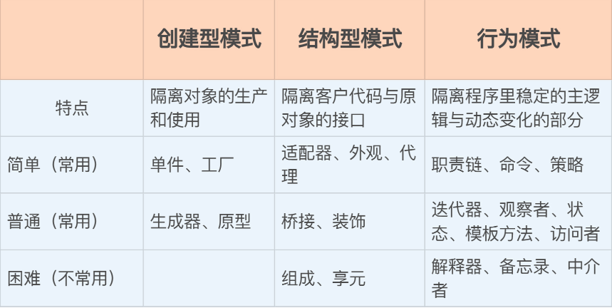

#### 创建型模式

* 隐藏了类的实例化过程和细节，让对象的**创建独立**于系统的其他部分

* **单件**和**工厂**

##### 单例

* 控制对象的创建数量，只能有一个实例，就像是公司的 `CEO` 一样，有且唯一

* 利用“双重检查锁定”来避免在多线程环境里多次初始化单件

* `call_once`还有**函数内部**的`static`静态变量可解决

  * 静态变量的初始化 线程安全

  * ```cpp
    auto& instance()   // 生产单例对象的函数
    {
        static T obj;   // 静态变量
        return obj;     // 返回对象引用
    }
    ```

##### 工厂模式

* 抽象工厂、工厂方法两个模式

  * 现实世界中的工厂，专门用来生产对象

* 抽象工厂 == 类、工厂方法 == 函数

* 用工厂来创建对象呢？这样做的好处在哪里呢？

  * `DRY（Don’t Repeate Yourself）`原则，尽量避免重复代码
  * 对`new`的封装

* 把 new 用工厂封装起来，就形成了一个**“中间层”**，隔离了客户代码和创建对象，两边只能通过工厂交互，彼此不知情，也就实现了**解耦**，由之前的强联系转变成了**弱联系**
  * `make_unique()、make_shared()` 工厂模式的具体应用

    * 隐藏创建的细节，看不见`new`，直接返回智能指针对象，接口更简洁，内部更多优化

  * ```cpp
    auto ptr1 = make_unique<int>(42);
    auto ptr2 = make_shared<string>("metroid");
    ```

  * 函数抛出异常、创建正则对象、创建`lua`虚拟机

* 理解它面对的问题和解决问题的思路

  * 创建专属的对象、创建成套的对象，重点是“**如何创建对象、创建出什么样的对象**”
  * 用函数或者类会比单纯用 new 更灵活

#### 结构型模式

* 对象的**静态联系，以灵活、可拆卸、可装配**的方式**组合**出**新对象**
* 重点：**最后**得到**一个对象**

* 常用
  * 适配器、外观和代理

##### 适配器模式

* 目的：接口转换，不需要修改源码，将一个对象转换成可以在本系统中可使用的形式
  * 拿到了一个英式电源插头，无法插到国标插座上，但你不必拿工具去拆开插头改造，只要买个**转换头**就行

* 容器 `array` 就是一个适配器，包装了 C++ 的原生数组，转换成了容器的形式，让**“裸内存数据”**也可以接入标准库的**泛型**体系

  * ```cpp
    array<int, 5> arr = {0,1,2,3,4};
    
    auto b = begin(arr);
    auto e = end(arr);
    
    for_each(b, e, [](int x){...});
    ```

##### 外观模式

* 封装了**一组对象**，目的是简化这组对象的**通信关系**，提供一个高层次的**易用接口**，让外部用户更容易使用，降低系统的复杂度

* 外观模式并**不绝对控制**、**屏蔽**内部包装的那些对象

* 函数` async() `就是外观模式的一个例子，它封装了线程的创建、调度等细节，用起来很简单，但也**不排斥**你直接使用 `thread`、`mutex` 等底层线程工具

  * ```cpp
    auto f = std::async([](){...});
    ```

##### 代理模式

* **“控制”对象**，**不允许**外部**直接**与内部对象**通信**，所以叫作“代理”
* 智能指针，接管原始指针，限制危险操作，添加自动生命周期管理，更安全

#### 行为模式

* 描述了对象之间**动态的消息传递**，也就是**对象的“行为”**、**工作方式**

* 易用：**职责链、命令和策略**

##### 职责链和命令

* 职责链把多个对象串成一个“链条”，让链条里的**每个对象**都**有机会去处理请求**
* **请求**通常使用的是命令模式，把相关的**数据打包成一个对象**，**解耦请求**的发送方和接收方

* `C++`的异常处理机制
  * 在异常处理的过程中，异常类 exception 就是一个命令对象，throw 抛出异常就是发起了一个请求处理流程
  * 一系列的 try-catch 块就构成了处理异常的职责链，异常会自下而上地走过函数调用栈——也就是职责链，直到在链条中找到一个能够处理的 catch 块

##### 策略模式

* 封装了不同的算法，可以在运行的时候灵活地互相替换，从而在**外部“非侵入”**地改变系统的行为内核

* **不会改变类**的**外部**表现和**内部状态**，只是**动态替换**一个很小的**算法功能模块**
* 容器和算法用到的比较函数、散列函数，还有 for_each 算法里的 lambda 表达式

* 非常适合应用在有` if-else/switch-case `这样“**分支决策**”的代码里，你可以把**每个分支逻辑**都封装成类或者 lambda 表达式，再把它们存进容器，让容器来帮你查找最合适的处理策略

#### 总结



