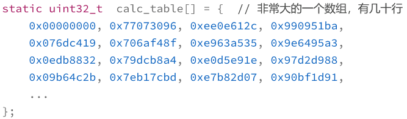

#### 预处理编程

* 操作目标是“源码”，用各种指令控制预处理器，把源码改造成另一种形式，就像是捏橡皮泥一样

* **预处理器**，**不受** C++ 语法规则的**约束**
* `# 开头、顶格写`

```cpp
#                    // 预处理空行
#if __linux__        // 预处理检查宏是否存在
# define HAS_LINUX 1 // 宏定义，有缩进
#endif               // 预处理条件语句结束
                     // 预处理空行
```

* `g++ test03.cpp -E -o a.cxx #输出预处理后的源码`

#### 包含文件`(#include)`

* **任意文件**
  * 防止重复包含，加上`"Include Guard"`

  * `#ifndef/#define/#endif`保护整个头文件

  * ```cpp
    #ifndef _XXX_H_INCLUDED_
    #define _XXX_H_INCLUDED_
    ...        // 头文件内容
    #endif // _XXX_H_INCLUDED_
    ```

* 小花样：加载大量数据

  * 

  * 将数据单独拷贝出来，存储为一个`*.inc*`文件，再`#include`即可

  * ```cpp
    static uint32_t calc_table[] = {
    #	include "calc_values.inc"    // 非常大的一个数组，细节被隐藏  
    };
    ```

#### 宏定义`(#define/#undef)`

* 源码级别**“文本替换”**

* 使用宏的时候一定要谨慎，时刻记着以**简化代码、清晰易懂**为目标，**不要“滥用”**，避免导致源码混乱不堪，降低可读性

* 注意事项

  * 宏的展开、替换发生在预处理阶段，不涉及函数调用、参数传递、指针寻址，没有任何运行期的效率损失

    * 对于一些调用频繁的小代码片段来说，用宏来封装的效果比`inline` 关键字要更好，因为它真的是源码级别的无条件内联

  * 宏是**没有作用域**概念的，永远是**全局生效**

    * 一些简化代码、临时作用的宏，用完`#undef`，避免冲突

    * ```cpp
      #define CUBE(a) (a) * (a) * (a) // 定义一个简单的求立方的宏
      
      cout << CUBE(10) << endl; // 使用宏简化代码
      cout << CUBE(15) << endl; // 使用宏简化代码
      
      #undef CUBE               // 使用完毕后立即取消定义
      ```

    * 宏定义前先检查，若有定义则先`undef`，接着重新定义

    * ```cpp
      #ifdef AUTH_PWD
      #	undef AUTH_PWD
      #endif
      #define AUTH_PWD "xxx"
      ```

  * 适当使用宏来定义代码中的常量，消除“魔术数字”“魔术字符串”（magic、number）

  * 宏定义名字空间

    * ```cpp
      #define BEGIN_NAMESPACE(x) namespace x {
      #define END_NAMESPACE(x) }
      
      BEGIN_NAMESPACE(my_own)
      ...                   // functions and classes
      END_NAMESPACE(my_own)
      ```

#### 条件编译`(#if/#else/#endif)`

* 在预处理阶段实现**分支处理**，通过判断**宏的数值**来产生**不同的源码**，**改变源文件的形态**

* `__cplusplus`，标记了`C++`的版本号，判断当前是`C or C++ or C++98 or C++11`
  * ```cpp
    #ifdef __cplusplus // 定义了这个宏就是在用C++编译
    extern "C"
    { // 函数按照C的方式去处理
    #endif
        void a_cfunction(int a);
    #ifdef __cplusplus
        // 检查是否是C++编译
    } // extern "C" 结束
    #endif
    #if __cplusplus >= 201402         // 检查C++标准的版本号
    	cout << "c++14 or later" << endl; // 201402就是C++14
    
    #elif __cplusplus >= 201103 // 检查C++标准的版本号
    	cout << "c++11 or later" << endl; // 201103是C++11
    #else                       // __cplusplus < 201103    // 199711是C++98
    #error "c++ is too old"
    // 太低则预处理报错
    #endif // __cplusplus >= 201402
           // 预处理语句结束
    ```

* 与优化更密切相关的底层系统信息在 C++ 语言标准里没有定义，但编译器通常都会提供，比如 `GCC` 可以使用一条简单的命令查看

  * `g++ -E -dM - < /dev/null`

  * ```cpp
    #define __GNUC__ 5
    #define __unix__ 1
    #define __x86_64__ 1
    #define __UINT64_MAX__ 0xffffffffffffffffUL
    ...
    ```

  * 基于这些，可以更加精细的根据具体的语言、编译器、系统特性来改变源码，有，就用新特性；没有，就采用变通实现

  * ```cpp
    #if defined(__cpp_decltype_auto) //检查是否支持decltype(auto)
    	cout << "decltype(auto) enable" << endl;
    #else
    	cout << "decltype(auto) disable" << endl;
    #endif //__cpp_decltype_auto
    #if __GNUC__ <= 4
    	cout << "gcc is too old" << endl;
    #else  // __GNUC__ > 4
    	cout << "gcc is good enough" << endl;
    #endif // __GNUC__ <= 4
    #if defined(__SSE4_2__) && defined(__x86_64)
    	cout << "we can do more optimization" << endl;
    #endif // defined(__SSE4_2__) && defined(__x86_64)
    ```

* 使用`#if 1 and #if 0`显示启动或禁用大段代码，比`/* ... */`的方式更加安全，也会更清楚

  * ```cpp
    #if 0  // 0即禁用下面的代码，1则是启用
    ...// 任意的代码
    #endif // 预处理结束
    #if 1  // 1启用代码，用来强调下面代码的必要性
    ...    // 任意的代码
    #endif // 预处理结束
    ```

