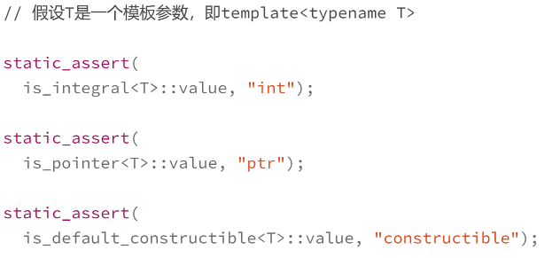

> 编码、预处理  生成人类可识别源码（`source code`）
>
> 编译  生成计算机可识别的机器码（`machine instruction code`）

#### 编译阶段编程

* 输入`预处理后C++源码`；输出**二进制可执行文件**（汇编、动态库或静态库）

* 该阶段看到的都是`C++`语法实体

  * `typedef、using、template、struct/class`这个关键字定义的类型，而不是运行阶段的变量

  * ```cpp
    template<int N>
    struct fib       // 递归求解斐波那契数列
    {
    	static const int value = 
            fib<N-1>::value+fib<N-2>::value;
    };
    
    template<>
    struct fib<0>      // 模板特化计算fib<0>
    {  
        static const int value = 1;
    };
    
    template<>
    struct fib<1>       // 模板特化计算fib<1>
    {
        static const int value = 1;
    };
    
    cout<<fib<2>::value<<endl;
    cout<<fib<3>::value<<endl;
    cout<<fib<4>::value<<endl;
    cout<<fib<5>::value<<endl;
    ```

  * 执行过程就是模型特化，过程无法调试，完全靠自己推导

* 编译器 就是一种特殊的“虚拟机”，只有编译器才能识别、处理的代码

#### 编译阶段技巧：属性与静态断言

* 手动指示编译器该怎么编译的选项  **编译指令 == 属性**
  * 给变量、函数、类等 贴上一个编译阶段的标签，方便编译器识别

* 类似便签

  * ```cpp
    [[noreturn]]            // 属性标签
    int func(bool flag)     // 函数绝对没有返回值
    {
    	throw std::runtime_error("xxx"); 	   
    }
    ```

* `C++11`中只有两个`noreturn and carr1ies_dependency`

* `c++14`给了一个废弃标签`deprecated`，标记不推荐使用的变量、函数或者类
  * ```cpp
    [[deprecated("deadline:2020-12-31")]]   // c++14 or later
    int old_func();
    ```

  * 编译时警告

  * `warning: ‘int old_func()’ is deprecated: deadline:2020-12-31 [-Wdeprecated-decl`

* 支持非官方定制

  * `gcc support gnu::`

  * 

  * 暂时不用的变量，只能用`(void)var;`骗过编译器

    * ```
      [[gnu::unused]]    // 声明下面变量暂时不适用
      int nouse;
      ```

##### 静态断言

* `static_assert`**关键字**，只在编译期生效，运行期看不见

* ```cpp
  template <int N>
  struct fib
  {
      static _assert(N >= 0, "N >= 0");  // 保证n>=0
      static const int value =
          fib<N - 1>::value + fib<N - 2>::value;
  };
  ```

* 保证程序在`64`位系统运行，编译期间判断`long`的大小，必须是`8`个字节

  * `static_assert(sizeof(long) >= 8, "must run on x64");`

* 检查空指针（不行）

  * 变量只在运行期出现

* 配合标准库中的`type_traits`，提供**编译期函数**
  * 

  * 将类当做函数，将模板参数当做函数参数，将`::`当做`return`返回值

