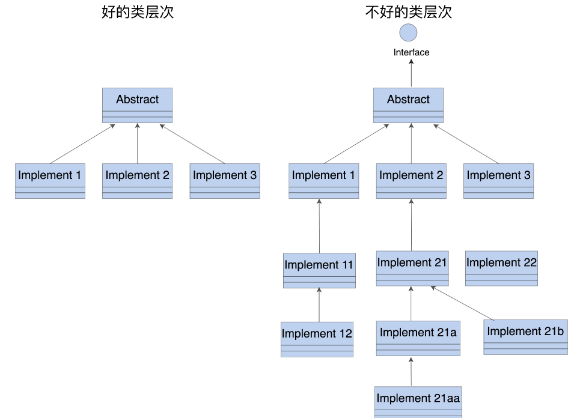

#### 面向对象 -- 抽象+封装 

* 设计思想、方法，与语言细节无关

* 出发点

  * “现实世界的模拟”，将问题中的实体抽象出来，封装成程序里的类和对象
  * 在计算机里为现实问题建立一个“虚拟模型”

* 模型演化，抽象对象之间的关系与通信，用越来越多的对象去描述、模拟，形成多个互相联系的对象构成的系统

* 缺陷：继承

  * 本意：重用代码，表述代码中的从属关系`Is-A`，与现实**不能完全对应**

  * > `Rectangle`表示长方形，`Square`继承`Rectangle`，表示正方形
    >
    > 长方形可以用成员函数单独变更长宽，正方形则不行，长宽必须同时变更
    >
    > 基类`Bird`有个`Fly`方法，所有鸟类继承之，但有的鸟不能飞

  * 补丁：“多态”、“虚函数”、“重载”；一定程度解决“继承”问题，也会复杂化代码，扭曲“面向对象”本意

#### 实现原则

* 尽量**少用继承和虚函数**

* **控制继承层次**
  * 用`UML`画类体系的示意图辅助检查，超过三层，就是有点“过度设计”
  * 考虑用组合关系 替代 继承关系，或者使用模板和泛型
* 

* 类功能上尽可能简单、“短小精悍”，**负责单一功能**
  * 防止**万能类**出现，应用设计模式、重构等知识，将大类拆分成各负其责的小类
  * 嵌套类，**高内聚** ，另一种万能类
    * 定义一个**新的名字空间，将内部类都“提”到外面，降低原来类的耦合度和复杂度**

#### 编码准则

* `final`标识符

  * ```cpp
    class DemoClass final  // 禁止任何人继承该类
    {
        ...
    };
    ```

* 尽量**只使用`public`继承**，避免使用`virtual、protected`

  * 让父类与子类的关系变得难以捉摸，带来很多麻烦
  * 到达继承体系底层时，也要**及时使用“final”**，**终止继承关系**

* 重要的构造函数和析构函数，用`=default`，明确告诉编译器（代码阅读者），应该实现该函数，但不想写

  * 编译器得到指示后，更好的优化

  * 一个类总是会有六大基本函数：三个构造、两个赋值、一个析构

  * 构造函数、析构函数、拷贝构造函数、拷贝赋值函数

  * `C++11`引入右值`(Rvalue)`和转移`(Move)`，多出两个函数：转移构造、转移赋值函数* *

  * ```cpp
    class DemoClass final
    {
    public:
        DemoClass() = default;   // 告诉编译器，使用默认实现
        ~DemoClass() = default;
    };
    ```

  * `=delete`代表**明确禁止**某个**函数形式**，适用于**任何函数**

  * 禁止对象拷贝，显示将拷贝构造和拷贝赋值`delete`

  * ```cpp
    class DemoClass final
    {
    public:
        DemoClass(const DemoClass&) = delete;           // 禁止拷贝构造
        DemoClass& operator=(const DemoClass&) = delete;
    };
    ```

* 类里有**单参数的构造函数**，或者是**转型操作符函数**，为了防止**意外的类型转换**，保证安全，就要使用**“explicit”**将这些函数标记为“显式”

  * `C++` 有**隐式构造**和**隐式转型**的规则

  * ```cpp
    class DemoClass final
    {
    public:
        explicit DemoClass(const string_type& str)  // 显示单参构造函数
        { ... }
        explicit operator bool()                    // 显示转换成bool
        { ... }
    };
    ```

#### 常用技巧

* 委托构造

  * 一个构造函数直接调用另一个构造函数，将构造工作"委托"出去

  * ```cpp
    class DemoDelegating final
    {
    private:
        int a;                // 成员变量
    public:
        DemoDelegating(int x) : a(x)   // 基本构造函数
        {}
        
        DemoDelegating() :    // 无参的构造函数
        	DemoDelegating(0) // 给定默认值，委托给另一个构造函数
        {}
        
        DemoDelegating(const string& s) : // 字符串参数构造函数
        	DemoDelegating(stoi(s))       // 转换成整数，委托给第一个构造函数
        {}
    };
    ```

* 成员变量初始化

  * `C++11`中，类中声明变量同时给其赋值，初始化

  * ```cpp
    class DemoInit final
    {
    private:
        int a=0;                   // 整数成员，赋值初始化
        string s="hello";          // 字符串成员，赋值初始化
        vector<int> v{1,2,3};      // 容器成员，使用花括号的初始化列表
    public:
        DemoInit() = default;       // 默认构造函数
        ~DemoInit() = default;      // 默认析构
    public:
        DemoInit(int x) : a(x) {}   // 可以单独初始化成员，其他用默认值
    };
    ```

#### 类型别名

* `C++11`拓展了关键字`using`用法，增加了`typedef`的能力，可以定义类型别名

* 使用赋值形式，左边是别名，右边是原名

* ```cpp
  using uint_t = unsigned int;   // using别名
  typedef unsigned int uint_t;   // 等价的typedef
  ```

* ```cpp
  class DemoClass final
  {
  public:
      using this_type = DemoClass;          // 给自己起个别名
      using kafka_conf_type = KafkaConfig;  // 外部类型别名
  
  public:
      using string_type = std::string;
      using uint32_type = uint32_t;         // 整数类型别名
      
      using set_type = std::set<int>;  
      using vector_type = std::vector<std::string>;
      
  private:
      string_type m_name = "tom";   // 使用类型别名声明变量
      uint32_type m_age = 23;
      set_type = m_books;
  
  private:
      kafka_conf_type m_conf;
  };
  ```

  * 语法层面的宏定义，维护时可以随意改成其他类型
  * 将字符串改成`string_view`，将集合类型改成`unordered_set`，变动别名定义即可，不需要改动原代码