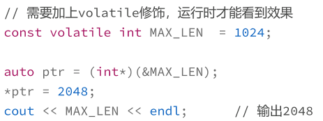
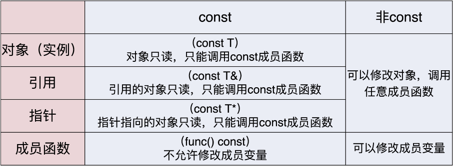

> 自动类型推导，`auto`推导出的类型可以附加`const、volatile`修饰（`cv`修饰符）
>
> * 更安全、更快的代码

#### `const`与`volatile`

* `const`用于定义程序用到的**数字**、**字符串常量**，**代替宏定义**
  * `const int MAX_LEN = 1024;`
  * `const std::string NAME = "metroid";`
* 定义的常量在**预处理阶段并不存在**，而是直到**运行阶段才会出现**
  * **运行时常量**
    * 不允许修改，**只读变量**
      * 可以使用指针获取地址，“强制”写入
      * 
    * 若无`volatile`修饰，使用指针得到常量地址，进行各种修改，输出常数还是`1024`
* **“真正的常数”**对于计算机来说有**特殊意义**，它是**绝对不变**的，所以编译器就要想各种办法去**优化**
  * 编译器看到`const`定义的常量，会采用优化，将`const`变量出现地方**替换成原始值**
  * 对于**没有 `volatile` 修饰的 `const` 常量**来说，虽然你用指针改了常量的值
    * 这个值在**运行阶段根本没有用到**，因为它在**编译阶段就被优化**掉

* `volatile`：禁止对该变量进行优化
  * 表示变量的值可能会以**“难以察觉”的方式**被修改（比如**操作系统信号、外界其他的代码**）
  * 让编译器老老实实去地址取值
  * 上述代码让其直接到内存取值，但在运行期间被指针强制修改了，所以值变成`2048`而不是原来的常量`1024`
* 建议：少用`volatile`；多用`const`修饰只读变量，让编译器优化

#### `const`用法

* 常量引用、常量指针

  * ```cpp
    int x = 100;
    
    const int& rx = x;
    const int* px = &x;
    ```

* `const&`**万能引用**：引用任何类型

  * 给变量附加`const`属性，“变量”成“常量”
  * 编译器检查写操作，发出警告即可
  * 将其作为**入口参数**，保证效率与安全

* 用于指针

  * 声明**最左边**，指向常量的指针，指针**指向“只读变量”**

  * ```cpp
    string name = "uncharted";
    const string* ps1 = &name;   // 指向常量
    *ps1 = "spiderman";          // 常量不允许改变
    ```

  * `const`**放`*`右边**，表示**指针不能修改**，指向的变量可改变

    * 恶心人

  * ```cpp
    string* const ps2 = &name;   // 指向变量，指针本身不能修改
    *ps2 = "spiderman";          // 可以修改
    ```

  * `*`两边都有`const`

  * ```cpp
    const string* const ps3 = &name;   // 看不懂
    ```

    * 指针不能修改，指针指向的变量也是只读的

  * 建议：**不要将`const`放在`*`后面**
    * 导致代码不好懂

#### 类相关的`const`用法



* `const`**成员函数**与成员变量

  * ```cpp
    class DemoClass final
    {
    private:
        const long MAX_SIZE = 256; // const成员变量
        int m_value;               // 成员变量
    
    public:
        int get_value() const     // const成员函数
        {
            return m_value;
        }
    };
    ```

  * `const`放在**函数后面**，便是**函数是一个“常量”**

    * 放在**前面**则是表示**返回值**是 `const int`

* **函数并不是变量**（`lambda` 表达式除外），“只读”对于函数来说没有任何意义

  * **函数是操作**
  * 函数的执行过程是 `const` 的，不会修改对象的状态（即成员变量），成员函数是一个**“只读操作”**

* 与常量引用、常量指针结合
  * “常量引用”“常量指针”关联的**对象是只读、不可修改**的
  * 意味着，对它的**任何操作也应该是只读、不可修改**的，否则就无法**保证它的安全性**
  * 编译器检查`const`对象相关的代码，若成员函数不是`const`，则不允许调用

> 标准库中
>
> 比如 `vector`，它的 `empty()`、`size()`、`capacity() `等查看基本属性的操作都是 `const` 的
>
> 而 `reserve()`、`clear()`、`erase() `则是非 `const` 的

#### `mutable`关键字

* 只用来修饰**类中成员变量**，表示变量即使在`const`对象中，也是可修改的

* 标记为 `mutable` 的成员**不会改变对象的状态**，也就是**不影响对象的常量性**，所以允许 `const` 成员函数改写 `mutable` 成员变量

* **`const`对象的补丁**，让其部分可变

  * 对象内部很多成员变量表示状态，由于“封装”，只能看到一部分

  * 判断对象是否 `const` 应该由这些外部可观测的状态特征来决定

  * > 比如说，对象内部用到了一个 `mutex` 来保证**线程安全**，或者有一个**缓冲区**来暂存数据，再
    > 或者有一个**原子变量做引用计数**……这些属于内部的私有实现细节，外面看不到，**变与不变**
    > **不会改变外界看到的常量性**
    >
    > 这时，如果 `const` 成员函数不允许修改它们，就有点说不过
    > 去了

* 对于特殊作用的成员变量，加上`mutable`修饰，解除`const`限制，任何成员函数都能操作

  * ```cpp
    class DemoClass final
    {
    private:
        mutable mutex_type m_mutex; // mutable成员变量
    public:
        void save_data() const      // const成员函数
        {
            // do someting with m_mutex
        }
    };
    ```

* 少用，慎用

> 贴士
>
> * 常量名字采用全大写，名字前面加上`k`
> * 函数参数“传值”语义
>   * 简单的值类型，如`int、double`，不用`const&`形式
> * `const_cast`去除常量性
>   * 调用纯`c`接口，尽量少用
> * 成员函数隐含`this`参数
>   * `const`成员函数实际上传入`const this`指针
>   * `c++`语法限制，无法声明`const this`，将`const`放在函数后面
> * 支持`const`和非` const`函数重载
>   * `const`对象编译器调用`const`版本成员函数

