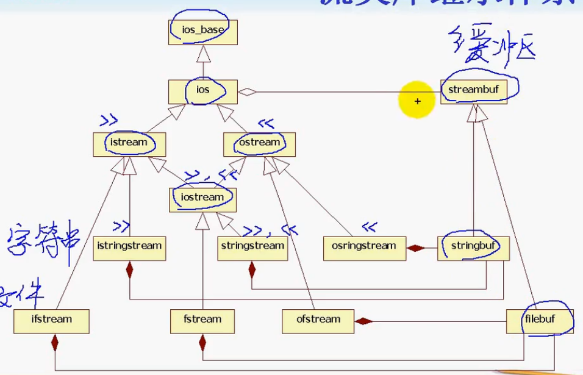
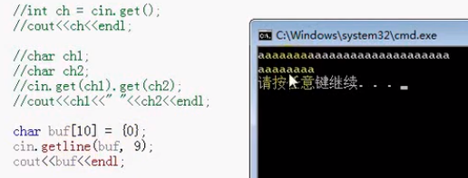
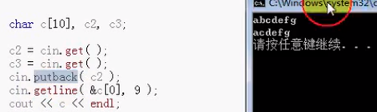

#### 目录

* 什么是`IO`
* 什么是流
* 流类库继承体系
* 标准输入/输出流

##### `I/O`

* 数据的输入和输出`(input/output)`
* 对**标准输入设备**和**标准输出设备的输入输出**简称**标准`I/O`**
* 对在**外存**磁盘上**文件的输入输出**简称为**文件`I/O`**
* 对**内存**中指定的**字符串存储空间的输入输出**简称为**串`I/O`**             

##### 流

* 数据输入输出的过程
* **从流中获取**数据  **提取（输入**`>>`）操作
  * `cin>>n` 
  * **从输入流**到变量
* **向流中添加**数据  **插入（输出**`<<`）操作
  * `cout<<n`
  * **从变量**到输出流
* 标准输入输出流
* 文件流
* 字符串流

##### 继承体系



* 两个基类：`streambuf`和`ios`
  * 所有流类都是两者之一作为基类
* `streambuf`提供对缓冲区的低级操作
  * 设置缓冲区、对缓冲区指针操作、向缓冲区存取字符
* `ios_base、ios`类记录流状态，支持对`streambuf`缓冲区输入/输出格式化或非格式化转换
* `strstreambuf`使用串保存字符序列
  * 拓展`streambuf`在缓冲区提取和插入的管理
* `filebuf`使用文件保存字符序列
  * 打开文件、读写、查找字符

##### 四个输入输出对象

* 标准`I/O`定义了四个类对象：`cin cout cerr clog`
  * `cin`是`istream`类的对象，代表标准输入设备键盘，后三个为`ostream`类对象
  * `cout`代表标准输出设备显示器
  * `cerr`和`clog`含义相同，代表错误信息输出设备显示器

##### `ostream`的操作

* `operator<<`

  * 连续使用？
    * 运算符重载 == 函数重载 
    * 函数返回 **对象引用**
  * 默认重载一些基本类型

* `put('c')`

* `write(buf,len)`

  * 返回一个`ostream`对象引用

  * `cout.write(buf,len); // char buf[len]` 

  * 输出一个缓冲区，指定其长度

  * ```cpp
    #include <iostream>
    
    using namespace std;
    
    int main()
    {
        int n = 100;
        int n2 = 200;
        // cout << n << n2 << endl;
        cout.put('1');
        cout.put('1').put('2').put('\n');
    
        char buf[] = "test!!!";
        cout.write(buf, 5);
        return 0;
    }
    ```

##### `istream`的操作

* `operator>>`操作

  * 同`<<`

  * ```cpp
    #include <iostream>
    
    using namespace std;
    
    int main()
    {
        int n;
        char ch;
    
        cin >> n >> ch;
        cout << "n=" << n << " ch=" << ch << endl;
        return 0;
    }
    ```

  * 一定要保证数字和字符的输入顺序，错了会导致流的状态错误

* `get()`

  * 读取单个字符

  * 返回一个整数

    * 字符的`ascii`码

  * 对回车换行的处理

    * 当作一个字符

  * ```cpp
    char ch1;
    char ch2;
    cin.get(ch1).get(ch2);
    cout << ch1 << " " << ch2 << endl;
    ```

* `getline()`
  * 读取一行
    * 遇到回车键
    * 不接收换行符（最后一个不接收）
    * 
      * 这里只有前8个字符
      * `endl`也是换行符
  * 返回`istream`对象引用
  * `getline()`操作与`>>`的区别
    * `char string1[256];`
    * `cin.getline(string1,256); // get a whole line`
      * 不会停止接收，等待接收换行符
    * `cin >> string1;   // stop at the 1st blank space`
      * 看见空格就停止接受
      * `sdafjkjk  sdfa`
      * `sdafjkjk`
* `read(buf,len)`
  * 与`write`相对应
  * 返回一个`istream`对象引用
  * 对空白字符照读不误
  * 遇到换行也当作一个字符，照读到规定的字符数为止
* `peek()`查看字符而不读取
* `putback()`将一个字符添加到流
  * 