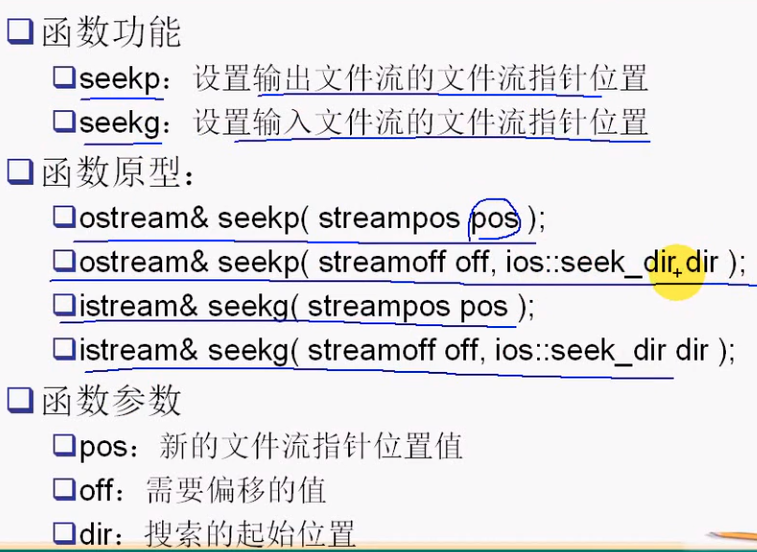
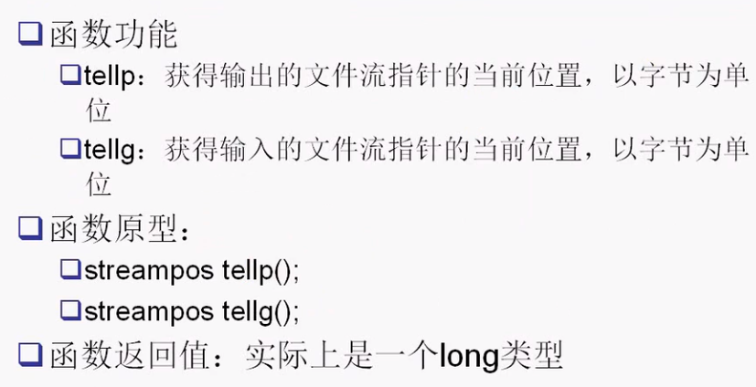

#### 目录

* 文件读写
* 二进制文件读写
* 文件随机读写`tellp、tellg、seekp、seekg`

##### 文件读写

* `>> << get put read write`

* **文本模式**打开与**二进制模式**打开

  * ```cpp
    #include <iostream>
    #include <fstream>
    
    using namespace std;
    
    int main()
    {
        ofstream fout("test.txt");
        fout << "abc"
             << " " << 200;
        fout.close();
    
        ifstream fin("test.txt");
        string s;
        int n;
        // 不按照写入顺序读取
        // 出现异常错误
        // fin >> n >> s;
        fin >> s >> n;
        cout << s << " " << n << endl;
        fin.close();
        return 0;
    }
    ```

  * ```cpp
    #include <iostream>
    #include <fstream>
    #include <cassert>
    
    using namespace std;
    
    int main()
    {
        ofstream fout("test2.txt");
        assert(fout);
        char ch;
    
        for (int i = 0; i < 26; i++)
        {
            ch = 'A' + i;
            fout.put(ch);
        }
        fout.close();
    
        ifstream fin("test2.txt");
    
        // 读取文件到末尾退出
        while (fin.get(ch))
        {
            cout << ch;
        }
        cout << endl;
        return 0;
    }
    ```

  *  **文本方式打开**文件，写入字符，遇到**`\n`作转换**

    * 写入`\r`不做转换
    * `windows`平台转换成`\r\n`
    * `linux`平台保留不变
    * `mac`平台转换成`\r`

  * **二进制方式**打开写入字符，遇到`\n`**不作转换**

    * 字节数不会变化

* 以文本或二进制方式打开文件，可写入二进制/文本

  * 与写入函数有关
    * 二进制数据 `write`，读取用`read`
    * 文本

##### 二进制文件读写

* 可用于任何类型的文件（包括文本文件）

* 采用从`istream`类继承的成员函数`read and write`

* 文件打开操作使用枚举变量`ios::binary`

  * `ofstream fout("binary.dat",ios::out|ios::binary);`

* ```cpp
  #include <cassert>
  #include <iostream>
  #include <fstream>
  #include <string>
  
  using namespace std;
  
  struct Test
  {
      int a;
      int b;
  };
  int main()
  {
      Test test = {100, 200};
      ofstream fout("test4.txt", ios::out | ios::binary);
      fout.write(reinterpret_cast<char *>(&test), sizeof(Test));
      fout.close();
  
      Test test2;
      ifstream fin("test4.txt", ios::in | ios::binary);
      fin.read(reinterpret_cast<char *>(&test2), sizeof(Test));
      cout << test2.a << " " << test2.b << endl;
      return 0;
  }
  ```

* ```cpp
  #include <cassert>
  #include <iostream>
  #include <fstream>
  #include <string>
  
  using namespace std;
  
  struct Test
  {
      int a;
      string b;
      string c;
  };
  int main()
  {
      Test t1;
      t1.a = 100;
      t1.b = "xxxssssssss";
      t1.c = "yysssssy";
  
      ofstream fout("test6.txt", ios::out | ios::binary);
      fout.write((char *)&t1, sizeof(Test));
      fout.close();
  
      ifstream fin("test6.txt", ios::in | ios::binary);
      Test t2;
      fin.read((char *)&t2, sizeof(Test));
      cout << t2.a << " " << t2.b << " " << t2.c << endl;
      fin.close();
      return 0;
  }
  ```

  * `sizeof(Test) == 68 `跟其中的`string`成员无关
    * `sizeof(string) == 32`
    * 导致溢出，`string`类型的对象是写入指针`char*`4个字节

* 解决办法：

  * 每个成员单独写入

  * `string`类型对象写入`t1.b.data()`

  * ```cpp
    #include <cassert>
    #include <iostream>
    #include <fstream>
    #include <string>
    
    using namespace std;
    
    struct Test
    {
        int a;
        string b;
        string c;
    };
    int main()
    {
        Test t1;
        t1.a = 100;
        t1.b = "xxxssssssss";
        t1.c = "yysssssy";
    
        cout << sizeof(Test) << endl;
        cout << sizeof(string) << endl;
        string a = "jdskfajklfklaasdfasfdsafasdfadfdsafdsa";
        cout << sizeof(a) << endl;
    
        ofstream fout("test6.txt", ios::out | ios::binary);
        // fout.write((char *)&t1, sizeof(Test));
        // 一个个写入
        fout.write((char *)&t1.a, sizeof(int));
        // 先写入长度，再写入实际数据
        int len;
        len = t1.b.length();
        fout.write((char *)&len, sizeof(int));
        fout.write((char *)t1.b.data(), t1.b.length());
        len = t1.c.length();
        fout.write((char *)&len, sizeof(int));
        fout.write((char *)t1.c.data(), t1.c.length());
        fout.close();
    
        ifstream fin("test6.txt", ios::in | ios::binary);
        Test t2;
        fin.read((char *)&t2.a, sizeof(int));
        fin.read((char *)&len, sizeof(int));
        t2.b.resize(len);
        fin.read(&t2.b[0], len); // 读取len个字节的数据到t2.b[0]
        fin.read((char *)&len, sizeof(int));
        t2.c.resize(len);
        fin.read(&t2.c[0], len);
    
        cout << t2.a << " " << t2.b << " " << t2.c << endl;
        fin.close();
    
        return 0;
    }
    ```

##### 文件随机读写

* 当前文件流活动指针
  * 跟踪发生`io`的位置
  * 从流中读取或写入一个字符，当前活动指针就会向前移动
  * 当打开方式中不含有`ios::ate or ios::app`选项时
    * 文件指针自动移动到文件起始位置
* 随机读写`seekp seekg`
  * 

* 获取当前文件流指针位置

  * 

  * ```cpp
    #include <cassert>
    #include <iostream>
    #include <fstream>
    #include <string>
    
    using namespace std;
    
    struct Test
    {
        int a;
        string b;
        string c;
    };
    
    int main()
    {
        ifstream fin("test7.txt");
        assert(fin);
        fin.seekg(2); // 移动文件指针下标到指定位置pos
    
        char ch;
        fin.get(ch); // 获取文件流中的字符数据
        cout << ch << endl;
    
        fin.seekg(-1, ios::end);
        fin.get(ch);
        cout << ch << endl;
    
        fin.seekg(0, ios::end); // 定位到文件流末尾
        streampos pos = fin.tellg();
        cout << pos << endl; // 获取文件大小
        return 0;
    }
    ```

    

##### 其他`c`库与系统调用

* `fseek、ftell`
* `Linux`系统调用
  * `lseek`
  * `lseek(fd,0,SEEK_CUR);`