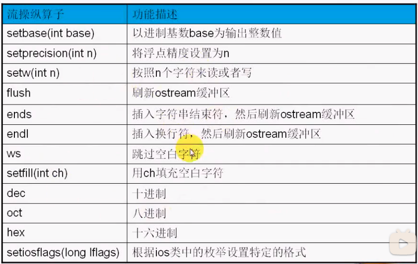
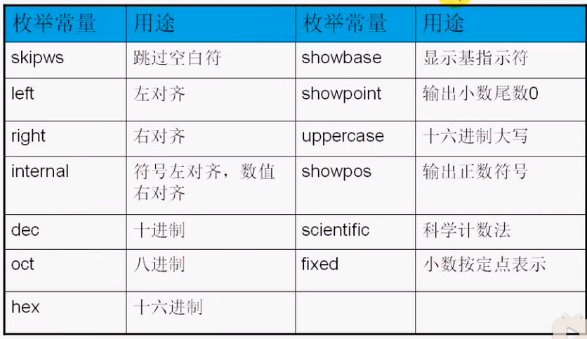
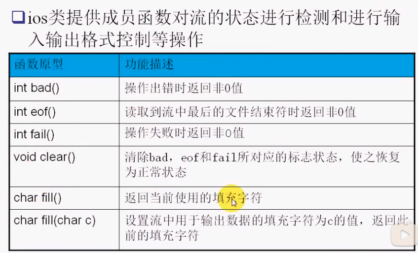
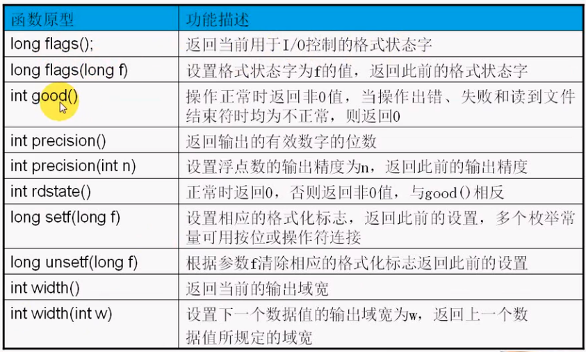

#### 目录

* 输出流格式化
  * 操纵子方式格式化
  * 成员函数方式格式化
* 宽度控制
* 对齐控制
* 填充控制
* 精度控制
* 进制控制

##### 输出流格式化





* `<iomanip>`提供的操纵符，将其作为插入操作符`<<`的输出对象即可
  * `setiosflags、setw、setfill、setprecision、hex、oct`
* 调用流的成员函数控制格式
  * `setf、unsetf、width、fill、precision`
  * 在设置格式同时，可以返回以前的设置，便于回覆

```cpp
#include <iostream>
#include <iomanip>

using namespace std;
// 操纵子方式
// 宽度控制
// 对齐控制
// 填充控制
// 精度控制
// 进制控制

int main()
{
    // system("chcp 936");  // 控制活动页 936使其能输出中文
    int n = 64;
    double d = 123.45;
    double d2 = 0.0187;

    cout << "=========================宽度控制=====================" << endl;
    cout << '#' << endl;
    cout << setw(10) << n << '#' << n << endl; //  不会影响下一个输出

    cout << "=========================对齐控制=====================" << endl;
    cout << setw(10) << setiosflags(ios::left) << n << '#' << endl;
    cout << setw(10) << n << '#' << endl; // 影响下一次输出，设置了流的状态
    // cout << setw(10) << setiosflags(ios::right) << n << '#' << endl;
    cout << setw(10) << resetiosflags(ios::left) << n << '#' << endl;

    cout << "=========================填充控制=====================" << endl;
    cout << setw(10) << setfill('?') << n << '#' << endl;
    cout << setw(10) << n << '#' << endl; // 影响下一次输出
    cout << setw(10) << setfill(' ') << n << '#' << endl;

    cout << "=========================精度控制=====================" << endl;
    cout << setprecision(4) << d << endl; // 设置有效数字个数
    cout << setprecision(2) << d2 << endl;

    cout << setiosflags(ios::fixed);
    cout << setprecision(4) << d << endl; // 设置小数点个数
    cout << setprecision(2) << d2 << endl;

    cout << "=========================进制控制=====================" << endl;
    cout << n << endl;
    // cout << resetiosflags(ios::dec);            // 去除10进制标志
    // cout << setiosflags(ios::oct) << n << endl; //设置8进制，输出完毕后默认恢复到10进制
    cout << hex << n << endl;
    cout << oct << n << endl; // 最简单方式

    cout << setiosflags(ios::showbase);
    cout << dec << n << endl;
    cout << oct << n << endl;
    cout << hex << n << endl;
    cout << endl;

    cout << setbase(8) << n << endl;
    cout << setbase(16) << n << endl;
    cout << setbase(10) << n << endl;
    return 0;
}
```





```cpp
#include <iostream>
// #include <iomanip>
// 少引入一个头文件

using namespace std;

// 宽度控制
// 对齐控制
// 填充控制
// 精度控制
// 进制控制

int main()
{
    // system("chcp 936");  // 控制活动页 936使其能输出中文
    int n = 64;
    double d = 123.45;
    double d2 = 0.0187;

    cout << "=========================宽度控制=====================" << endl;
    cout << '#' << endl;
    cout.width(10);
    cout << n << '#' << n << endl; // 宽度控制不会影响下一个输出

    cout << "=========================对齐控制=====================" << endl;
    cout.width(10);
    cout.setf(ios::left);
    cout << n << '#' << endl;
    cout.width(10);
    cout << n << '#' << endl; // 影响下一次输出，设置了流的状态
    cout.width(10);
    cout.setf(ios::right);
    cout << n << '#' << endl;

    cout.width(10);
    cout.unsetf(ios::left);
    cout << n << '#' << endl;

    cout << "=========================填充控制=====================" << endl;
    cout.width(10);
    cout.fill('?');
    cout << n << '#' << endl;

    cout.width(10);
    cout << n << '#' << endl; // 影响下一次输出

    cout.width(10);
    cout.fill(' ');
    cout << n << '#' << endl;

    cout << "=========================精度控制=====================" << endl;
    cout.precision(4);
    cout << d << endl;
    cout.precision(2);
    cout << d2 << endl;

    cout.setf(ios::fixed);
    cout.precision(4);
    cout << d << endl;
    cout.precision(2);
    cout << d2 << endl;

    cout << "=========================进制控制=====================" << endl;
    cout.setf(ios::showbase);
    cout << n << endl;
    cout.unsetf(ios::dec); // 去除当前进制
    cout.setf(ios::oct);
    cout << n << endl;

    cout.unsetf(ios::showbase);
    cout << n << endl;
    return 0;
}
```

