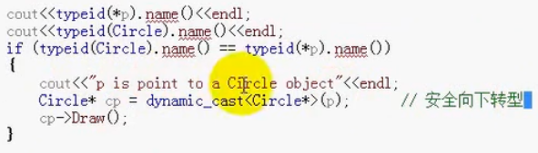

#### 目录

* `RTTI(runtime type information)`	
  * 对象模型中除了虚函数表之外的运行时信息
  * 由下面的东西组成
* `dyamic_cast`运算符
  * 安全向下转型
  * 消耗比虚函数多态大
  * 
* `typeid`运算符
* `type_info`

##### 显式类型转换

* `static_cast`：编译器认可的转型
* `reinterpret_cast`：编译器不认可的转型
  * 不做任何对齐操作，基于内存的不安全转换
  * `c`风格的会做对齐操作
* `const_cast`：去除常量限定
* `dynamic_cast`：安全向下转型
  * 编译器支持`GR`
  * 有虚函数的多态

##### `typeid`运行时识别

* 返回`type_info`对象
* 
* 
* 