* 引用 -- 别名 也是指针

* 内联函数（inline）

  * 函数被反复调用，调用函数产生的开销较大
  * 引入内联函数机制
    * 编译器处理对内联函数的调用语句时，将整个函数代码插入到调用语句处，不会产生调用函数的语句

* 函数重载（避免二义性）

  * 函数名相同，参数个数/参数类型各不相同

* 隐藏 -- 设置私有成员

  * 目的：强制对成员变量的访问一定要通过成员函数
  * 作用：方便在类中成员函数处定义中修改
  * 可访问范围（base = 类定义中）（出现次数和先后次序没有限制）
    * private：私有对象，只能在成员函数内访问
    * public：公有对象，可以在任何地方访问
    * protected：保护对象，todo
  * class定义类缺省为私有对象
  * struct定义类，缺省成员可访问范围为公有对象

* 构造函数（public）

  * 形式：名字与类名一致，可有参数，无返回值

  * 作用：初始化对象，给成员变量赋初值

  * 没写构造时，生成默认无参数构造函数（不做任何操作）

    * 定义了构造函数，编译器不生成默认构造函数
    * 对象生成时构造函数自动调用。对象生成，不能对其执行构造函数

  * 复制构造函数 -- 一个参数，对同类对象的引用X::X(X&)或X::X(const X&)

    * 用一个对象初始化同类的另一个对象

      ```c++
      Complex c2(c1);
      Complex c2=c1;
      ```

    * 某函数有一参数是类A的对象，函数被调用时，类A的复制构造函数也被调用

      ```c++
      void Func(A a1){ }
      int main(){
          A a2;
          Func(a2);
          return 0;
      }
      ```

    * 某函数返回值是类A的对象，函数返回时，A的复制构造函数被调用

      ```c++
      class A{
         public:
          	int v;
          	A(int n){ 
              	v = n;
              }
          	A(const A & a){
                  v = a.v;
                  cout<<"copy constructor called"<<endl;
              }
      };
      
      A Func(){
          A b(4);
          return b;
      }
      int main(){
          cout<<Func().v<<endl;
          return 0;
      }
      ```

  * 类型转换构造函数

    * 目的：类型自动转换

    * 特征：单参数，需要时，自动调用转换构造函数，建立无名临时对象（或临时变量）

      ```c++
      class A{
          public:
          	double real,imag;
          	A(int i){   // 类型转换构造函数
                  real = i;
                  imag = 0;
              }
      };
      int main(){
          A a1(7,8);
          A a2 =12;
          a1 = 9; // 9会被自动转换成一个临时A对象
          return 0;
      }
      
      case 2:
      class B{
          public:
          	double real,imag;
          	explicit B(int i){      // 显式类型转换构造函数
                  real = i;imag=0;
              }
      };
      int main(){
         
              ...
                  a1 = 9;  // error 此时9不能被自动转换成一个临时B对象
              ...
              
      }
      ```

  * 析构函数

    * 定义：名字与类名相同，前面加上'~'，无参与返回值，一个类最多一个析构
    * 作用：**每个**对象消亡自动调用。释放空间
    * 缺省析构函数什么都不做，定义之后编译器则不会自己生成

* this指针  指向成员函数所作用的对象

  * 静态成员函数中不能使用this函数
    * 静态成员函数不具体作用于某个对象
    * 静态成员函数的真实参数的个数，是程序中写出的参数个数

* 静态成员变量（函数）  本质  全局变量（函数）

  * 普通成员变量 每个对象都有一份 
    * 具体作用于某个对象
  * 静态成员变量 所有对象共享一份
    * sizeof运算符也不会计算静态成员变量
    * 不具体作用于某个对象
    * 不需要通过对象访问
      * 类名：：成员名
        * Test::print();
      * 对象名.成员名
        * Test t;
        * t.print();
      * 指针->成员名
        * Test *t = &r;
        * p->print();
      * 引用.成员名
        * Test &ref = t;
        * int n = ref.number;
  * 机制存在的目的：
    * 将某些类紧密相关的全局变量和函数写到类中，看起来像一个整体，易于维护和理解
      * 一个随时需要知道矩形总数和总面积的图形处理程序
      * 全局变量记录总数和总面积
        * 用静态成员将两个变量封装进类中，更容易理解和维护
  * 注意：
    * 静态成员函数中，不能访问非静态成员变量、不能调用非静态成员函数

* 封闭类（enclosing）

  * 有成员对象的类
  * 任何生成封闭类对象的语句，都要定义构造函数，初始化成员对象
  * 构造函数和析构函数的执行顺序
    * 对象生成时，先执行所有对象成员的构造函数，然后执行封闭类的构造函数
    * 对象成员的构造函数调用次序和对象成员在类中的说明次序一致，与它们在成员初始化列表中出现的次序无关
    * 封闭类的对象消亡时，先执行封闭类的析构函数，然后执行成员对象的析构函数。次序和构造函数的调用次序相反

* 友元 关系不能相互传递，不能继承（我的朋友的朋友不是我的朋友，我爸爸的朋友不是我的朋友），类中声明其友元，友元可以访问其类，但是该类不一定能访问其友元

  * 友元函数和友元类

    * 友元函数：一个类的友元函数可以访问该类的私有成员

      * 可以将一个类的成员函数（包括构造、析构函数）说明为另一个类的友元

    * 友元类：如果A是B的友元类，那么A的成员函数可以访问B的私有成员

      * ```c++
        class CCar{
        private:
        	int price;
        	friend class CDrive; // 声明CDriver为友元类
        };
        class CDriver{
        public:
        	CCar My Car;
        	void ModifyCar(){
        		myCar.price += 1000; // 此处访问友元的私有成员
        	}
        }
        ```

* 常量成员函数

  * 不希望某个对象的值被改变，可定义该对象时前面加上const关键字

  * ```c++
    const Sample Obj；// 常量对象
    Obj.SetValue();        // error  常量对象只能使用构造函数、析构函数和有const说明的函数
    ```

  * 类成员函数后加上const关键字，表示该成员函数为常量成员函数

    * 其内部不能改变属性的值，不能调用非常量成员函数

  * 若一个成员函数内没有调用非常量成员函数，也没有修改成员变量的值。最好设置为常量成员函数

  * ```c++
    class CTest{
    public:
    	bool GetData() const{
    		m_n1++;
    		return m_b2;
    	}
    private:
    	mutable int m_n1;     // 可以在const成员函数中修改的成员变量
    	bool m_b2;
    }
    ```


* 运算符重载

  * 预定义的运算符：只能用于基本数据类型运算：整型、实型、字符型和逻辑型

    * 数学中两个复数可以进行+-运算，但在c++中不行
      * 需要自己定义运算符进行运算
      * complex_a + complex_b

  * 重载目的：扩展C++中提供的运算符的适用范围，使之能作用于对象

  * 实质：函数重载

    * 普通函数重载 和 成员函数重载
    * 把含有运算符的表达式转换成对运算符函数的调用
    * 把运算符的操作数转换成运算符函数的参数
    * 运算符被多次重载时，根据实参的类型决定调用哪个运算符函数

    ```c++
    class Complex{
        public:
        	double real,imag;
        	Complex(double r=0.0,double i=0.0):real(r),imag(i){}
        	Complex operator-(const Complex &c);
    };
    Complex operator+(const Complex &a,const Complex &b){
    	return Complex(a.real+b.real,a.imag+b.imag); // 返回一个临时对象
    }
    Complex Complex::operator-(const Complex &c){
        return Complex(real-c.real,imag-c.imag);  // 返回一个临时对象
    }
    // 重载为成员函数时，参数个数为运算符 数目减一
    // 重载为普通函数时，参数个数为运算符 数目
    
    int main(){
    	Complex a(4,4),b(1,1),c;
        c = a+b;   // 等价于c=operator+(a,b);
        cout<<c.real<<","<<c.imag<<endl;
        cout<<(a-b).real<<","<<(a-b).imag<<endl;
        // a-b 等价于a.operator-(b)
        return 0;
    }
    // output：
    // 5,5
    // 3,3
    ```

  * 赋值运算符（=）重载

    * 有时希望运算符两边类型不匹配：将一个int类型变量赋值给一个Complex对象或把一个char*类型字符串赋值给字符串对象，就需要重载运算符=

    * 赋值运算符号只能重载为成员函数

    * ```c++
      class String{
          private:
          	char* str;
          public:
          	String():str(new char[1]){ str[0] = 0; }
          	const char* c_str(){ return str; }
          	String & operator=(const char* s);
          	~String() {delete [] str}
      };
      String & String::operator=(const char* s){
          // 重载"="使得 obj = “hello” 能够成立
          delete[] str;
          str = new char[strlen(s)+1];
          strcpy( str, s);
          return *this;
      }
      int main(){
          String s;
          s = "Good Luck";  // 等价于 s.operator=("Good Luck,");
          cout<<s.c_str()<<endl;
          // String s2 = "hello"; // 不注释会出错
          s = "shenzhou 8!";   // 等价于s.operator=("shenzhou 8!");
          cout<<s.c_str()<<endl;
          return 0;
      }
      ```

  * 浅拷贝和深拷贝

    * 

    * 若不定义自己的赋值运算符，S1=S2实际上会导致S1.str和S2.str指向同一地方

    * 若S1对象消亡，析构函数将释放S1.str指向的空间，则S2消亡时还要释放一次，不好

    * 当执行 S1="other"; 会导致S2.str指向的地方被delete

      * 这里要添加成员函数解决这种问题

      * ```c++
        String & operator = (const String &s){
            delete [] str;
            str = new char[strlen(s.str)+1];
            strcpy(str,s.str);
            return *this;
        }
        
        // 考虑如下语句
        String s;
        s = "hello";
        s = s;
        
        // 解决方案
        String & operator = (const String &s){
            if(this==&s)
                return *this;
            delete [] str;
            str = new char[strlen(s.str)+1];
            strcpy(str,s.str);
            return *this;
        }
        
        // 为String类编写复制构造函数时，会面临和=同样的问题，用同样的方法处理
        String(String &s){
            str = new char[strlen(s.str)+1];
            strcpy(str,s.str);
        }
        ```

    * 运算符重载为友元函数

      * 将运算符重载为类的成员函数，有时不能满足使用要求，重载为普通函数，又不能访问类的私有成员，所以需要将运算符重载为友元

      * ```c++
        class Complex{
            double real,imag;
            public:
            	Complex(double r,double i):real(r),imag(i){};
            	Complex operator+(double r);
        };
        Complex Complex::operator+(double r){
            // 能解释c+5
            return Complex(real+r,imag);
        }
        
        // 经过上述重载后：
        Complex c;
        c = c+5;  // 等价于 c= c.operator+(5);
        // 但是 下面会编译出错
        c = 5+c; 
        // 需要将+重载为普通函数
        Complex operator+(double r,const Complex &c){
            // 能解释5+c
            return Complex(c.real+r,c.imag);
        } // 但是普通函数又不能访问私有成员，那么就需要将运算符+重载为友元
        class Complex{
            double real,imag;
            public:
            	Complex(double r,double i):real(r),imag(i){};
            	Complex operator+(double r);
            	friend Complex operator+(double r,const Complex &c);
        }
        ```

  * 运算符重载实例（可变长整型数组）

    * ```c++
      int main(){ // 编写可变长整型数组类，使其能够使用
          CArray a; // 开始时的数组是空的
          for(int i = 0;i<5;++i)
              a.push_back(i);  // 使用动态分配的内存来存放数据元素，需要指针变量
          CArray a2,a3;
          a2 = a;              // 重载 “=”
          for(int i = 0;i<a.length();++i)
              cout<<a2[i]<<" ";
          a2 = a3;   // a2是空的
          for(int i = 0;i < a2.length();++i) // a2.length()返回0
              cout<<a2[i]<<" ";  // 重载[]
          cout<<endl;
          a[3] = 100;
          CArray a4(a);          // 自己写复制构造函数
          for(int i = 0;i<a4.length();++i)
              cout<<a4[i]<<" ";
          return 0;
      }
      
      class CArray{
          int size;  // 数组元素的个数
          int* ptr;  // 指向动态分配的数组
          public:
          	CArray(int s=0);   // s代表数组元素个数
          	CArray(CArray &a);
          	~CArray();
          	void push_back(int v); // 用于在数组尾部插入一个元素v
          	CArray& operator=(const CArray &a);
          	// 用于数组对象间的赋值
          	int length(){return size;} // 返回数组元素个数
          	int& CArray::operator[](int i){
                  // 用来支持下标访问数组元素
                  return ptr[i];
              }
      }
      
      CArray::CArray(int s):size(s){
          if(s==0)
              ptr = NULL;
          else ptr = new int[s];
      }
      CArray::CArray(CArray &a){
          if(!a.ptr){
              ptr = NULL;
              size = 0;
              return ;
          }
          ptr = new int[a.size];
          memcpy(ptr,a.ptr,sizeof(int) *a.size);
          size = a.size;
      }
      CArray::~CArray(){
          if(ptr) delete []ptr;
      }
      CArray& CArray::operator=(const CArray &a){
      	// 赋值号的作用是使得=左边对象里存放的数组，大小和内容都和右边的对象一样
          if(ptr == a.ptr) // 防止a=a这样的赋值出现
              return *this;
          if(a.ptr==NULL){ // 如果a里面的数组是空的
              if(ptr) delete []ptr;
              ptr = NULL;
              size = 0;
              return *this;
          }
          if(size<a.size){ // 如果原有空间够大，就不用分配新的空间
              if(ptr)
                  delete []ptr;
              ptr=new int[a.size];
          }
          memory(ptr,a.ptr,sizeof(int)*a.size);
          size = a.size;
          return *this;
      } // CArray& CArray::operator=(const CArray &a)
      
      void CArray::push_back(int v){
          // 在数组尾部插入一个元素
      	if(ptr){
              int* tmpPtr = new int[size+1]; // 重新分配空间
      		memory(tmpPtr,ptr,sizeof(int)*size); // 拷贝原数组内容
              delete []ptr;
              ptr = tmpPtr;
          }
          else // 数组本来是空的
              ptr = new int[1];
          ptr[size++] = v;  // 加入新的数组元素
      }
      ```

      * 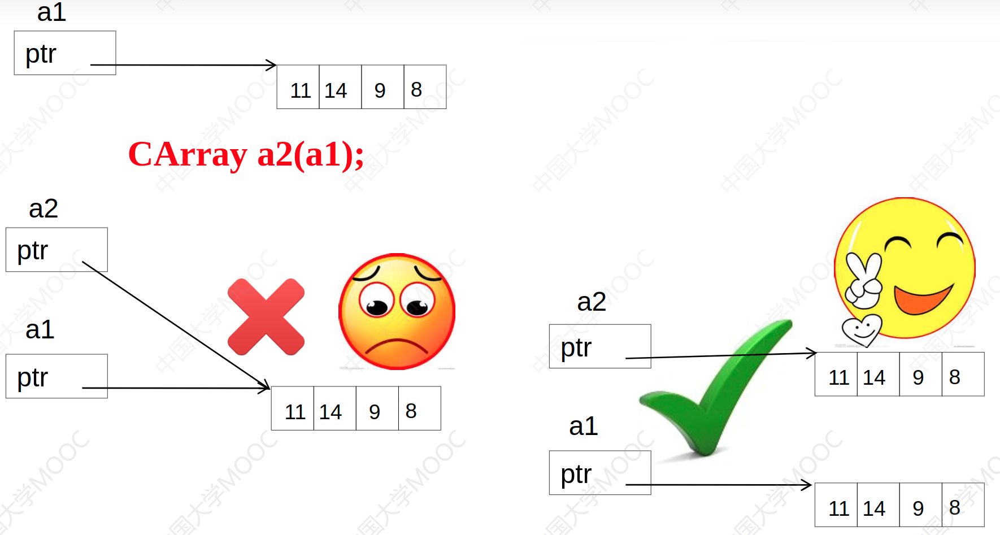

---

* 流插入运算符和流提取运算符的重载

  * cout是在iostream中定义，ostream类中对象

  * <<能用在cout是因为，在iostream里对<<进行了重载

  * 考虑重载方式，使得cout<<5; 和cout<<this都能成立

    * ```c++
      // 有可能按以下方式重载成ostream类的成员函数
      void ostream::operator<<(int n){
          ...// 输出n的代码
      	return ;
      }
      // 流插入运算符的重载
      cout<<5;          // 即cout.operator<<(5);
      cout<<"this";     // 即cout.operator<<("this")
      ```

    * 怎么重载才能使得上述有效？

      * ```c++
        ostream& stream::operator<<(int n){
            ...// 输出n的代码
           	return *this;
        }
        ostream& ostream::operator<<(const char* s){
            ...// 输出s的代码
            return *this;
        }
        ```

      * cout<<5<<"this";

      * 本质上函数调用本质是什么？

        * cout.operator<<(5).operator<<("this");

        * ```c++
          // 假定下面程序输出为5hello，该补充些什么
          class CStudent{
              public:
              	int nAge;
          };
          int main(){
          	CStudent s;
              s.nAge=5;
              cout<<s<<"hello";
              return 0;
          }
          
          // 要让cout<<s函数调用之后，继续返回了一个ostream对象，继续调用函数
          ostream& operator<<(ostream& o,const CStudent &s){
              o<<s.nAge;
              return o;
          }
          ```

        * 例题：实现cin>>c;就能接受a+bi复数的输入，并且使得c.real=a,c.imag=b的操作

          * ```c++
            int main(){
                Complex c;
                int n;
                cin>>c>>n;
                cout<<c<<","<<n;
                return 0;
            } // 程序输出结果：13.2+133i
            
            #include <iostream>
            #include <string>
            #include <cstdlib>
            using namespace std;
            class Complex{
                double real,imag;
            public: 
                Complex(double r= 0,double i=0):real(r),imag(i){};
                friend ostream& operator<<(ostream& os,const Complex &c);
                friend istream* operator>>(istream &is,Complex &c);
            };
            ostream& operator<<(ostream &os,const Complex &c){
                os<<c.real<<"+"<<c.imag<<"i";   // 以“a+bi”的形式输出
                return os;
            }
            istream& operator>>(istream &is,Complex &c){
                string s;
                is>>s;    // 将“a+bi”作为字符串读入，“a+bi”中间不能有空格
                int pos = s.find("+",0);
                string sTmp = s.substr(0,pos); // 分离出代表实部的字符串
                c.real = atof(sTmp.c_str());   // atof库函数将const char*指针指向内容转换成float
                sTmp = s.substr(pos+1,s.length()-pos-2); // 分离出代表虚部的字符串
                c.imag = atof(sTmp.c_str());
                return is;
            }
            ```

---


* 继承与派生

  * 继承：在定义一个新类B时，如果该类与某个已有的类A相似（B拥有A的全部特点），把A作为基类，B作为基类的一个派生类（子类）

  * 派生类通过对基类进行修改和扩充得到，可以扩充新的成员变量和成员函数，独立使用，不依赖于基类

    * 派生类的各个成员函数中，不能访问基类中的private成员

  * 写法：

    * ```c++
      class 派生类名：public 基类名{
          public:
          	bool isTrue(){...};  // 会对父类的方法进行覆盖
      };
      ```

  * 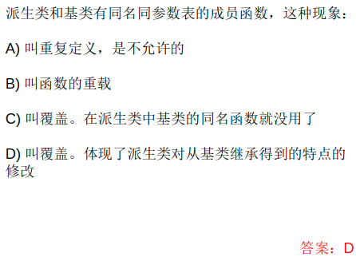

  * 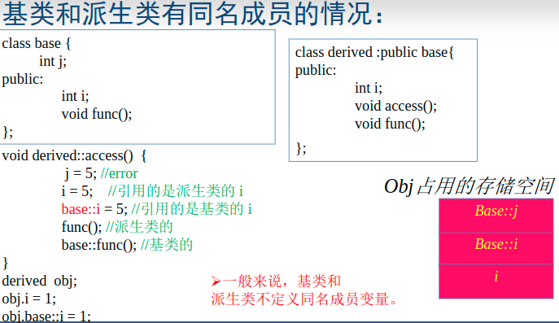

  * 体积：基类对象体积 + 子类对象自己成员变量的体积

    * 基类对象存储位置在子类对象新增成员变量之前
    * 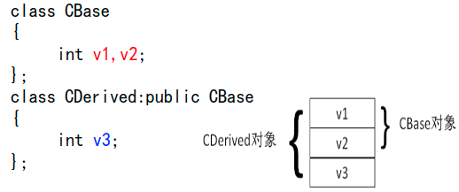

* 继承关系与复合关系

  * 继承：“是”关系
    * 基类A,B是基类A的派生类
    * “一个B对象也是一个A对象”
    * 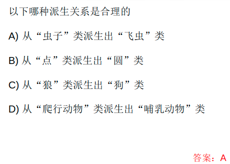
  * 复合：“有”关系
    * 类C中“有”成员变量k，k是类D的对象，则C和D是复合关系
    * “D对象是C对象的固有属性或组成部分”
    * 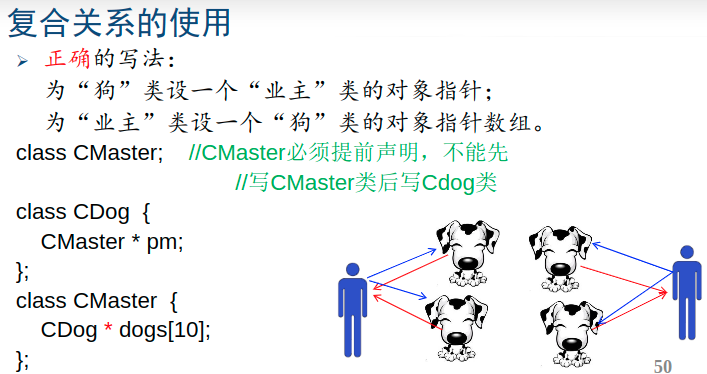

---

* 存取权限说明符：protected

  * 基类private成员：可以被下列函数访问
    * 基类的成员函数
    * 基类的友元函数
  * 基类public成员：可以被下列函数访问
    * 基类的成员函数
    * 基类的友元函数
    * 派生类的成员函数
    * 派生类的友元函数
    * 其他函数
  * 基类的protected成员：可以被下列函数访问
    * 基类的成员函数
    * 基类的友元函数
    * 派生类的成员函数可以访问当前对象的基类的保护成员
  * 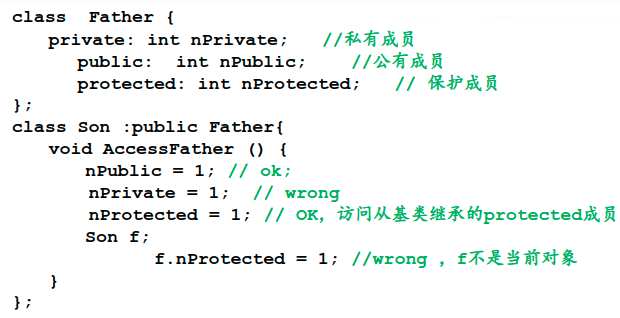
    * f不是当前对象，当前对象是this指针指向的对象

* 派生类的构造函数

  * 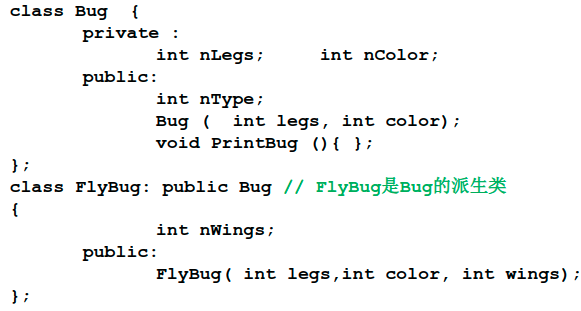
  * 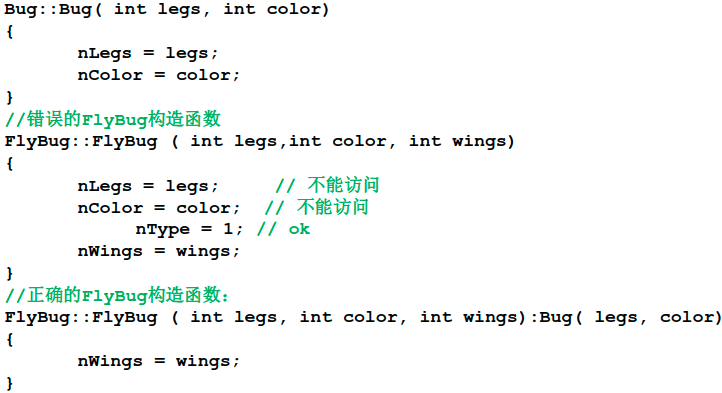
    * 创建派生类的对象时，需要创建好基类的对象（这点在内存上两者的位置也能看出）：初始化派生类对象中的从基类继承的成员。执行派生类构造函数之前，总是先执行基累的构造函数
    * 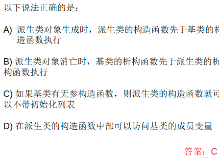
      * 调用基类构造函数的方式
        * 显式方式：在派生类的构造函数中，为基类的构造函数提供参数
          * derived::derived(arg_derived-list):base(arg_base-list)
        * 隐式方式：在派生类的构造函数中，省略基类的构造函数时，派生类的构造函数自动调用基类的默认构造函数
      * 派生类的析构函数被执行时，在执行完派生类的析构函数之后，自动调用基类的析构函数
    * 
    * 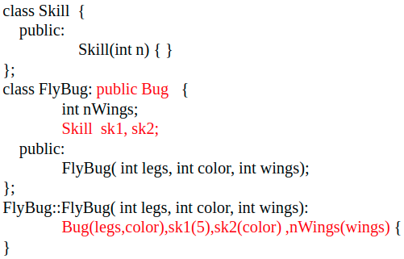

* public继承的赋值兼容规则

  * ```c++
    class base{};
    class dervied:public base{};
    base b;
    derived d;
    ```

    * 派生类的对象可以赋值给基类对象
      * b=d
    * 派生类对象可以初始化基类引用
      * base &br = d;
    * 派生类对象的地址可以赋值给基类指针
      * base *pb = &d;
    * 如果派生方式是private或protected，上面三条都不可以

* protected继承和private继承

  * ```c++
    class base{};
    class derived:protected base{};
    base b;
    derived d;
    ```

  * protected继承时，基类的public成员和protected成员成为派生类的protected成员

  * private继承时，基类的public成员成为派生类的private成员，基类的protected成员成为派生类的不可访问成员

  * protected和private继承不是“是”的关系

* 基类与派生类的指针强制转换

  * 公有派生的情况下，派生类对象的指针可以直接赋值给基类指针
    * Base *ptrBase = &objDerived;
    * ptrBase指向一个Derived类对象
    * *ptrBase可以看成一个Base类对象，访问其public成员直接通过ptrBase即可，但不能通过ptrBase访问objDerived对象中属于objDerived对象中属于Derived类而不属于Base类的成员
  * 即使基类指针指向一个派生类的对象，也不能通过基类指针访问基类没有而派生类中有的成员
  * 通过强制指针类型转换，可将ptrBase转换成Derived类的指针
    * Base *ptrBase = &objDerived;
    * Derived *ptrDerived = (Derived * ) ptrBase;
    * 一定要保证ptrBase指向一个Derived类对象，否则很容易出错
  * 
  * 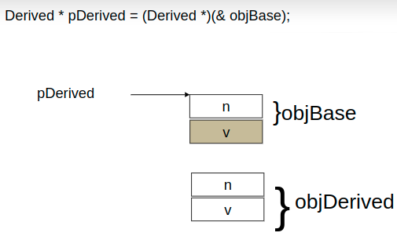

* 直接基类和间接基类

  * 类A派生类B，类B派生类C，类C派生类D，。。。
  * 
    * 类A是类B的直接基类
    * 类B是类C的直接基类，类A是类C的间接基类
    * 类C是类D的直接基类，类A,B是类D的间接基类
  * 在声明派生类时，只需要列出它的直接基类
    * 派生类沿着类的层次自动向上继承它的间接基类
    * 派生类的成员包括
      * 派生类自己定义的成员
      * 直接基类中的所有成员
      * 所有间接基类的全部成员

---

* 虚函数

  * 类定义中，前面有virtual关键字成员函数 == 虚函数

  * ```c++
    class base{
        virtual int get();
    };
    int base::get(){}
    ```

  * virtual关键字只用在类定义的函数声明中，写函数体时不用

* 多态表现形式1

  * 派生类的指针可以赋给基类指针
  * 通过基类指针调用基类和派生类中的同名 虚函数 时：
    * 若该指针指向一个基类的对象，那么被调用是基类的 虚函数
    * 若该指针指向一个派生类的对象，那么被调用的是派生类的虚函数
    * 这种机制就是 多态
  * 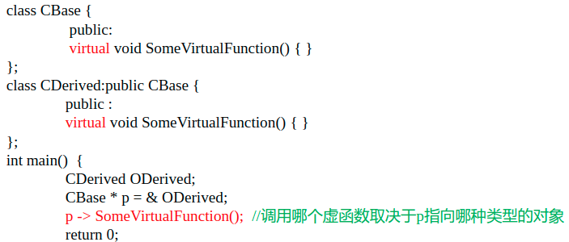

* 多态表现形式2

  * 派生类的对象可以赋给基类引用
  * 通过基类引用调用基类和派生类中的同名 虚函数 时：
    * 若该引用引用的是一个基类的对象，那么被调用的是基类的虚函数
    * 若该引用引用的是一个派生类的对象，那么被调用的是派生类的虚函数
    * 这也是多态
  * 

* 简单例子：

  * 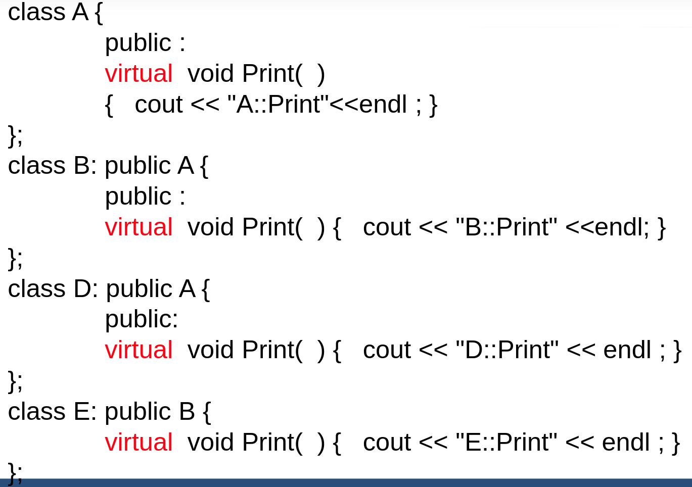
  * 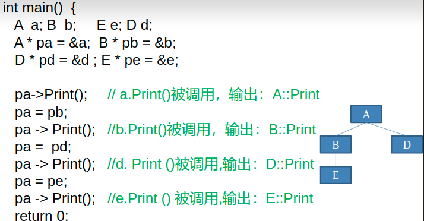

* 多态的作用

  * 面向对象的程序设计中使用多态，能增强程序的可扩充性，即程序需要修改或增加功能的时候，需要改动和增加的代码较少

* 在构造函数和析构函数中调用虚函数，不是多态。编译时已经确定，调用的函数是自己的类或基类中定义的函数，不会等到运行时才决定调用自己的还是派生类的函数

  * 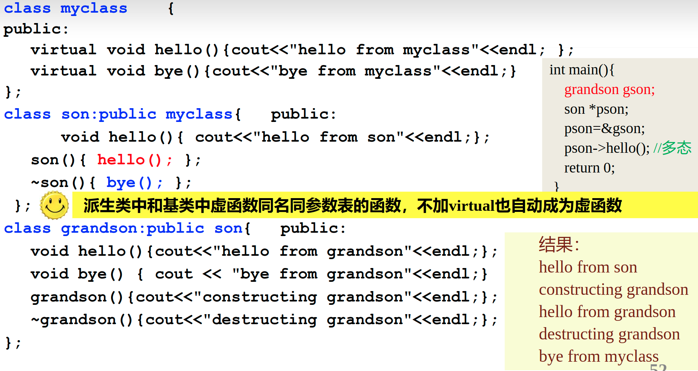

* 虚函数访问权限

  * 
  * 错误是因为fun2()是Base的私有成员，即使运行到此时实际上调用的是Derived的公有成员fun2()也不行，因为语法检查是不会检查运行结果的
  * 如果将Base中的private换成public，即使Derived中的fun2()是private的，编译依然能够通过，也能正常调用Derived::fun2()

* 多态的实现原理

  * 其关键在于通过基类指针或引用调用一个虚函数时，编译时不确定调用的是基类还是派生类的函数，运行时才会确定 -- 动态联编 ？

  * ```c++
    class Base{
        public:
        	int i;
        	virtual void Print(){ cout<<"Base::Print"; }
    };
    class Derived:public Base{
        public:
        	int n;
        	virtual void Print(){ cout<<"Drived:Print"<<endl; }
    };
    int main(){
    	Derived d;
        cout<<sizeof(Base)<<","<<sizeof(Derived);
        return 0;
    }
    // 程序运行输出结果：8，12或12，16
    // 程序运行输出结果：8，12
    // 为什么多4个字节？
    ```

* 多态实现关键 -- 虚函数表

  * 每个有虚函数的类（或有虚函数的类的派生类）都有一个虚函数类，该类的任何对象中都放着虚函数表的指针。虚函数表中列出了该类的虚函数地址。多出来的4个字节就是用来放虚函数表的地址
    * 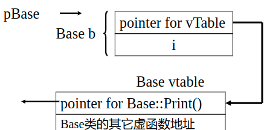
    * 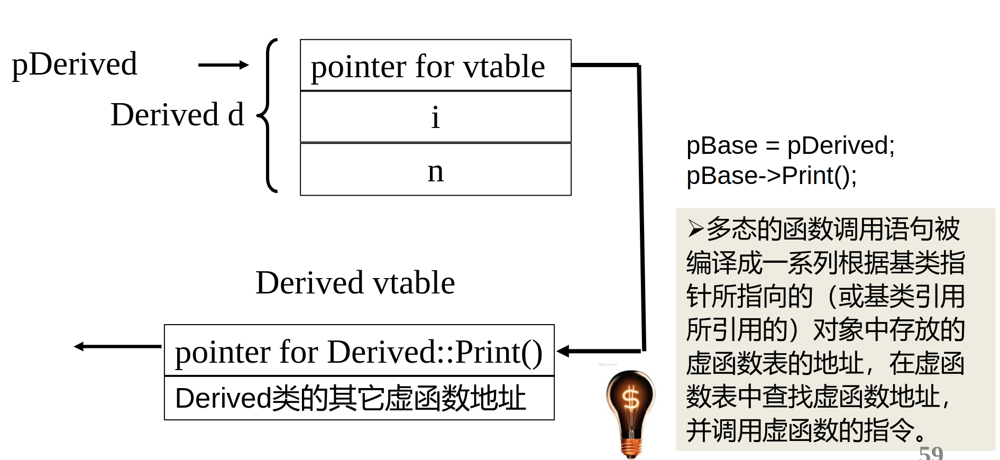

* 虚析构函数

  * 通过基类的指针删除派生类对象时，通常情况只调用基类的析构函数
    * 删除一个派生类的对象时，应该先调用派生类的析构函数，接着调用基类的析构函数
  * 解决办法：把基类的析构函数声明为virtual
    * 派生类的析构函数可以为virtual不进行声明
    * 通过基类的指针删除派生类对象时，首先调用派生类的析构函数，然后调用基类的析构函数
  * 一般来说，一个类定义了虚函数，就应该把析构函数也定义为虚函数。或者，一个类打算作为基类使用，就应该将析构函数定义为虚函数
  * 注意：不允许以虚函数作为构造函数
  * 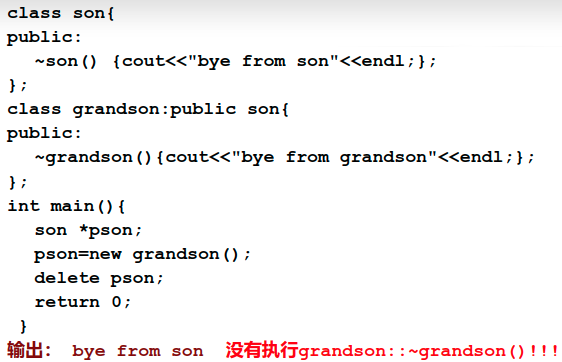
  * 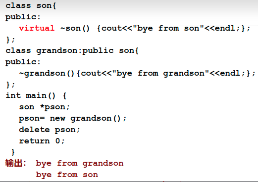

* 纯虚函数和抽象类

  * 纯虚函数：没有函数体的虚函数

    * ```c++
      class A{
          private:
          	int a;
          public:
          	virtual void Print() = 0; // 纯虚函数
          	void fun() { cout<<"fun"; }
      };
      ```

  * 包含纯虚函数的类叫抽象类

    * 抽象类只能作为基类来派生新类使用，不能创建抽象类的对象

    * 抽象类的指针和引用可以指向由抽象类派生出来的类的对象

      * ```C++
        A a;            // 错误，A是抽象类，不能创建对象
        A *pa;          // ok，可以定义抽象类的指针和引用
        pa = new A;     // 错误，A是抽象类，不能创建对象
        ```

  * 在抽象类的成员函数内可以调用纯虚函数，但在构造函数或析构函数内部不能调用纯虚函数

  * 如果一个类从抽象类派生而来，那么当且仅当它实现了基类中的所有纯虚函数，它才能成为非抽象类

  * 

  ---

* 函数模板和类模板

  * 能否写一个swap函数交换各种类型的变量？

    * 函数模板：

      * ```c++
        template <class T>
        void Swap(T &x, T &y){
            T tmp = x;
            x = y;
            y = tmp;
        }
        
        // 使用举例
        int main(){
            int n = 1,m=2;
            Swap(n,m);     // 编译器自动生成 void Swap(int &,int &)函数
            double f = 1.2,g=2.3;
            Swap(f,g);     // 编译器自动生成 void Swap(double &,double &)函数
            return 0;
        }
        ```

    * 函数模板中可以有不止一个类型参数

      * ```c++
        template <class T1,class T2>
        T2 print(T1 arg1,T2 arg2){
            cout<<arg1<<" "<<arg2<<endl;
            return arg2;
        }
        ```

    * 求数组最大元素的MaxElement函数模板

      * ```c++
        template <class T>
        T MaxElement(T a[],int size){   // size 是数组元素个数
            T tmpMax = a[0];
            for(int i = 1;i<size;++i)
                if(tmpMax<a[i])
                    tmpMax = a[i];
            return tmpMax;
        }
        ```

    * 不通过参数实例化函数模板

      * ```c++
        #include <iostream>
        using namespace std;
        template <class T>
        T Inc(T n){
            return 1+n;
        }
        int main(){
            cout<<Inc<double>(4)/2;   // 输出2.5
            return 0;
        }
        ```

* 函数模板的重载 形参表或类型参数表不同

  * ```c++
    template<class T1,class T2>
    void print(T1 arg1,T2 arg2){
        cout<< arg1 << " " << arg2 <<endl;
    }
    template<class T>
    void print(T arg1,T arg2){
        cout<< arg1 << " " << arg2 << endl;
    }
    template<class T,class T2>
    void print(T arg1,T arg2){
        cout<< arg1 << " " << arg2 << endl;
    }
    ```

  * 处理顺序

    1. 先找参数完全匹配的普通函数（并由模板实例化而得的函数）
    2. 再找参数完全匹配的模板函数
    3. 再找实参数经过自动类型转换后能匹配的普通函数
    4. 上面都找不到，则报错
    5. 
    6. 易看出，这里匹配模板函数时，不会进行类型自动转换

  * 函数模板示例：Map

    * ```c++
      template<class T,class Pred>
      void Map(T s, T e,T x, Pred op){
          for(;s!=e;++s,++x)
              *x = op(*s);
      }
      
      int a[5] = {1,2,3,4,5},b[5];
      Map(a,a+5,b,Square);         // 实例化出下面函数
      void Map(int *s,int *e,int *x,double (*op)(double)){
          for(;s!=e;++s,++x)
              *x = op(*s);
      }
      ```

* 类模板

  * 多快好省的定义出一批相似的类，定义类模板，然后由类模板生成不同的类
  * 数组 常见数据类型，元素可以是
    * 整数、学生、字符串...
  * 考虑一个可变长数组类，需要提供的基本操作
    * len()：查看数组长度
    * getElement(int index)：获取其中一个元素
    * setElement(int index)
  * 继续分析数组类：除了元素类型不同，其他完全相同
  * 类模板：类定义时，加上一个/多个类型参数。使用类模板时，指定类型参数应该替换成具体类型，编译器据此生成相应的模板类
    * 
      * class和typename一样的意思
    * 
  * 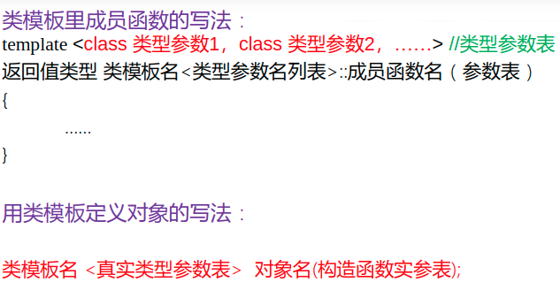
  * 实例：Pair类模板

