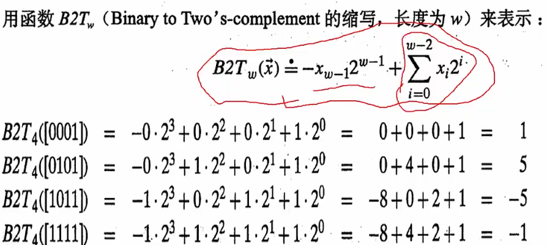

##### 从例子出发

```c++
int sum;     // 定义整型变量
int m = 1;
int n = 1;   
sum = m+n;   // 求和赋值
```

* 这个计算，在计算机内部到底发生了什么？
  * 数据类型内部结构
    * 每个变量都有数据类型，**数据类型**决定该变量所占**内存空间的大小和布局方式、空间能存储的值的范围，以及变量能参与的运算**
    * 
    * 这里`int`类型占用4个字节，这里是16进制2个位置也就是32位==4Bytes

| 名称                | 字节数 | 描述                        | 范围                                                         |
| :------------------ | ------ | --------------------------- | ------------------------------------------------------------ |
| char                | 1      | 字符或整数，8位             | 有符号：-128到127                                                 无符号：0到255 |
| short char（short） | 2      | 短整数，16位                | 有符号：-32768到32767                                       有符号：0到65535 |
| long int（long）    | 4      | 长整数，32位                | 有符号：-2147483648到2147483657                  无符号：0到4294967295 |
| int                 | 4      | 整数                        | 有符号：-2147483648到2147483647                     无符号：0到4294967295 |
| float               | 4      | 浮点数                      | 3.4e + / - 38 （7个数字）                                    |
| double              | 8      | 双精度浮点数                | 1.7e + / -308 (15 digits)                                    |
| long double         | 8      | 长双精度浮点数              | 1.7e + / -308 (15 digits)                                    |
| bool                | 1      | 布尔值。1/0；true/flase     | true / false                                                 |
| wchar_t             | 2      | 宽字符。存2字节长的国际字符 | 一个宽字符（1 wide characters）                              |

* 标识符
  * 标识变量、函数、类、模块，或任何其他用户自定义项目的名字
  * 以字母A-Z或a-z或下划线_开始，后跟零个或多个字母、下划线和数字（0-9）；如button_email1
  * 不允许以数字开头，内部不允许出现标点字符，如@、&和%
  * 区分大小写
  * 不能使用cpp关键字，长度<=32位
  * **命名规则**
    * 制定大部分项目成员满意的规则
    * 英文单词组合
    * 符合“min-length&&max-information”原则，`maxVal`比`maxValueUnitOverflow`好
    * **变量**尽量使用**`名词`或`形容词+名词`**，如`value`或`newValue`，避免使用名词中出现数字
    * **函数名**可使用`动词+名词`，如`DrawGraph`
    * 匈牙利命名法、驼峰式（Camel）或Pascal命名
      * 匈牙利：开头字母用变量类型缩写，其余部分用变量的英文或英文的缩写，要求单词第一个字母大写，如`int iMyAge;`
      * Camel：第一个单词首字母小写，后面其他单词首字母大写，如`int myAge;`
      * Pascal：每个单词的首字母大写，如`int MyAge;`

#### 变量与常量

* 变量：程序运行过程中，其值可以改变的量

  * 变量在程序执行中能够赋值，发生变化
  * 变量有一个名字，并在使用之前要说明其类型，一经说明，就在内存中占据与其类型相应的存储单元

* 常量：程序运行过程中，其值一直保持不变的量

  * 不同的类型：

  * 定义方式

    * 使用`#define`如：`#define PI 3.14`

    * 使用`const`如：`const double PI = 3.14;`

    * **尽量使用`const`定义变量，`#define`不会出现在编译期间**

    * ```c++
      #define AST 1.54              // 编译时出错，很难排错
      const double AST = 1.54;      // 编译时出错，可以排错
      ```

  * 类型

    * 整数常量：前缀表示进制，后缀表示有无符号/是否为长整型

      * `0x`或者`0X`表示16进制，`0(零)`表示8进制，不带前缀默认10进制

      * 后缀是U和L的组合，U表示无符号整数，L表示长整数。后缀可以大小写。

      * ```c++
        212      // 合法
        215u     // 合法 无符号整数
        0xFeeL   // 合法 16进制长整型没有超出范围
        078      // 非法 8进制8不是其数字
        032UU    // 非法 不能重复后缀    
        ```

    * 布尔常量

      * true == 真值
      * false == 假值

    * 字符常量

      * 括在单引号中。当常量以L（仅当大小时）（L'x'）开头，表示该字符常量占用一个宽字符（占用两个字节），必须存储在`wchar_t`类型变量中。否则，就是一个窄字符常量（如'x'），此时可以存储在`char`类型的简单变量中
      * 可以是一个普通的字符（如'x'）、一个转移序列（如'\t'），或一个通用字符（如'\u02C0'）

    * 运算符优先级

      * 高优先级的在表格上面，高优先级的优先被计算

      * 规则

        * **一元运算符优先级高于对应的二元运算符**
        * **不清楚，加括号**

      * | 类别 | 运算符                  | 结合性   |
        | ---- | ----------------------- | -------- |
        | 后缀 | ()[] -> . ++ --         | 从左到右 |
        | 一元 | +-！~++--(type)*&sizeof | 从右到左 |
        | 乘除 | */%                     | 从左到右 |
        | 加减 | +-                      | 从左到右 |
        | 移位 | <<>>                    | 从左到右 |
        | 关系 | <<=>>=                  | 从左到右 |

        

#### 运算符和表达式

* 运算符
  * 告诉编译器执行特定数学或逻辑操作的符号
  * 操作数据，数据被称为操作数
  * 种类
    * 算术运算符
    * 关系运算符
    * 逻辑运算符
    * 位运算符
    * 赋值运算符
    * 杂项运算符
      * `sizeof`返回变量大小。`sizeof(a)`返回4，a是整数
      * `Condition ？X:Y`条件运算符。若`Condition`为真，值为X，否则为Y
      * `,`逗号运算符会顺序执行一系列运算。整个逗号表达式的值是以逗号分割的列表中最后一个表达式的值
      * `.`和`->`成员运算符，用于引用类、结构和共用体的成员
      * `Cast`强制转换运算符符，将一种数据类型转换成另一种数据类型，如`int(2.2000)`返回`2`
      * `&`指针运算符，返回变量地址
      * `*`指针运算符，指向一个变量。例如`*var`指向变量`var`
* 表达式
  * 使用运算符将操作数连接成的式子
  * 特点
    * 常量与变量都是表达式
    * 运算符的类型对应表达式的类型，如，算术运算符对应算术表达式
    * 每个表达式都有自己的值，表达式都有运算结果

#### 注释

* 单行注释

  * ```c++
    int a = 1;    // 这是注释
    ```

* 多行注释

  * ```c++
    /* 这是注释 */ 
    /* 
     * 跨行注释
     * /
    ```

* 建议

  * 好的命名和代码本身就是最好的注释，代码本身很清楚，不需要注释
  * **重要代码段、或复杂**代码处**先写注释在写代码**，思路更清晰，同时保证代码和注释一致性
  * **更新了代码，注意更新注释**

#### 补码

* 使用加法来计算减法

  * > 现在是8点，3小时前是5点，9小时后，还是5点。为什么？
    >
    > 因为：8+9-12=5，还是5点
    >
    > 实际上进行了模运算，还有一个关键点，总共12个数
    >
    > 结论：
    >
    > ​	**8-3 和 8+9 的结果是一样的**
    >
    > 用9去表示-3
    >
    > 然后如果计算减法 8 - 3，直接在计算器上输入8+9
    >
    > 得到一张对照表：12清零
    >
    > 
    >
    > 5-3 ==> (5+9)%12 = 2
    >
    > 3-5 ==> 3+7 ==>  10%12 = 10 ==>  -2
    >
    > **凭什么有时候对应，有时候不对应？**2怎么不对应-10
    >
    > 修改表：**计算机内部其实就是用补码构造这样一张映射表**
    >
    > 
    >
    > 对应一半，去除一部分负数的对应
    >
    > 5-3 ==>  (5+9)%12 = 2 ==>  2
    >
    > 3-5 ==> (3+7)%12 = 10 ==> -2

* 计算方式

  * 正数：按位计算权重和
  * 负数：保留符号位，对后面每位取反+1
    * 

> ##### 机器数和真值
>
> * 机器数
>
>   * 数字在计算机中的二进制表示形式
>
>   * 机器数带符号，最高位存放一个数字的符号，正数为0，负数为1
>
>   * 比如：十进制数+3，就是 0000 0000 0000 0000 0000 0000 0000 0011
>
>   * ​           十进制数-3，就是  1000 0000 0000 0000 0000 0000 0000 0011
>
>     
>
> * 真值
>
>   * 真正的具有数学意义的数值
>   * 第一位是符号位，所以机器数的形式值不等于真正的数值
>   * 0000 0000 0000 0000 0000 0000 0000 0011  -->   +3
>   * 1111  1111 1111 1111 1111 1111 1111 1101 -->  -3
>
> ##### 无符号数的编码
>
> * 
>
> ##### 有符号数的补码
>
> * 

* 补码数值范围
  * 

#### 字节序（Byte Ordering）

* 一个字（32位机器采用32bits字长4bytes）在内存中如何以byte存放
  * 两个传统
    * 大端法（Big Endian）：IBM机器，Internet传输
      * 
    * 小端法（Little Endian）：Intel兼容机
      * 
      * 倒序

#### 位运算

* 左移
  * 
* 右移
  * 逻辑右移：移走的位填充为0
    * 
  * 算术右移：移走的位填充与符号位有关，负数的话填充1
    * 
  * **有符号数字，尽可能不要使用右移运算**
    * 到底逻辑右移还是算术右移 **取决于 编译器**

