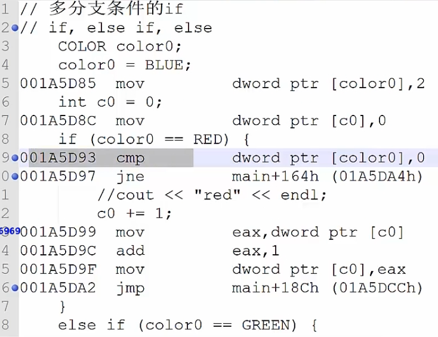

##### 三种基本程序结构

* 顺序、分支和循环

  * 

* `if`分支语句

  * 复合语句

    * 单一语句：任何一个表达式后加上分号`(;)`
    * 复合语句：用**一对花括号`{}`括起来的语句块**，语法上等效于一个单一的语句

  * `if`语句

    * 最常用的一种分支语句，也叫做条件语句

      * ```c++
        if(p!=NULL)
        {
            cout<<*p<<endl;
        }
        else
        {
            ;
        }
        ```

      * 比较好的编程规范是**`if`的花括号不允许不写**，即使只是一个单一语句

    * 单分支

      * 

      * ```c++
        if(p!=NULL)
        {
        	cout<<*p<<endl;
        }
        ```

    * 双分支

      * 

      * ```c++
        if(p!=NULL)
        {
            cout<<*p<<endl;
        }
        else
        {
            cout<<"no pointer"<<endl;
        }
        ```

    * 多分支

      * 

      * ```c++
        if(today == "星期六") {
            // todo something
        } else if(today == "星期日") {
            // todo something
        } else if(today == "星期一") {
            // todo something
        } else {
            // todo other things
        }
        ```

  * 小练习

    * 判断闰年

    * ```c++
      if(year%400==0||(year%4==0&&year%100!=0))
          return true;
      else return false;
      ```

      * **短路运算**

        * **`||`前面的条件满足，直接进入循环**
        * **`&&`前面条件不满足，后面的不进行判断**

      * 这里修改为

        * ```c++
          if((year%4==0&&year%100!=0)||(year%400==0))
          	return true;
          else return false;
          ```

      * 考虑的是命中率问题：大部分年份被4整除的概率更高，命中率高的放前面，效率更高

    * 判断一个整数是否是另一个数的倍数

      * ```c++
        if((a!=0)&&b%a==0)
            cout<<"是"<<endl;
        else cout<<"不是"<<endl;
        ```

        * **这里如果`a==0`后面不用判断了，除数不能为`0`**

    * 枚举

      * 这里的`typedef`没有具体的意义，就是定义了一个别名

      * ```c++
        typedef enum _COLOR{
            RED,
            GREEN,
            BLUE,
            UNKOWN
        }color;
        
        color color0;
        color0 = BLUE;
        if(color0==RED) cout<<"red"<<endl;
        else if(color0==GREEN) cout<<"green"<<endl;
        else if(color0==BLUE) cout<<"blue"<<endl;
        else cout<<"unkown color"<<endl;
        
        // switch分支
        color color1;
        color1=GREEN;
        switch(color1){
            case RED:{
                cout<<"red"<<endl;
                break;
            }
                
            case GREEN:{
                cout<<"green"<<endl;
                break;
            }
                
            case BLUE:{
                cout<<"blue"<<endl;
                break;
            }
                
            default:{
                cout<<"unknown color"<<endl;
                break;
            }
        }
        ```

* `switch`分支和`if`的对比

  * 
    * `jne`不相等就跳转
    * 层次越深，难卡
  * 
    * 先比较相等就跳转
    * 存在一个跳转表，满足就跳过去
    * 效率更高
  * 使用场景
    * `switch`只支持常量值固定相等的分支判断
    * `if`还可以判断区间范围
    * 用`switch`能做的，`if`都能做，但反过来不行
  * 性能比较
    * 分支少时，差别不大；分支多时，`switch`性能高
    * `if`开始处几个分支效率，后面效率降低
    * `switch`所有`case`速度几乎一样

* 自定义结构 -- 枚举
  * `#define`和`const`创建符号常量，使用`enum`不仅可以创建符号常量，还能定义新的数据类型
  * 枚举类型`enum`的声明和定义
    * 例如：`enum wT{Monday,Tuesday,Wednesday,Thursday,Friday,Saturday,Sunday};`
      * **声明：告诉编译器，这里有这种类型的变量，此时没有分配存储空间**
    * `wT weekday;`
      * **定义：分配存储空间**
    * 
      * `weekday = wT(1);`进行强制的类型转换就可以赋值`int`类型了
    * 这里的类型值不能作为左值（其本身不是变量，不能修改）
  * 使用细节
    * 枚举值不可以直接做左值
    * 非枚举变量不可赋值给枚举变量
    * 枚举变量可以赋值给非枚举变量
      * 其本身是`int`

* 自定义结构 -- 结构体和联合体

  * 使用`struct`定义的结构体

    * ```c++
      struct Student{
          char name[6];
          int age;
          Score s;
      };
      ```

  * 使用`union`定义的联合体

    * ```c++
      union Score{
          double sc;
          char level;
      };
      ```

    * **联合体：两个变量共同使用一个空间**

      * 所以**选择最大的那个内存空间作为整体**

    * 

      * **结构体数据对齐**
        * **以最长的个体作为单元考虑**
        * **是最大元素占用字节的整数倍**
        * 
        * 
        * 

  * 结构体数据对齐 -- 缺省对齐原则

    * 32位CPU
      * `char` : 任何地址
      * `short`：偶数地址
      * `int`：`4`的整数倍地址
      * `double`：`8`的整数倍地址
    * 修改默认编译选项
      * `Visual C++`
        * `#pragma pack(n)`
          * `#pragma pack(1)`
          * 
          * **尽量把小的放在一起**
        * `n`是几就按照多少的倍数来对齐
      * `g++`
        * `__attribute__(aligned(n))`
        * `__attribute__(__packed__)`

* 循环语句

  * `while、do while和for`

  * 

  * 计算`1+2+3+...+100`的和

    * 
      * 前面两个加载语句在赋值，后面比较语句，大于则跳出循环
      * 循环体最后会进行跳转到比较语句处
    * 
      * 逻辑与第一个循环类似，但是多了一次跳转，效率低一点
    * 
      * 进行一次跳转，效率最高

  * 例子：输出所有形状为`aabb`的四位完全平方数

    * ```c++
      int n=0;
      double m=0;
      for (int a = 1; a < 10; ++a) {
          for (int b = 0; b < 10; ++b) {
              n=a*1100+b*11;
              m=sqrt(n);
              if(m-int(m) < 0.000000001)
                  cout<<n<<endl;
          }
      }
      ```

  * 进行优化

    * ```c++
      int n = 0;
      int high,low;
      for (int i = 31; ; ++i) {
          n = i*i;
          if(n<1000)
              continue;  // 继续下一次循环
          if(n>9999)
              break;     // 退出循环
          high = n/100;  // 4567 --> 45
          low = n%100;   // 4567 --> 67
          if((high/10 == high%10) && (low/10==low%10))
              cout<<n<<endl;
      
      }
      ```

    * 双层循环变成单层循环，避免了**求平方根会造成性能降低**的操作

* 函数

  * 程序由若干个源程序构成，而一个源程序**由若干函数构成**，函数将一段**逻辑封装，便于复用**

  * 用户角度

    * 库函数：标准函数，由`C++`系统提供，比如：`strcpy_s`等等
    * 用户自定义函数：需要用户定义后使用，比如：自定义的判断闰年函数`isLeapYear`

  * 函数组成部分

    * 返回类型：一个函数可以返回一个值

    * 函数名称：函数的实际名称，函数名和参数列表构成了函数签名

    * 参数：参数列表包含函数参数的类型、顺序、数量。参数可选（可不带参数）

    * 函数体：函数体包含一组定义函数执行任务的语句

      * ```c++
        int Fib(int n){
            if(n==0)
                return 0;
            else if(n==1)
                return 1;
            else 
                return Fib(n-1)+Fib(n-2);
        }
        ```

        

  * 函数重载`overload`与`C++ Name Mangling`函数签名

    * 编译器将重载函数翻译成函数签名的形式区分函数名相同的函数

    * ```c++
      int test(int a);
      int test(double a);
      int test(int a,double d);
      ```

    * 问题

      * 给`int test(int a=1,double d=2.0);`赋值默认值，使用`int test(int a);`函数会报错
      * 给`int test(int a=1,double d);`赋初始值，也会提示错误
        * 解决方案 **函数指针**
          * `int(*p)(int);`：表示一个函数指针，指向的函数参数类型是`int`，返回值也是`int`
          * 让其指向`test`，之后调用即可
            * `p = test;int result = (*p)(1);`

* 指向函数的指针和返回指针的函数

  * 每一个函数都占用一段内存单元，它们有一个起始地址，**指向函数入口地址的指针称为函数指针**

    * 一般形式：数据类型（*指针变量名）(参数表);
      * `int(*p)(int);`

  * 与**返回指针的函数**的区别

    * ```c++
      int(*p)(int);      // 是指针，指向一个函数入口地址
      int* p(int);       // 是函数，返回的值是一个指针
      
      bool ProcessNum(int i,int j,int(*p)(int a,int b));
      char* strcpy(char *dest,const char *src);
      ```

  * 函数指针的使用

    * ```c++
      bool ProcessNum(int i,int j,int(*p)(int a,int b)){
          cout<<p(x,y)<<endl;
          return true;
      }
      int main(){
          int x=10,y=20;
          cout<<ProcessNum(x,y,MaxValue);   // 函数名称相当于函数指针
          cout<<ProcessNum(x,y,MinValue);   // 这里改变函数指针的指向
          cout<<ProcessNum(x,y,AddValue);
      }
      ```

* 命名空间
  * 
  * 这里能通过函数签名解决问题
  * `C++`程序中很容易出现同签名函数
    * 命名空间，作为附加信息区分不同库中相同名称的函数、类、变量等，命名空间即定义了**上下文**。本质上，**命名空间就是定义了一个范围**
    * 关键字：`using`和`namespace`的使用
      * 
      * 
      * 

* 函数体

  * 函数主体包含**一组定义函数执行任务的语句**

  * ```c++
    int MaxValue(int a,int b){
        return (a>b)?a:b;
    }
    int main() {
        MaxValue(1,4);
        return 0;
    }
    ```

  * 

    * **这里先传第二个参数入栈**，从右往左入栈（`cdc call`）`c`语言的调用方式
    * 所以这里**默认参数需要右边的先写**
    * 每个函数一个栈空间，每次调用结束，需要将恢复原来的上下文环境

* to be continued

