##### 序列型容器 -- 数组

* 概念

  * 代表内存里一组连续的同类型存储区

  * 可用来把多个存储区合并成一个整体

  * 比如

    * ```c++
      int arr[10] = {1,2,3,4,5,6};
      ```

* 数组声明

  * `int arr[10];`
  * 类型名称`int`表示数组里所有元素的类型
  * 名称`arr`是数组的名称
  * 整数`10`表示数组里包含的元素个数
  * 数组中元素个数不可改变

* 使用

  * 通过下标访问任意一个元素
  * 下标从0开始到元素个数减一为止
  * 超过范围的下标不可以使用
  * 数组名称和下标一起可以表示数组里的元素 `a[4]`

* 优点

  * 可以循环依次处理数组中所有元素

  * 循环变量依次代表所有有效下标

    * ```c++
      for(int index=0;index<len;++i)
          cout<<a[index];
      ```

> 问题：100m，每10米需要一个栏杆，总共需要多少个栏杆？
>
> 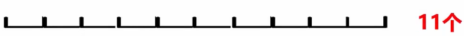

* off-by-one error（差一错误）

> 一个简单的问题：假定整数x满足边界条件 x>=16 并且 x<=37，那么此范围内 x 的可能取值个数有多少？
>
> 37 - 16 + 1 = 22
>
> 怎么利用编程技巧避免这种缺少了1的错误？

* 使用数学上的左闭右开区间`[,)`来表示范围

  * 问题转换为：x >= 16 并且 x <= 37  -->  (x >= 16 && x < 38)

    * 38 - 16 = 22

  * 遍历方式

    * ```c++
      for(int i=0;i<10;++i)
          cout<<a[i]<<" ";
      ```

  * 设计数组下标原则：**从0开始，使用非对称区间**

    * 让区间是一个非对称区间`[,)`
    * 让下界（左侧）可以取到值，让上界（右侧）取不到值
      * 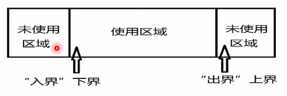
    * 这种设计的好处
      * 取值范围的大小：上界 - 下界
      * 若取值范围为空：上界值 = 下界值
      * 即使取值范围为空，上界值永远不可能小于下界值

* 数组的操作

  * 添加与删除

    * 尾部增加与删除：在尾部进行，时间复杂度`O(1)`
    * 中间增加与删除：中间进行，需要移动元素，平均复杂度`O(n)`

  * 访问与修改

    * 数组访问：时间复杂度`O(1)`

      * 下标方式：`a[2]=5`

      * 指针方式：

        ```c++
        int *p = a;
        *(a+2) = 5;
        ```

    * 查找：时间复杂度为`O(n)`，取决于数组容量

      * ```c++
        int a[] = {1,2,3,4};
        int len = sizeof(a) / sizeof(a[0]);  // 得到数组容量
        for(int i=0;i<len;++i)
            if(a[i] == 3)
                return i;
        ```

* 二维数组：包含行列两个维度的数组

  * 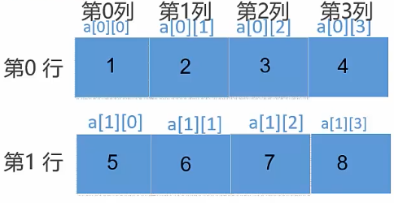

  * 访问

    * ``` c++
      int a[2][4] = {{1，2，3，4}，{5，6，7，8}}；
      for(int row=0;i<2;++i) {
          for(int col=0;i<4;++j)
              cout<<a[row][col]<<" ";
          cout<<endl;
      }
      ```

  * tips：循环时尽可能满足**“空间局部性”**

    * 一个小的时间窗口内，访问的变量地址越接近越好，执行速度更快
    * 一般来说，需要将**最长的循环放在最内层，最短的循环放在最外层**，减少CPU跨切循环层的次数

##### 新型数组：vector

* 面向对象方式的动态数组

  * 遍历操作

    * ```c++
      for(int i=0;i<vec.size();++i)
          cout<<vec[i]<<endl;
      ```

    * 可使用`vec`的`capacity`和`size`方法来查看`vector`当前容量和已经存储的元素个数

  * 插入操作

    * `vec.insert(--vec.end(),4);` 在中间进行元素插入操作
    * `vec.push_back(4);` 在尾部进行元素插入操作

  * 删除操作

    * `vec.pop_back();`
    * `vec.erase(vec.end()-1);`  `vec.end()`指向最后一个元素的后一个元素

##### 字符串与字符数组

* 字符串变量与常量

  * 字符串变量

    * 字符串是以空字符`\0` 结束的**字符数组**
    * 空字符串`\0`自动添加到字符串的内部表示中
    * 声明字符串变量时，应该在空结束符处预留一个额外元素的空间
      * `char strHelloWorld1[11] = {"helloworld"};`

  * 字符串常量

    * 字符串常量是一对双引号括起来的字符序列
    * 字符串中每个字符作为一个数组元素存储
      * `"helloworld"`
      * 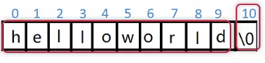

  * 字符表示

    * `0`，`'\0'`与`'0'`

      * 计算机内部机器码表示

      * ```c++
        char c1 = 0;       // 0x00
        char c2 = '\0';    // 0x00
        char c3 = '0';     // 0x30
        ```

    * ASCII码表

      * 使用指定7位或8位二进制数组合表示128或256中可能的字符
      * `0x41`（十进制65）对应`'A'`;`0x30`（十进制48）对应字符`'0'`
      * `0x61`（十进制97）对应`'a'`;`0x7F`（十进制127）对应字符DEL

> **字符表示**
>
> * Unicode编码：最初目的是把世界上的文字都映射到一套字符空间中
> * 为了表示`Unicode`字符集，有3种（确切来说5种）`Unicode`的编码方式
>   * `utf-8`：`1byte`表示字符，兼容`ASCII`码
>     * 存储效率高，变长（不方便内部随机访问），无字节序问题（可作为外部编码）
>   * `utf-16`：`2byte`表示字符。分为`utf-16be(big endian)`，`utf-15le(little endian)`
>     * 定长（方便内部随机访问），有字节序问题（不可作为外部编码）
>       * **不同平台使用的字节序不同，发端编码和收端解码方式不同**
>   * `utf-32`：`4byte`表示字符。分为`utf-32be`，`utf-32le`
>     * 定长（方便内部随机访问），有字节序问题（不可作为外部编码）
> * **编码错误的根本原因在于编码方式和解码方式的不统一**
>   * `windows`的文件可能有`BOM(byte order mark)`，若要在其他平台使用，可去掉`BOM`
> * 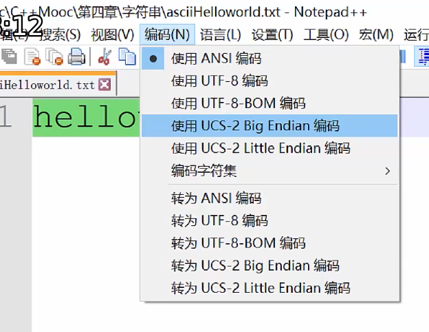
> * `utf-16`中前两个字节`FF FE`表示小端字节序，`FE FF`表示大端
>   * 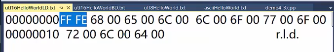

* 字符串的指针表示方法
  * `char *pStrHelloWorld = "helloworld";`
  * 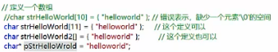
  * 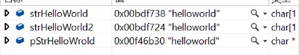
    * **前两个用数组定义的变量地址和最后一个用指针定义的变量地址不一样**
      * 不同的变量放在不同的内存区间
* `char[]`和`char*`区别
  * 地址和地址存储的信息
  * 可变与不可变
    * 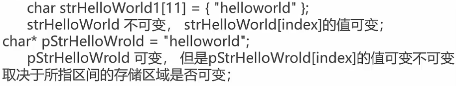
      * 原`pStrHelloWorld`指向一个常量区，值不允许改变
      * 指针变量可以指向任何区域，改变其指向，指向一个数组空间（变量区域），此时允许改变其值
    * 指向的**地址能否改变**
      * **数组变量名称 与 指针 有密切关系**
      * 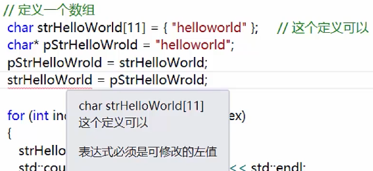
      * 定义的`strHelloWorld`本身作为一个**数组变量**，其**变量名本身不允许改变**，但里面**指向的区域的值可以改变**
      * 定义的`pStrHelloWorld`本身作为一个**指针变量**，其**变量名允许改变**，但是其指向的区域的值**可变不可变**取决于**指向的内存区域是否允许数据改变（常量区`or`变量区）**

* 字符串常见操作
  * 字符串长度：`strlen(s)`
    * 返回字符串`s`的长度，不包含`'\0'`
  * 字符串比较：`strcmp(s1,s2)`
    * 若`s1`和`s2`相同，返回`0`
    * 若`s1`< `s2`，返回值小于`0`
    * 若`s1`> `s2`，返回值大于`0`
      * 两个字符串从**左到右逐字符比较**（按照`ASCII`值大小比较），直到出现不同的字符或遇到`'\n'`为止
  * 字符串拷贝：`strcpy(s1,s2)`
    * 复制字符串`s2`到字符串`s1`
  * 复制指定长度字符串：`strncpy(s1,s2,n)`
    * 将字符串`s2`中前`n`个字符拷贝到`s1`
  * 字符串拼接：`strcat(s1,s2)`
    * 将字符串`s2`接到`s1`后面  `_CRT_SECURE_NO_WARNINGS`**去除底层关于安全方面的警告**
      * 预处理器定义中拉倒最后添加该宏
  * 查找字符串：`strchr(s1,ch)`
    * 指向字符串`s1`中字符`ch`第一次出现的位置
  * 查找字符串：`strstr(s1,s2)`
    * 指向字符串`s1`中字符串`s2`的第一次出现位置
  * **尽量使用`strlen_s,strcpy_s,strncpy_s,strcat_s`等`API`函数，更加安全**

* 字符串操作中的问题
  * 缓冲区溢出
    * 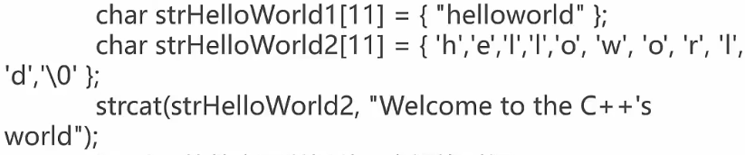
  * `strlen`的效率可以提升：空间换时间
    * `Redis`字符串的设计
    * 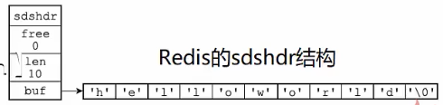
      * 单独存储**字符串长度`len`**
      * 字符串的**剩余容量信息`free`**

##### 新型字符串 -- string

* `c++`标准库中提供`string`类型专门表示字符串

  * ```c++
    #include <string>
    using namespace std;
    ```

* 使用`string`可以更方便和安全的管理字符串

* 定义字符串变量

  * ```c++
    string s;                   // 定义空字符串
    string s = "helloworld";    // 定义并初始化
    string s("helloworld");
    string s = string("helloworld");
    ```

* 字符串相关函数

  * 获取字符串长度

    * ```c++
      cout<<s.length()<<endl;
      cout<<s.size()<<endl;         // 本质与上面一样
      cout<<s.capacity()<<endl;     // 容量不一定与size一样
      ```

  * 字符串比较： `== != > < >= <=`

    * 比较原则与`char`字符串一样

  * 转换为`c`风格的字符串

    * ```c++
      const char *c_str1 = s1.c_str();
      cout<<"the c-style string c_str1 is " << c_str1<<endl;
      ```

  * 随机访问（获取字符串中某个字符）:`[]`

    * ```c++
      string s = "hello";
      s[0] = 'h';          // hello
      ```

  * 字符串拷贝：`=`

    * 'string s = s1;'

  * 字符串连接：`+、+=`

    * ```c++
      string s1 = "hello",s2 = "world"；
      string s3 = s1 + s2;    // s3:helloworld
      s1 += s2;               // s1:helloworld  
      ```

* 总结
  * `string`结合了`c++`的新特性，使用起来比原始的`c`风格更安全和方便，**对性能要求不是特别高的时候可以使用**

