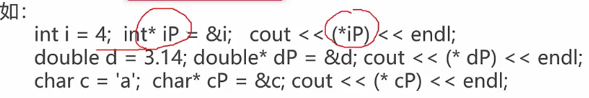
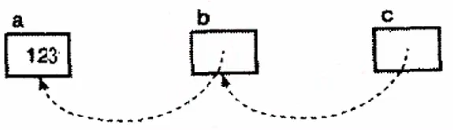
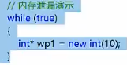

##### 计算机体系中的存储结构


##### C++中内存单元内容与地址

* 内存由很多内存单元组成。这些**内存单元用于存放各种类型的数据**
* 计算机对内存的每个内存单元进行了**编号，相当于内存地址**，地址决定了**内存单元在内存中的位置**
* **记住内存单元地址不方便**，**编译器**让我们通过**名字（变量名）访问内存位置**

> ```c++
> int a = 112,b=-1;
> float c = 3.14;
> int *d = &a;
> float *d = &c;
> ```
>
> 
>
> * 地址从大到小？
> * 变量`d e`存储的地址？

##### 指针的定义和间接访问操作

* **默认占用四个字节**

* 指针定义的基本形式：**指针本身是一个变量**，符合变量定义的基本形式，存储**值的地址**。对类型`Y`，`T*`是`“到T的指针”`类型，**一个类型为`T*`的变量能保存一个类型`T`的对象的地址**
  * 
* 通过一个指针访问它所指向地址的过程称为间接访问（indirection）或者引用指针（dereferencing the point）
  * 如：`cout<<(*d)<<endl; cout<<(*e)<<endl;`
  * 
* 变量、地址和指针变量小结
  * 一个变量有三个重要信息
    * 变量的地址信息
    * 变量所存的信息
    * 变量类型
      * 指针变量是一个专门用来记录变量的地址的变量；
    * 通过指针变量可以间接访问另一个变量的值

##### C++原生指针

> 
>
> * **指针变量的名字（地址）作为一个变量可以改变**，但其指向的内容是否可改变取决于该区域是否允许
> * **数组变量的名字（地址）不允许改变**，指向的区域的内容可以改变
>
> ##### 左值与右值
>
> * 概念
>   * **左值（一种变量或表达式）**，编译器为其**单独分配一块存储空间，可以取其地址**，**左值可以放在赋值运算符左边**
>   * **右值指的是数据本身**；**不能取到其自身地址**，右值只能赋值运算右边
>     * 前面的数组变量指向一个字符串就是一个右值
> * 具体分析
>   * **左值**最常见情况如**函数和数据成员的名字**
>   * **右值**是没有标识符、不可以取地址的表达式，**一般称为“临时对象”**
>     * 比如`a=b+c;`
>     * `&a`是允许的操作，而`&（b+c）`不能通过编译
>     * 因此`a`是一个左值，而`(b+c)`是右值

* 一般类型`T*`
  * `T`是一种泛型，**泛指任何一种类型**
    * 
    * 两个`*`意义不同
      * 前面是在**定义一个指针类型**，后面是在**取间接引用的值**
  * 指针的数组`(array of pointers)`与数组的指针`（a pointer to an array）`
    * 指针的**数组**`T* t[]`
    * 数组的**指针**`T(*t)[]`
    * 
      * 第二个是**一个指针 **
        * 指向包含了4个`int`元素的数组
        * 

* `const pointer`与`pointer to const`
  * 
  * 关于`const`修饰的部分
    * 当一个**变量用`const`修饰**，其在**运行期间的值不会发生改变**
      * 与编译器建立了连接
    * 看**左侧最近的部分**
    * **左侧没有，看右侧**
      * `char const *pStr1 = "helloworld";`这里`const`修饰的是`char`，表示其指向的区域内容不能改变
      * `char* const pStr2 = "helloworld";`这里`const`修饰的是`*`指针，表示其指向（地址/名称）不能改变
      * `char const * const pStr3 = "helloworld"：`两个`const`修饰了内容和地址，代表两个都不能改变
      * 

* 指向指针的指针

  * ```c++
    int a = 123;
    int* b = &a;
    int** c = &b;
    ```

  * 

    * `*`操作符具有**从右到左的结合性**

    * `**`这个表达式相当于`*(*c)`，必须从里到外逐层求值，两次间接访问到`a`

      * `*c`相当于`c`指向的位置，即`b`;
      * `**c`相当于`*b`，得到变量`a`的值

    * | 表达式 | 表达式的值 |
      | ------ | ---------- |
      | a      | 123        |
      | b      | &a         |
      | *b     | a，123     |
      | c      | &b         |
      | *c     | b，&a      |
      | **c    | *b，a，123 |

* 未初始化和非法的指针

  * ```c++
    int* a;
    *a = 12;
    ```

  * `a`指向何处？直接对`a`指向的区域进行赋值会发生什么？

    * 运气好：**定义到一个非法地址，程序出错，从而终止**
    * **最坏情况：定位到一个可以访问的地址，无意修改了，这样的错误难以捕捉，引发的错误无法定位**

  * 用指针进行间接访问之前，一定要确保其已经初始化，并被恰当的赋值****

* **`NULL`指针**

  * 一个特殊指针变量，其**不指向任何东西**
    * `int* a=NULL;`
  * 概念上很有用：表示**特定的指针目前未指向任何东西**
  * 注意事项
    * 对于一个指针，若已经知道初始化什么地址，请赋予这个地址值，否则将其**设置为`NULL`**
    * 对一个指针进行间接引用前，**先判断这个指针的值是否为`NULL`**
    * 

* 杜绝`野`指针

  * 指向`"垃圾"`内存的指针。`if`等判断对其不起作用，因为没有置`NULL`
  * 三种情况
    * 指针变量没有初始化
    * 已经释放不用的指针没有置`NULL`，如`delete`和`free`之后的指针
    * 指针操作超越了变量的作用范围
  * 指针使用注意：**没有初始化的、不用的或超出范围的指针把值置为`NULL`**

##### 指针的基本运算

* `&`与`*`运算符

  * ```c++
    char ch = 'a';
    char* cP = &ch;
    ```

    

    * 
      * `&ch`**放在赋值符号左边非法**：表达式是**取得`ch`变量的地址，放在一个内存空间中，是一个临时变量，没有变量去存储**，不能作为左值
      * `&cp`**放在赋值符号左边非法**：表达式是**取得`ch`指针变量的地址，放在一个内存空间中，是一个临时变量，没有变量去存储**，不能作为左值
    * 
      * `*cp`作为**左值**：**对其指向的内存空间进行赋值**
      * `*cp`作为**右值：取得`cp`指向的内存空间的值**
      * `*cp+1`：存在优先级问题，先取得内容，然后加一，作为右边（临时变量）没有问题；作为左值：不行，取出`cp`指向的内容加一存在一个临时变量中，不能对其赋值
      * `*(cp+1)`：作为左值：取得`cp`指向内存空间的地址加上4个字节的地址；作为右值：取得`cp`指向的内存空间的后一个的值
    * 

* `++`与`--`
  * 
    * `dword ptr[cp]`代表`cp`地址
    * `++cp`的前三行，将`cp`移动到寄存器中，完成加一操作后再挪回`cp`位置
    * `++cp`后两行，将`cp`位置的信息通过寄存器移动到`cp2`位置
    * `cp++`先完成移动操作，再完成加法操作
  * 
  * `++`进一步说明
    * 
    * `++cp` `cp`本身是指针，对其进行`++`操作会移动到后一个内存空间，**此时对其赋值（作左值）非法**，取得其地址合法（作为右值）
    * `cp++` 同上对其赋值非法，作为右值时
      * 先返回`cp`指向的`ch`的地址，然后对`cp`自增
    * 
      * 左值取得指向的空间，右值取得指向空间的值

* `++++`和`----`
  * 贪心法：一个字符一个字符的读入，若该字符能组成一个符号，就读入下一个字符，一直读到不能组成一个有意义的符号
  * 
  * 
    * `++(*(++cp))` 从右边往左边结合。右值关注内容，左值关注地址

##### 每行代码在内存单元中的地址位置

* 
  * 函数内定义的变量地址都在栈中，`new`出来的内存空间在堆区
    * 栈区从地址高处往低处长，堆从低处往高处长
  * 
    * 栈空间由系统决定，堆空间可以被程序员操作
    * `BSS`未初始化的区域可以经过一些优化
      * 比如全部赋值为0（做个标记，不需要占用空间）
    * 常量区在堆区和`BSS`（全局未初始化）区之间
    * `text`代码区

* 动态分配资源 -- 堆（heap）
  * 使用动态内存分配，使用堆是一件很自然的事情
  * 不确定性：内存分配耗时需要多久？失败了怎么办？在实时性要求比较高的情况，如一些嵌入式控制器和电信设备
  * 一般来说，在堆上分配内存时，很多语言会使用`new`的关键字，有的则是隐式分配。`C++`中`new`的对应词是`delete`，程序员完全接管内存分配与释放
    * 对`new`出来的空间进行释放
    * 
    * 这里`p4`是数组

* 分配和回收动态内存的原则
  * 三个内存管理器的操作
    * **分配一个某个大小的内存块**
    * **释放一个之前分配的内存块**
    * 垃圾收集操作，寻找不再使用的内存块并予以释放
      * 需要实现性能、实时性、额外开销等各方面的平衡，很难有统一和高效的做法
    * `C++`做了1、2两件事；而`Java`做了1、3两件事

* 资源管理方案 -- `RAII(Resource Acquisition Initialization)`

  * 依托于栈和析构函数，对所有的资源 -- 包括堆内存在内进行管理。
  * 成熟的智能指针代表：`std::auto_ptr`和`boost::shared_ptr`

* 几种变量的对比

  * |                  | 栈（stack）                            | 堆（heap）                                          |
    | ---------------- | -------------------------------------- | --------------------------------------------------- |
    | 作用域           | 函数体内，语句`{}`作用域               | 整个程序范围，由`new malloc`开始，`delete,free`结束 |
    | 编译期间大小确定 | 变量大小范围确定                       | 变量大小范围不确定，需要运行期确定                  |
    | 大小范围         | `windows`默认`1M`；`linux`默认`8M/10M` | 上限接近内存（虚拟内存）的一半                      |
    | 内存分配方式     | 地址由高到低减少                       | 地址由低到高增加                                    |
    | 内容是否可变     | 可变                                   | 可变                                                |

  * |                  | 全局静态存储区     | 常量存储区 |
    | ---------------- | ------------------ | ---------- |
    | 存储内容         | 全局变量；静态变量 | 常量       |
    | 编译期间大小确定 | 确定               | 确定       |
    | 内容是否可变     | 可变               | 不可变     |

* 内存泄露`(Memory Leak)`
  * 程序内已动态分配的**堆内存因为某种原因未释放或无法释放**，造成系统资源浪费，**导致程序运行速度减慢甚至系统崩溃等严重后果**
  * 发生原因和排查方式
    * **主要发生在堆内存分配方式**中，即“配置了内存后，所有指向该内存的指针都遗失了”。若缺乏`jvm`这样的垃圾回收机制，这样的内存片就无法归还给系统
    * 内存泄露属于程序运行中的问题，无法通过编译识别，**只能在程序运行过程中来判别和诊断**
    * 

* 比指针更安全的解决方案
  * 更安全的指针  --  智能指针
  * 不使用指针，更安全的方式  --  引用

* 智能指针

  * `unique_ptr、shared_ptr √、weak_ptr √`和`C++ 11`已经废弃的`（deprecated）auto_ptr`，在`C++ 17`中正式删除
  * 从应用方面分析几种智能指针
    * 应用场景
      * 对象所有权
      * 生命周期
    * 性能分析

  * `auto_ptr`
    * 
    * 由`new expression`获得对象，在`auto_ptr`对象销毁时，所管理的对象也会被自动`delete`
    * **所有权转移**：不小心把它传递给另外的智能指针，原来的指针就不能再拥有这个对象了，在拷贝/赋值过程中，会直接剥夺指针对原对象对内存的控制权，**转交给新对象，然后再将原对象指针置为`nullptr`**
    * 
      * 出现空指针


* 引用：一种**特殊的不允许修改的指针**
  * 指针的坑
    * 空指针
    * 野指针
    * 不知不觉改变了指针的值，却继续使用
  * 引用的好
    * 不存在空引用
    * 必须初始化
    * 一个引用永远指向它初始化的那个对象
  * 基本使用：认为是**指定变量的别名**
    * **使用时候认为是变量本身**
    * 
  * 问题
    * 有了指针为什么还需要**引用**？
      * 支持**函数运算符重载**
    * 有了引用为什么还需要指针？
      * 兼容`c`语言
  * **函数传递参数类型**
    * **对内置基础类型`如int、double等`而言，函数中传递时`pass by value`更高效**
    * **对`oo面向对象`中自定义类型而言，函数中传递时`pass by reference to const`更高效**

