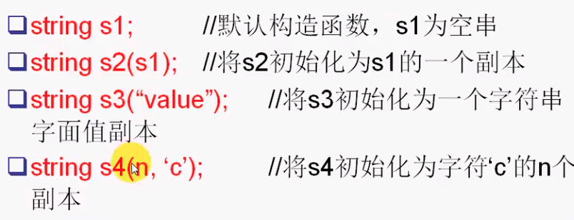
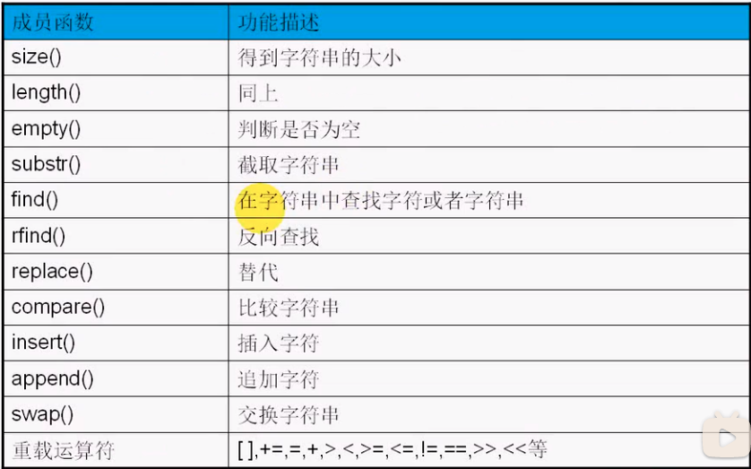

>#### 标准库类型
>
>| 类型     | 实际类型    | 对应`c`库                            |
>| -------- | ----------- | ------------------------------------ |
>| `string` | 字符串      | `char*`                              |
>| `vector` | 动态数组    | 静态数组`[]`                         |
>| `map`    | `key/value` | 存储结构：树`O(log2N)`；哈希表`O(1)` |

#### 目录

* `string`介绍
* `string`对象的定义与初始化
* 常用成员函数

##### 标准库`string`类型

* 长度可变的字符串

  * 标准库负责管理与存储字符相关的内存，以及提供各种有用的操作

* `typedef basic_string<char> string;`

  * 模板类

* `typedef basic_string<wchar_t> wstring;`

* 头文件

  * ```cpp
    #include <string>
    using std::string;
    ```

##### 对象定义与初始化

* 

```cpp
#include <string>
#include <iostream>
using namespace std;

int main()
{
    string s1;
    string s2("abcdefghi");
    cout << s2 << endl;

    basic_string<char> s3("xxx"); // 等价于string s2("xxx");
    cout << s3 << endl;

    string s4("abcdef", 4);
    cout << s4 << endl;

    string s5(s2, 2, 3); // 从下标2开始，3个元素
    cout << s5 << endl;

    string::iterator first = s2.begin() + 1;
    string::iterator last = s2.end();

    string s6(first, last); // [)
    cout << s6 << endl;

    return 0;
}
```

##### 常用成员函数

* 

* ```cpp
  #include <string>
  #include <iostream>
  using namespace std;
  
  int main()
  {
      string s1("abcdA");
      cout << s1.size() << endl;
      cout << s1.length() << endl;
      cout << s1.empty() << endl;
  
      cout << s1.substr(1, 2) << endl;
  
      cout << s1.substr(1) << endl;
      cout << s1.substr(1, -1) << endl;
      cout << s1.substr(1, string::npos) << endl;
  
      string::size_type pos = s1.find('A', 1);
      if (pos == string::npos)
          cout << "not found" << endl;
      else
          cout << "pos=" << pos << endl;
  
      pos = s1.rfind('d', 7);
      if (pos == string::npos)
          cout << "not found" << endl;
      else
          cout << "pos=" << pos << endl;
  
      string s2("abcdefghijkl");
      s2.replace(2, 2, "AAAAA");
      cout << s2 << endl;
  
      s2 = "abcdefg";
      s2.replace(s2.begin() + 1, s2.begin() + 4, "AAAA");
      cout << s2 << endl;
  
      string s3 = "xyzlmn";
      s3.insert(2, "MMMM");
      cout << s3 << endl;
  
      string s4 = "111";
      s3.swap(s4);
      cout << s3 << endl;
      cout << s4 << endl;
  
      return 0;
  }
  ```

##### 运算符重载

* ```cpp
  #include <string>
  #include <iostream>
  using namespace std;
  
  void fun(char *str)
  {
      cout << str << endl;
  }
  
  int main()
  {
      string s1 = "abc";
  
      s1[1] = 'B';
  
      cout << s1 << endl;
  
      const string s2 = "xyz";
      // s2[1] = 'Y'; // error s2[1]返回的是const char&
  
      // string s3 = "111" + "222" + s1; // 前两个至少有一个是对象，两个常量不能连接
      string s3 = "111" + s1 + "222";
  
      // s3.c_str();   //  返回 const char*
      // fun(s3);
      // fun(s3.c_str()); // const转换不了
      fun(const_cast<char *>(s3.c_str()));
  
      return 0;
  }
  
  // 2 重载运算符
  // operator char *();
  ```

##### 实现字符串去除左右空格

* ```cpp
  #ifndef _STRING_UTIL_H_
  #define _STRING_UTIL_H_
  
  #include <string>
  using namespace std;
  
  class StringUtil
  {
  public:
      static void LTrim(string &s);
      static void RTrim(string &s);
      static void Trim(string &s);
  };
  
  #endif // !_STRING_UTIL_H_
  // .cpp
  #include "stringutil.h"
  
  void StringUtil::LTrim(string &s)
  {
      string drops = " \t"; // 空格\t 表示空白字符
      s.erase(0, s.find_first_not_of(drops));
  }
  
  void StringUtil::RTrim(string &s)
  {
      string drops = " \t";
      s.erase(s.find_last_not_of(drops) + 1);
  }
  
  void StringUtil::Trim(string &s)
  {
      LTrim(s);
      RTrim(s);
  }
  // test.cpp
  #include <iostream>
  #include <string>
  #include "stringutil.h"
  using namespace std;
  
  int main()
  {
      string s = "   abcd    ";
      StringUtil::LTrim(s);
      cout << "[" << s << "]" << endl;
  
      StringUtil::RTrim(s);
      cout << "[" << s << "]" << endl;
  
      return 0;
  }
  ```
  
  

