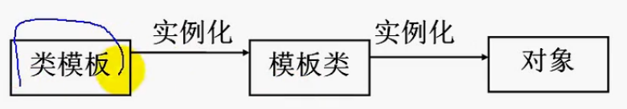
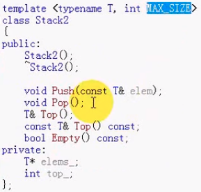
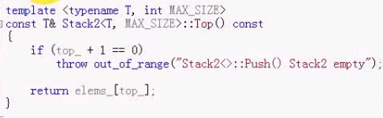

#### 目录

* 类模板
* 非类型模板参数

##### 类模板

* 将类定义中的数据类型参数化
  * `vector<int>`
* 函数模板的推广，将相同的类模板来组建任意类型的对象集合

##### 类模板定义

* ```cpp
  #include <exception>    // 异常类
  
  // 类声明
  template <typename T>
  class Stack
  {
  public:
      explicit Stack(int maxSize);  // 防止隐式转换
      ~Stack();
      
      void Push(const T& elem);
      void Pop();
      T& Top();
      const T& Top() const;  // 加const不能改变内部数据成员
      bool Empty() const;
  private:
      T* elems_;
      int maxSize_;
      int top_;
  };
  
  // 类实现
  template <typename T>
  Stack<T>::Stack(int maxSize):maxSize_(maxSize),top_(-1)
  {
  	elems_ = new T[maxSize_];
  }
  
  template <typename T>
  Stack<T>::~Stack()
  {
      delete[] elems_;
  }
  
  template <typename T>
  void Stack<T>::Push(const T& elem)
  {
      if(top_+1 >= maxSize_)
          throw out_of_range("Stack<>::push() stack full");
      elems_[++top_] = elem;
  }
  
  template <typename T>
  void Stack<T>::Pop()
  {
      if(top_+1 == 0)
          throw out_of_range("Stack<>::push() stack empty");
      -- top_;
  }
  
  template <typename T>
  T& Stack<T>::Top()
  {
      if(top_+1 == 0)
          throw out_of_range("Stack<>::push() stack empty");
      return elems_[top_];
  }
  
  template <typename T>
  constT& Stack<T>::Top() const
  {
      if(top_+1 == 0)
          throw out_of_range("Stack<>::push() stack empty");
      return elems_[top_];
  }
  
  template <typename T>
  bool Stack<T>::Empty() const
  {
      return top_+1 == 0;
  }
  ```

##### 使用类模板

* 实例化：具体的数据类型替换模板的参数得到具体的类（模板类）

* 模板类可实例化为对象

* 创建类模板的实例

  * `类名<类型实参表> 对象名称;`
  * 

  * 只能显式

##### 非类型模板参数

* 将值作为模板参数传递
* 

* 