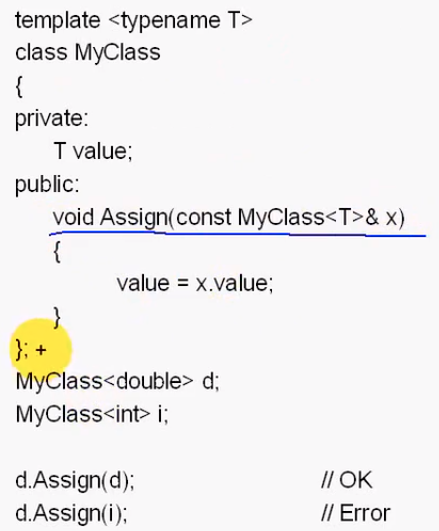
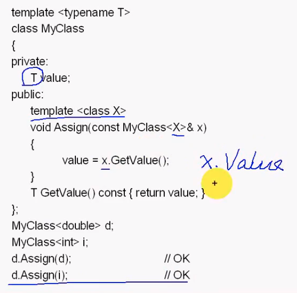

#### 目录

* 缺省模板参数
* 成员模板
* 关键字`typename`
* 派生类和模板
* 面向对象与泛型

##### 缺省模板参数

* 将使用的存储结构作为形参传递

  * `T*` 动态数组
    * 具有数组特征，空间不固定，但支持随机访问
  * 链表或队列

* `template <typename T, typename CONT=std::vector<T> >`

  * ```cpp
    #ifndef _STACK_H_
    #define _STACK_H_
    
    #include <deque>
    using namespace std;
    
    #include <exception> // 异常类
    
    // 类声明
    template <typename T, typename CONT = deque<T>>
    class Stack
    {
    public:
        Stack() : c_()
        {
        }
        ~Stack()
        {
        }
    
        void Push(const T &elem)
        {
            c_.push_back(elem);
        }
        void Pop()
        {
            c_.pop_back();
        }
        T &Top()
        {
            return c_.back();
        }
        const T &Top() const
        {
            return c_.back();
        }
        bool Empty() const
        {
            return c_.empty();
        }
    
    private:
        CONT c_;
        int top_;
    };
    
    #endif // !_STACK_H
    ```

  * ```cpp
    #include "stack.h"
    #include <iostream>
    
    #include <vector>
    using namespace std;
    
    int main()
    {
        Stack<int, vector<int>> s;  // 封装数据存储类型
        s.Push(1);
        s.Push(2);
        s.Push(3);
    
        while (!s.Empty())
        {
            cout << s.Top() << endl;
            s.Pop();
        }
        return 0;
    }
    ```

##### 成员模板

* 
* 使得成员函数中使用的数据成员类型可以**和成员变量类型不一致**
  * 
  * 不能访问**不同类型的私有成员**
* 要实现类型转换
  * `x=y`
    * 实现`=`号重载函数的成员模板
  * `auto_ptr<X> a(y);`
    * 实现复制构造函数的成员模板

##### 关键字`typename`

* ```cpp
  template <typename T>
  class MyClass
  {
  private:
      typename T::SubType *ptr; 
      // T 一个类型
      // ::SubType 类型中的一个静态数据成员
  };
  ```

* 没有`typename`关键字指定时

  * `T`一个类型
  * `::SubType`类型中一个静态数据成员
  * `*ptr`乘以`ptr`变量

* 有`typename`关键字

  * 作为一个公有数据成员

  * ```cpp
    template <typename T>
    class MyClass
    {
    private:
        typename T::SubType *ptr_;
    };
    
    class Test
    {
    public:
        typedef int SubType;
    };
    
    int main()
    {
        MyClass<Test> mc;
        return 0;
    }
    ```

##### 派生类与模板

* 为了运行效率，类模板相互独立
  * 独立设计，不使用继承
  * 对类模板扩展采用**适配器**`(adapter)`
* 通用性 – 设计出发点
  * 泛型算法和函数对象等手段
* 派生目标
  * 代码复用于程序通用 `MFC`
  * 充分利用前面的工作，完成一个复杂的工作
* 模板 – 运行效率 ；派生 – 编程效率

##### 面向对象与泛型编程

* 面向对象与泛型都依赖于多态
* 面向对象
  * 动态多态  –  虚函数
  * 静态多态  –  模板
* 派生在运行时存在继承关系
  * 编写这些类时，忽略基类与派生类之间的类型差异
  * 使用基类指针或引用，基类类型对象、派生类类型对象即可共享相同的代码
* 泛型编程
  * 类与函数可编译成不相关的类型。
  * 一个类或函数可用于操纵多种类型对象