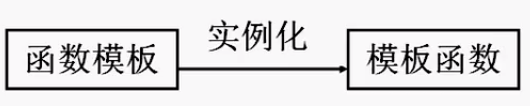
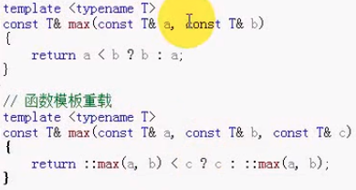

#### 目录

* 模板
* 函数模板
* 函数模板特化
* 重载函数模板

##### 问题

* 考虑求两数较大值函数`max(a,b)`
* 对于`a,b`的**不同类型**，都有**相同的处理形式**
  * `return a<b?b:a;`
* 用已有方法解决
  * 宏替换
    * `#define max(a,b) ((a)<(b)?(b):(a))`
    * 问题 
      * 避开了**类型检查**
      * 宏的副作用
  * 重载
    * 问题 
      * 每个类型提供一个重载版本，程序自己维护重载版本
  * 函数模板
    * 相同逻辑功能提供一个模板
    * **类型参数化**，编译器**实例化对应版本**的函数处理，不同版本由编译器维护
      * 编译器进行宏替换

##### 模板

* **参数化多态**工具
  * 将**对象类型**参数化，使得一段程序代码可用于处理多个不同类型的对象
* 模板编程，可以为各种逻辑功能相同而数据类型不同的程序提供**代码共享机制**

##### 模板分类

* 函数模板 `function template`
* 类模板 `class template`

##### 函数模板

* 一般形式

  * ```cpp
    template<模板形参表>
    返回值类型 函数名(模板函数形参表)
    {
        // 函数定义体
    }
    
    template <typename T>
    const T& max(const T& a,const T& b)
    {
        return a<b?b:a;
    }
    ```

* `template`后的`<>`是函数模板**参数列表**

* 类型参数，类型为`class or typename`

  * `template<class T>`
  * `template<class T1,class T2>`
  * 形参作为一种类型使用，作为函数**形参**、**函数返回值**和**函数局部变量**
  * 每个模板形参在函数**形参列表**中**至少出现一次**
  * 函数形参名作用域局限于函数模板范围内

##### 函数模板使用

* 为所有函数提供**唯一**的一段**函数代码**，增强函数设计的通用性
* 使用函数模板的方法是**先说明函数模板**，然后**实例化成相应的模板函数**进行调用执行
  * **函数模板**不是函数，**不能被执行**
  * **置换**代码中的**类型参数**得到**模板函数 – 实例化**
  * 实例化的**模板函数**是真正的函数，可以**被执行**
  * 
    * **编译过程实例化**

* 问题
  * 模板被**编译两次**
    * **实例化之前**，检查模板本身，查看**语法是否正确**
    * **实例化期间**，检查模板代码，查看所有**调用是否有效**
      * 如实例化类型不支持某些函数调用
  * **普通函数**只需**声明**，即可顺利编译
    * **模板编译**需要查看**模板定义（函数体）**
      * 模板声明与实现都放在头文件
    * 编译过程中需要进行**自动推导**，校验**调用是否合法**

##### 函数模板特化

* ```cpp
  template<>
  const char* const& max(const char* const& a,const char* const& b)
  {
      return strcmp(a,b) < 0?b:a;  // 比较指针内容，而不是指针本身
  }
  ```

##### 重载函数模板

* 

* 用一个函数重载一个同名函数模板

  * ```cpp
    const int& max(const int& a,const int& b)
    {
        return a < b ? b : a;
    }
    
    // 重载函数模板
    std::cout<<max('a',100)<<std::endl;     // 字符可以隐式转换成整型
    std::cout<<max(89,100)<<std::endl;      // 调用重载函数
    std::cout<<max<>(89,100)<<std::endl;    // 调用模板自动推导出的模板函数
    std::cout<<max<int>(89,100)<<std::endl;  // 显式调用模板推导函数
    std::cout<<max<int>('a',100)<<std::endl; // 显式调用模板推导函数
    ```

  * 