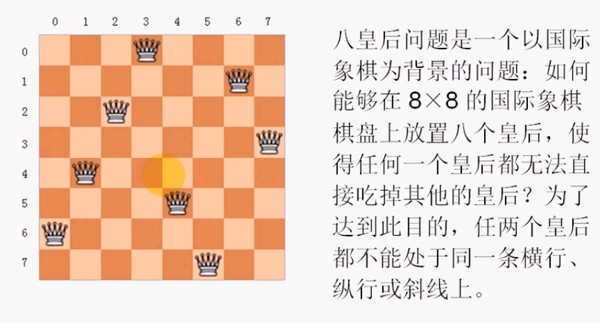
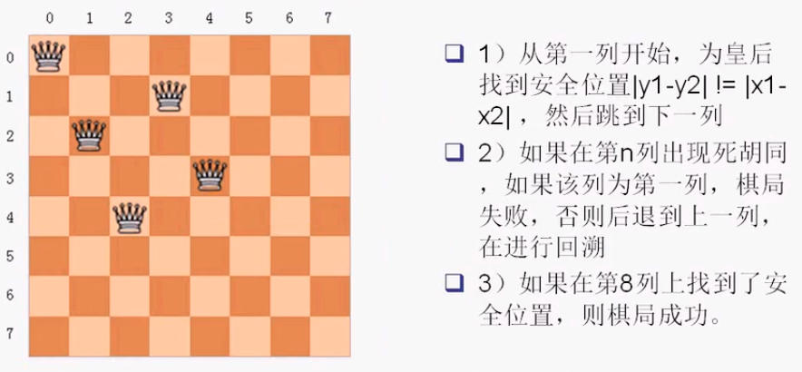
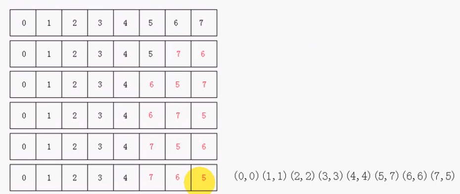

#### 问题描述

* 

#### 解决方案

* 回溯递归法（传统）

  * 
    * 斜率`-1 1`判断正对角线与副对角线

*  利用`stl`的`next_permutation`方法，得到下一个排列

  * ```cpp
    #include <iostream>
    using namespace std;
    #include <vector>
    #include <algorithm>
    
    void print_element(int n)
    {
        cout << n << " ";
    }
    
    int main()
    {
        int a[] = {1, 2, 3, 4};
        vector<int> v(a, a + 4);
    
        for_each(v.begin(), v.end(), print_element);
        cout << endl;
    
        // 获取下一个排列，直到没有排列为止
        while (next_permutation(v.begin(), v.end()))
        {
            for_each(v.begin(), v.end(), print_element);
            cout << endl;
        }
    
        return 0;
    }
    ```

  * 

  * ```cpp
    #include <cmath>
    #include <iostream>
    #include <vector>
    #include <algorithm>
    
    using namespace std;
    const int MAX = 8;
    
    vector<int> board(MAX);
    
    void show_result()
    {
        for (size_t i = 0; i < board.size(); ++i)
            cout << "(" << i << "," << board[i] << ")";
        cout << endl;
    }
    
    int check_cross()
    {
        for (size_t i = 0; i < board.size() - 1; ++i)
            for (size_t j = i + 1; j < board.size(); ++j)
                if ((j - i) == (size_t)abs(board[i] - board[j]))
                    return 1;
        return 0;
    }
    
    void put_chess()
    {
        while (next_permutation(board.begin(), board.end()))
            if (!check_cross())
                show_result();
    }
    
    int main()
    {
        // 初始化棋盘
        for (size_t i = 0; i < board.size(); ++i)
            board[i] = i;
        put_chess();
        return 0;
    }
    ```

    