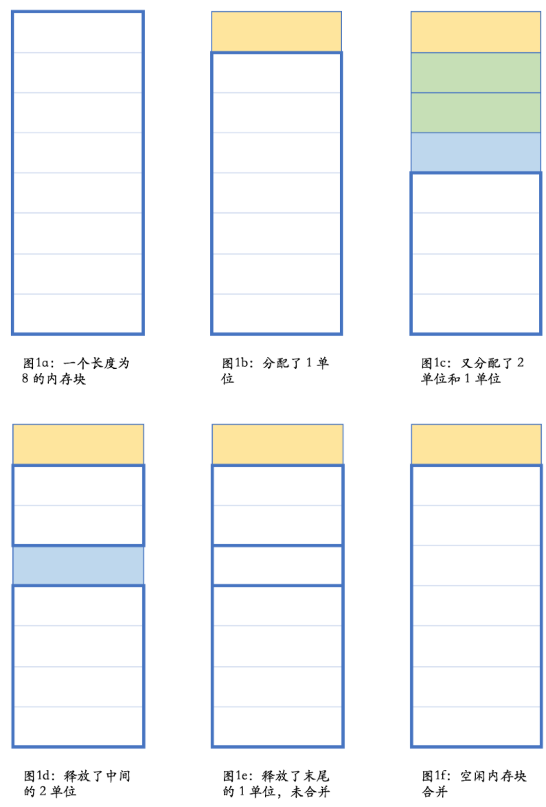
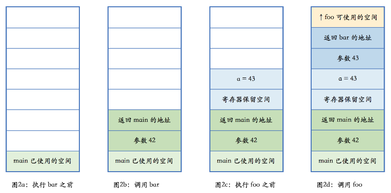

##### 基本概念

* 堆：在**内存管理的语境**下，指的是**动态分配内存的区域**

  * 与数据结构中的堆不是一回事

  * 指的是内存，被分配之后需要**手工释放**，否则会造成内存泄露

  * 堆的一个子集 -- C++中的**自由存储区** free store

    * 特指使用 new 和 delete 来分配和释放内存的区域

  * > new 和 delete 操作的区域是 free store
    >
    > `malloc` 和 free 操作的区域则是 heap
    >
    > * 但 new 和 delete 底层使用的是 `malloc` 和 free，所以 free store 也是 heap
    > * 没必要对这俩进行区分

* 栈：在内存管理的语境下，指的是**函数调用过程中产生的本地变量和调用数据的区域**

  * 与数据结构中的栈高度相似，都满足“后进先出” （last-in-first-out 或 LIFO）

* `RAII`：Resource Acquisition Is Initialization。是 C++ 特有的资源管理方式

  * 依托**栈和析构函数**，来对所有的资源——包括堆内存在内——进行管理。
  * 对 `RAII` 的使用，使得 C++ 不需要类似于 Java 那样的垃圾收集方法，也能有效地对内存进行管理。
  * `RAII` 的存在，也是垃圾收集虽然理论上可以在 C++ 使用，但从来没有真正流行过的主要原因

---

###### 堆

* 使用堆，或者说使用动态内存分配，是一件再自然不过的事情

* 在堆上分配内存（并构造对象）

  * ```c++
    // C++
    auto ptr = new std::vector<int>();
    // Java
    ArrayList<int> list = new ArrayList<int>();
    # Python
    lst = list()
    ```

* 动态内存带来的**不确定性**——内存分配耗时需要多久？失败了怎么办?

  * 至今仍有很多场合会禁用动态内存，尤其在**实时性要求比较高的场合**，如**飞行控制器和电信设备**

* 三个可能的内存管理器的操作

  1. 让内存管理器**分配**一个**某个大小**的内存块
  2. 让内存管理器**释放**一个**之前分配**的内存块
  3. 让内存管理器进行**垃圾收集**操作，寻找**不再使用的内存块并予以释放**

  > C++ 通常会做上面的操作 1 和 2。
  >
  > Java 会做上面的操作 1 和 3
  >
  > 而 Python 会做上面的操作 1、2、3
  >
  > 这是语言的特性和实现方式决定

* **三个操作都不简单，并且相互相关**

  * **分配内存**要考虑程序当前**已经有多少未分配的内存**
    * 内存不足时要从操作系统申请新的内存
    * 内存充足时，要从可用的内存里取出一块合适大小的内存，做簿记工作将其**标记为已用**，然后**将其返回给要求内存的代码**
    * 绝大部分情况下，可用内存都会比要求分配的内存大，所以**代码只被允许使用其被分配的内存区域**，而剩余的内存区域仍属于**未分配状态**，可以在后面的分配过程中使用
    * 内存管理器支持垃圾回收时，分配内存操作还可能触发垃圾收集
  * 释放内存不只是简单地把内存标记为未使用
    * **连续未使用的内存块**，通常内存管理器需要**将其合并成一块**，以便可以**满足后续的较大内存分配要求**
      * 目前的编程模式都要求申请的内存块是连续的
  * 垃圾收集操作有很多**不同的策略和实现方式**，以实现性能、实时性、额外开销等各方面的**平衡**
    * C++ 中不适用垃圾收集，这里则不重点讨论

* **分配过程**

  * 
    * 在图 `1e` 的状态下，内存管理器是满足不了长度大于 4 的内存分配要求的；
    * 而在图 `1f` 的状态，则长度小于等于 7 的单个内存要求都可以得到满足
  * 不考虑垃圾收集的情况下，**内存需要手工释放**；在此过程中，内存可能有**碎片化**的情况
    * 在图 `1d` 的情况下，虽然总共剩余内存为 6，但却满足不了长度大于 4 的内存分配要求

* 内存分配和释放的管理，是内存管理器的任务，一般情况下不需要介入。

  * 只需要正确使用 new 和 delete 

  * 每个 new 出来的对象都应该用 delete 来释放

  * 实际情况下，**漏掉 delete 导致“内存泄露”的情况颇多**

    * ```c++
      void foo()
      {
        bar* ptr = new bar();
        …
        delete ptr;
      }
      ```

      * **中间省略的代码部分**也许会**抛出异常**，导致最后的 `delete ptr` 得不到执行
      * 这个代码不符合 C++ 的惯用法
        * 在 C++ 里，这种情况下有 99% 的可能性不应该使用堆内存分配，而**应使用栈内存分配**

    * ```c++
      bar* make_bar(…)
      {
        …
        try {
          bar* ptr = new bar();
          …
        }
        catch (...) {
          delete ptr;
          throw;
        }
        return ptr;
      }
      
      void foo()
      {
        …
        bar* ptr = make_bar(…)
        …
        delete ptr;
      }
      ```

      * 更常见与合理的情况：分配和释放不在一个函数中
      * `todo`

###### 栈：更符合C++特性的内存分配

* ```c++
  void foo(int n)
  {
    …
  }
  
  void bar(int n)
  {
    int a = n + 1;
    foo(a);
  }
  
  int main()
  {
    …
    bar(42);
    …
  }
  ```

* 

* 栈是向上增长

  * 包括 `x86` 在内的大部分计算机体系架构中，栈的增长方向是低地址，因而**上方意味着低地址**

  * 任何一个函数，根据架构的约定，只能使用进入函数时**栈指针向上部分的栈空间**

  * 当函数**调用另外一个函数**时

    * 会把参数也压入栈里（此处忽略使用寄存器传递参数的情况）
    * 然后把**下一行汇编指令的地址压入栈**，并**跳转到新的函数**

  * 新的函数进入后，首先做一些**必须的保存工作**，**调整栈指针**，分配出**本地变量所需空间**

    * 执行函数中的代码，并在**执行完毕**之后，根据调用者**压入栈的地址**，**返回到调用者未执行的代码中继续执行**

  * 图中每种颜色都表示**某个函数占用的栈空间**

    * 这部分空间有个**特定的术语**，叫做栈帧（stack frame）

    * > `GCC` 和 Clang 的命令行参数中提到 frame 的，如 `-fomit-frame-pointer`，一般就是指栈帧

* 本地变量所需的内存就在栈上，跟函数执行所需的其他数据在一起。当函数执行完成之后，这些内存也就自然而然释放掉了

  * 栈上的**分配极为简单**，只是**移动一下栈指针**
  * 栈上的**释放也极为简单**，函数执行**结束时移动一下栈指针**即可
  * 由于后进先出的执行过程，**不可能出现内存碎片**

* 本地变量是简单类型，C++ 中称为 `PDD`类型 （plain old data）

  * 对于有构造和析构函数的非 `PDD` 类型的复杂类型，栈上内存分配同样有效

  * C++ 编译器在生成代码的合适位置，插入对构造函数和析构函数的调用

  * **编译器会自动调用析构函数，包括在函数执行发生异常的情况**

    * 发生**异常时对析构函数的调用**，栈展开（stack unwinding）

    * ```c++
      #include <stdio.h>
      
      class Obj {
      public:
        Obj() { puts("Obj()"); }
        ~Obj() { puts("~Obj()"); }
      };
      
      void foo(int n)
      {
        Obj obj;
        if (n == 42)
          throw "life, the universe and everything";
      }
      
      int main()
      {
        try {
          foo(41);
          foo(42);
        }
        catch (const char* s) {
          puts(s);
        }
      }
      
      // result
      Obj()
      ~Obj()
      Obj()
      ~Obj()
      life, the universe and everything
      ```

    * 不管是否发生了异常，`obj` 的析构函数都会得到执行

* C++ 里，所有的**变量缺省都是值语义**——如果不使用 `*` 和 `&` 的话，变量不会像 Java 或 Python 一样引用一个堆上的对象

  * 像智能指针这样的类型，`ptr->call()` 和 `ptr.get()`，语法上都是对的，并且 `->` 和 `.` 有着不同的语法作用

    * > `A.B` A 为对象或结构体
      >
      > A->B A 为指针，-> 是成员提取，A->B是提取A中的成员B，A只能是指向类、结构、联合的指针
      >
      > :: 是作用域运算符，A::B表示作用域A中的名称B，A可以是名字空间、类、结构
      >
      > : 一般用来表示继承
      >
      > 枚举类型::具体枚举值  `todo`

  * 在大部分其他语言里，访问成员只用 `.`，但在作用上实际等价于 C++ 的 `->`

  * > 值语义：对象的拷贝与原对象无关
    >
    > * 拷贝之后与原对象脱离关系
    >
    > * ```c++
    >   string a = "hello world";
    >   string b = a;
    >   ```
    >
    > * a 和 b 指向的不是同一个对象，两者并不相关

###### `RAII`

* C++ 支持**将对象存储在栈上面**。在很多情况下，对象**不该存储在栈上**

  * 对象**很大**
  * 对象的**大小在编译时不能确定**
  * 对象是**函数的返回值**，但由于特殊的原因，**不应使用对象的值返回**

* 在工厂方法或其他**面向对象编程**的情况下，**返回值类型是基类**

  * ```c++
    enum class shape_type {
      circle,
      triangle,
      rectangle,
      …
    };
    
    class shape { … };
    class circle : public shape { … };
    class triangle : public shape { … };
    class rectangle : public shape { … };
    
    shape* create_shape(shape_type type)
    {
      …
      switch (type) {
      case shape_type::circle:
        return new circle(…);
      case shape_type::triangle:
        return new triangle(…);
      case shape_type::rectangle:
        return new rectangle(…);
      …
      }
    }
    ```

  * `create_shape` 方法会返回一个 `shape` 对象，对象的实际类型是某个 `shape` 的子类

    * 圆啊，三角形啊，矩形啊，等等

  * 但是**定义的函数的返回值**只能是**指针或其变体形式**

    * 如果返回类型是 `shape`，实际却返回一个 `circle`，编译器不会报错，但结果多半是错的
      * 对象切片现象 （object slicing），C++ 特有编码错误
      * 对象复制相关的语义错误

  * 确保使用 create_shape 的返回值时不会发生内存泄露

    * 将返回值放在一个本地变量中，确保其析构函数会删除该对象即可

    * ```c++
      class shape_wrapper {
      public:
        explicit shape_wrapper(
          shape* ptr = nullptr)
          : ptr_(ptr) {}
        ~shape_wrapper()
        {
          delete ptr_;
        }
        shape* get() const { return ptr_; }
      private:
        shape* ptr_;
      };
      
      void foo()
      {
        …
        shape_wrapper ptr_wrapper(
          create_shape(…));
        …
      }
      ```

    * 注意 delete 空指针是合法的空操作

  * 在 `new` 一个对象和 `delete` 一个指针时编译器需要干不少活的

    * ```c++
      // new circle(…)
      {
        void* temp = operator new(sizeof(circle));
        try {
          circle* ptr =
            static_cast<circle*>(temp);
          ptr->circle(…);
          return ptr;
        }
        catch (...) {
          operator delete(ptr);
          throw;
        }
      }
      
      if (ptr != nullptr) {
        ptr->~shape();
        operator delete(ptr);
      }
      ```

    * `new` 的时候**先分配内存**（失败时整个操作失败并向外抛出异常，通常是 `bad_alloc`），然后**在这个结果指针上构造对象**（注意上面示意中的调用构造函数并不是合法的 C++ 代码）

      * **构造成功**则 `new` 操作整体完成，否则释放刚分配的内存并继续向外抛构造函数产生的异常

    * `delete` 时则**判断指针是否为空**，在指针**不为空时调用析构函数**并**释放之前分配的内存**

  * 回到 `shape_wrapper` 和它的析构行为

    * 在**析构函数里做必要的清理工作**，这就是 `RAII` 的基本用法

      * 关闭文件（`fstream` 的析构就会这么做）
      * 释放同步锁
      * 释放其他重要的系统资源

    * ```c++
      std::mutex mtx;
      
      void some_func()
      {
        std::lock_guard<std::mutex> guard(mtx);
        // 做需要同步的工作
      }
      ```

    * 而不是

      * ```c++
        std::mutex mtx;
        
        void some_func()
        {
          mtx.lock();
          // 做需要同步的工作……
          // 如果发生异常或提前返回，
          // 下面这句不会自动执行。
          mtx.unlock();
        }
        ```

  * 注意：上面的`shape_wrapper` 差不多就是个最简单的智能指针


##### 总结

* 讨论了 C++ 里内存管理的一些基本概念
* 栈是 C++ 里最“自然”的内存使用方式
* 使用基于栈和析构函数的 `RAII`，可以有效地对包括堆内存在内的系统资源进行统一管理

