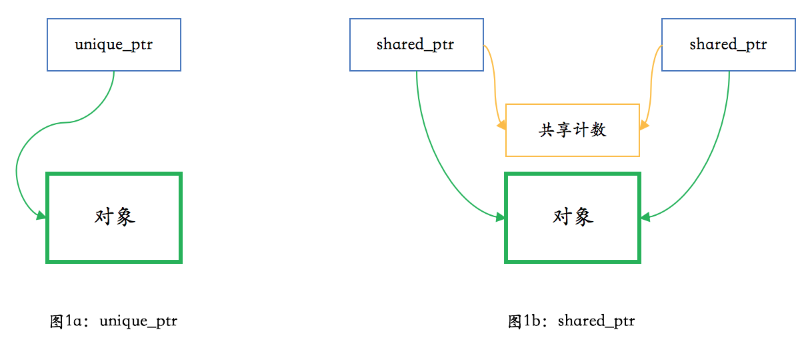

> 智能指针：`RAII`资源管理功能的自然展现
>
> #include <memory>
>
> * 用于帮助自动完成
>   * 程序使用new从堆（自由存储区）分配内存，不再需要时，应使用delete释放
>     * 作为一个类对象，析构函数在对象过期守，让其析构函数删除指向的内存
>   * 减少对象的复制

```c++
class shape_wrapper {
public:
  explicit shape_wrapper(
    shape* ptr = nullptr)
    : ptr_(ptr) {}
  ~shape_wrapper()
  {
    delete ptr_;
  }
  shape* get() const { return ptr_; }

private:
  shape* ptr_;
};
```

* 能完成智能指针的基本功能
  * 存在析构函数
    * 对超出作用域（比如大括号）的对象进行释放
  * 显式构造，防止
* **缺少**
  * 只适用于 `shape` 类
  * 类对象的行为不够像指针
  * 拷贝该类对象会引发程序行为异常
* 如何弥补？

##### 模板化和易用性

* 要使之能**包装任何类型的指针**，需要将其变成**类模板**

  * ```c++
    template <typename T>
    class smart_ptr {
    public:
      explicit smart_ptr(T* ptr = nullptr)
        : ptr_(ptr) {}
      ~smart_ptr()
      {
        delete ptr_;
      }
      T* get() const { return ptr_; }
    private:
      T* ptr_;
    };
    ```

  * 与 `shape_wrapper`对比，只是开头增加了模板声明 `template<typename T>`，然后吧代码中的 shape 替换成 模板参数 T 

* 模板使用

  * `shape_wrapper`  -->  `smart_ptr<shape>`  

* 与智能指针的差距

  * 不能用 * 运算符 解引用
  * 不能用 -> 运算符指向对象成员
  * 不能像指针一样用在布尔表达式中

* 解决方案

  * 加入成员函数

  * ```c++
    template <typename T>
    class smart_ptr {
    public:
      …
      T& operator*() const { return *ptr_; }
      T* operator->() const { return ptr_; }
      operator bool() const { return ptr_; }
    }
    ```

##### 拷贝构造与赋值

* 简称为拷贝

* 如何定义其行为

  * 示例代码

  * ```c++
    smart_ptr<shape> ptr1{create_shape(shape_type::circle)};
    smart_ptr<shape> ptr2{ptr1};
    ```

* 对于第二行，应该让其编译时出错，还是可以有一个合理的行为

  * 最简单情况：禁止拷贝

    * ```c++
      template <typename T>
      class smart_ptr {
        …
        smart_ptr(const smart_ptr&)
          = delete;
        smart_ptr& operator=(const smart_ptr&)
          = delete;
        …
      };
      ```

    * 禁用这两个函数非常简单，但却解决了一种可能出错的情况。

      * 不然`smart_ptr<shape> ptr2{ptr1};` 在编译时不会出错，但在运行时却会有未定义行为——由于会**对同一内存释放两次**，通常情况下会导致程序崩溃

  * 考虑在拷贝智能指针时把对象拷贝一份？

    * 使用智能指针的目的：减少对象的拷贝
    * 而且，指针类型是 shape ，但实际指向 circle 或 triangle 之类的子对象
      * C++ 中没有像 Java 的 clone 方法的约定
    * 一般来说，没有通用方法可以通过基类指针构造一个子类的对象
    
  * 拷贝时转移指针的所有权
  
    * ```c++
      template <typename T>
      class smart_ptr {
        …
        smart_ptr(smart_ptr& other)
        {
          ptr_ = other.release();
        }
        smart_ptr& operator=(smart_ptr& rhs)
        {
          smart_ptr(rhs).swap(*this);
          return *this;
        }
        …
        T* release()
        {
          T* ptr = ptr_;
          ptr_ = nullptr;
          return ptr;
        }
        void swap(smart_ptr& rhs)
        {
          using std::swap;
          swap(ptr_, rhs.ptr_);
        }
        …
      };
      ```
  
    * 拷贝构造函数中，通过调用 `other` 的 `release` 方法来释放它对指针的所有权
  
    * 在赋值函数中，则通过**拷贝构造产生一个临时对象**并**调用 `swap` 来交换对指针的所有权**
  
      * 赋值函数还有一个类似于 `if (this != &rhs)` 的判断的话，那种用法更啰嗦，而且异常安全性不够好
        * 若在赋值过程中发生异常的话，this 对象的内容可能已经被部分破坏了，对象不再处于一个完整的状态
  
    * 目前这种常用方法则**保证了强异常安全法**
  
      * **赋值**分为**拷贝构造和交换**两步
        * 异常只可能在第一步发生；而第一步如果发生异常的话，this 对象完全不受任何影响
        * 无论拷贝构造成功与否，结果只有赋值成功和赋值没有效果两种状态，而不会发生因为赋值破坏了当前对象这种场景
  
    * C++98 的 `auto_ptr` 的定义
  
    * `auto_ptr` 在 C++17 时已经被正式从 C++ 标准里删除
  
    * 最大问题是，它的行为会让程序员非常容易犯错。一不小心把它**传递给另外一个 `smart_ptr`**，**就不再拥有这个对象了**

##### “移动”指针

* `smart_ptr`如何使用“移动”来减少对象复制

* ```c++
  template <typename T>
  class smart_ptr {
    …
    smart_ptr(smart_ptr&& other)
    {
      ptr_ = other.release();
    }
    smart_ptr& operator=(smart_ptr rhs)
    {
      rhs.swap(*this);
      return *this;
    }
    …
  };
  ```

  * 把拷贝构造函数中的参数类型 `smart_ptr&` 改成了 `smart_ptr&&`
    * 拷贝构造函数 --> 移动构造函数
  * 把赋值函数中的参数类型 `smart_ptr&` 改成了 `smart_ptr`，在**构造参数时直接生成新的临时智能指针**，从而不再需要在函数体中构造临时对象
    * 现在赋值函数的行为是移动还是拷贝，完全依赖于构造参数时走的是**移动构造还是拷贝构造**

* 根据 C++ 的规则，如果**提供了移动构造函数而没有手动提供拷贝构造函数**，那**后者自动被禁用**（这些复杂的规则也是为了方便编程而设立）

  * ```c++
    smart_ptr<shape> ptr1{create_shape(shape_type::circle)};
    smart_ptr<shape> ptr2{ptr1};             // 编译出错
    smart_ptr<shape> ptr3;
    ptr3 = ptr1;                             // 编译出错
    ptr3 = std::move(ptr1);                  // OK，可以
    smart_ptr<shape> ptr4{std::move(ptr3)};  // OK，可以
    ```

* 以上就是 C++11 中的 `unique_ptr` 的基本行为

##### 子类指针向基类指针的转换

* 一个 `circle*` 是可以隐式转换成 `shape*` 的，但上面的 `smart_ptr<circle>` 却无法自动转换成 `smart_ptr<shape>`

* 添加模板代码：修改移动构造函数

  * ```c++
      template <typename U>
      smart_ptr(smart_ptr<U>&& other)
      {
        ptr_ = other.release();
      }
    ```

  * 利用了指针的转换特性：现在 `smart_ptr<circle>` 可以移动给 `smart_ptr<shape>`，但不能移动给 `smart_ptr<triangle>`

    * 不正确的转换会在代码编译时直接报错

  * 非隐式的转换，因为本来就是要写特殊的转换函数的

##### 引用计数

* `unique_ptr` 算是一种较为安全的智能指针，但**一个对象只能被单个 `unique_ptr`所拥有**，显然不能满足所有使用场合的需要
  * 多个智能指针同时拥有一个对象；当它们全部失效时，这个对象也同时被删除。这种则是 `shared_ptr`
  * `unique_ptr`和`shared_ptr`的主要区别
    * 
  * 多个不同的 `shared_ptr` 不仅可以**共享一个对象**，在共享同一对象时也需要**同时共享同一个计数**
  * 当最后一个指向对象（和共享计数）的 `shared_ptr` 析构时，它需要**删除对象和共享计数**

* 实现 `shared_ptr`

  * 共享计数接口

    * ```c++
      class shared_count {
      public:
        shared_count();
        void add_count();
        long reduce_count();
        long get_count() const;
      };
      ```

    *  `shared_count` 类除构造函数之外有三个方法：一个增加计数，一个减少计数，一个获取计数

      * 增加计数接口，不需返回计数值
      * 减少计数时需要返回计数值，供调用者判断**是否它已经是最后一个指向共享计数的 `shared_ptr`**

    * ```c++
      class shared_count {
      public:
        shared_count() : count_(1) {}
        void add_count()
        {
          ++count_;
        }
        long reduce_count()
        {
          return --count_;
        }
        long get_count() const
        {
          return count_;
        }
      
      private:
        long count_;
      };
      ```

  * 实现引用计数智能指针

    * 首先是构造函数、析构函数和私有成员变量

      * ```c++
        template <typename T>
        class smart_ptr {
        public:
          explicit smart_ptr(T* ptr = nullptr)
            : ptr_(ptr)
          {
            if (ptr) {
              shared_count_ =
                new shared_count();
            }
          }
          ~smart_ptr()
          {
            if (ptr_ &&
              !shared_count_
                 ->reduce_count()) {
              delete ptr_;
              delete shared_count_;
            }
          }
        
        private:
          T* ptr_;
          shared_count* shared_count_;
        };
        ```

      * 构造函数跟之前的主要不同点是会**构造一个 `shared_count` 出来**

      * 析构函数在看到 `ptr_` 非空时（此时根据代码逻辑，`shared_count` 也必然非空），需要**对引用数减一**，并在引用数降到零时彻底删除对象和共享计数

    * 新的swap函数

      * ```c++
          void swap(smart_ptr& rhs)
          {
            using std::swap;
            swap(ptr_, rhs.ptr_);
            swap(shared_count_,
                 rhs.shared_count_);
          }
        ```

    * 赋值函数可以跟前面一样，保持不变，但拷贝构造和移动构造函数是需要更新一下的

      * ```c++
          template <typename U>
          smart_ptr(const smart_ptr<U>& other)
          {
            ptr_ = other.ptr_;
            if (ptr_) {
              other.shared_count_
                ->add_count();
              shared_count_ =
                other.shared_count_;
            }
          }
          template <typename U>
          smart_ptr(smart_ptr<U>&& other)
          {
            ptr_ = other.ptr_;
            if (ptr_) {
              shared_count_ =
                other.shared_count_;
              other.ptr_ = nullptr;
            }
          }
        ```

      * 除复制指针之外，对于拷贝构造的情况

        * 需要在指针非空时 把引用数加一，并复制共享计数的指针

      * 对于移动构造的情况，不需要调整引用数，直接把 `other.ptr_` 置为空，认为 `other` 不再指向该共享对象即可
      
      * 存在问题：不能正确编译
      
          * > fatal error: ‘ptr_’ is a private member of ‘smart_ptr<circle>’
      
          * 错误原因是模板的各个实例间并**不天然就有 friend 关系，因而不能互访私有成员 `ptr_` 和 `shared_count_`。**
      
              * 需要在 `smart_ptr` 的定义中显式声明
      
              * ```c++
                    template <typename U>
                    friend class smart_ptr;
                  ```
      
      * 此外，之前的实现（类似于单一所有权的 `unique_ptr` ）中用 `release` **来手工释放所有权**。在目前的引用计数实现中，它就不太合适了，应当删除。但我们要加一个对调试非常有用的函数，返回引用计数值。定义如下
      
          * ```c++
                long use_count() const
                {
                  if (ptr_) {
                    return shared_count_
                      ->get_count();
                  } else {
                    return 0;
                  }
                }
              ```
      
    * 代码验证其正确性
    
      * ```c++
        class shape {
        public:
          virtual ~shape() {}
        };
        
        class circle : public shape {
        public:
          ~circle() { puts("~circle()"); }
        };
        
        int main()
        {
          smart_ptr<circle> ptr1(new circle());
          printf("use count of ptr1 is %ld\n",
                 ptr1.use_count());
          smart_ptr<shape> ptr2;
          printf("use count of ptr2 was %ld\n",
                 ptr2.use_count());
          ptr2 = ptr1;
          printf("use count of ptr2 is now %ld\n",
                 ptr2.use_count());
          if (ptr1) {
            puts("ptr1 is not empty");
          }
        }
        
        // result
        use count of ptr1 is 1
        use count of ptr2 was 0
        use count of ptr2 is now 2
        ptr1 is not empty
        ~circle()
        ```
    
    * 可以看到引用计数的变化，以及最后对象被成功删除

##### 指针类型转换

* 对应C++中不同类型强制转换

  * `static_cast`
  * `reinterpret_cast`
  * `const_cast`
  * `dynamic_cast`

* 智能指针需要实现类似的函数模板

  * 需要添加构造函数，允许在**对智能指针内部的指针对象赋值时**，使用一个**现有的智能指针的共享计数**。如下所示

  * ```c++
      template <typename U>
      smart_ptr(const smart_ptr<U>& other,
                T* ptr)
      {
        ptr_ = ptr;
        if (ptr_) {
          other.shared_count_
            ->add_count();
          shared_count_ =
            other.shared_count_;
        }
      }
    ```

* 实现一个 `dynamic_pointer_cast` 来示例一下

  * ```c++
    template <typename T, typename U>
    smart_ptr<T> dynamic_pointer_cast(
      const smart_ptr<U>& other)
    {
      T* ptr =
        dynamic_cast<T*>(other.get());
      return smart_ptr<T>(other, ptr);
    }
    ```

* 验证代码后面可以加上

  * ```c++
      smart_ptr<circle> ptr3 =
        dynamic_pointer_cast<circle>(ptr2);
      printf("use count of ptr3 is %ld\n",
             ptr3.use_count());
    ```

* 编译会正常通过，同时能在输出里看到下面的结果

  * > use count of ptr3 is 3

* 对象仍然能够被正确删除。这说明我们的实现是正确

##### 代码列表

* `smart_ptr`

* ```c++
  #include <utility>  // std::swap
  
  class shared_count {
  public:
    shared_count() noexcept
      : count_(1) {}
    void add_count() noexcept
    {
      ++count_;
    }
    long reduce_count() noexcept
    {
      return --count_;
    }
    long get_count() const noexcept
    {
      return count_;
    }
  
  private:
    long count_;
  };
  
  template <typename T>
  class smart_ptr {
  public:
    template <typename U>
    friend class smart_ptr;
  
    explicit smart_ptr(T* ptr = nullptr)
      : ptr_(ptr)
    {
      if (ptr) {
        shared_count_ =
          new shared_count();
      }
    }
    ~smart_ptr()
    {
      printf("~smart_ptr(): %p\n", this);
      if (ptr_ &&
        !shared_count_
           ->reduce_count()) {
        delete ptr_;
        delete shared_count_;
      }
    }
  
    template <typename U>
    smart_ptr(const smart_ptr<U>& other) noexcept
    {
      ptr_ = other.ptr_;
      if (ptr_) {
        other.shared_count_->add_count();
        shared_count_ = other.shared_count_;
      }
    }
    template <typename U>
    smart_ptr(smart_ptr<U>&& other) noexcept
    {
      ptr_ = other.ptr_;
      if (ptr_) {
        shared_count_ =
          other.shared_count_;
        other.ptr_ = nullptr;
      }
    }
    template <typename U>
    smart_ptr(const smart_ptr<U>& other,
              T* ptr) noexcept
    {
      ptr_ = ptr;
      if (ptr_) {
        other.shared_count_
          ->add_count();
        shared_count_ =
          other.shared_count_;
      }
    }
    smart_ptr&
    operator=(smart_ptr rhs) noexcept
    {
      rhs.swap(*this);
      return *this;
    }
  
    T* get() const noexcept
    {
      return ptr_;
    }
    long use_count() const noexcept
    {
      if (ptr_) {
        return shared_count_
          ->get_count();
      } else {
        return 0;
      }
    }
    void swap(smart_ptr& rhs) noexcept
    {
      using std::swap;
      swap(ptr_, rhs.ptr_);
      swap(shared_count_,
           rhs.shared_count_);
    }
  
    T& operator*() const noexcept
    {
      return *ptr_;
    }
    T* operator->() const noexcept
    {
      return ptr_;
    }
    operator bool() const noexcept
    {
      return ptr_;
    }
  
  private:
    T* ptr_;
    shared_count* shared_count_;
  };
  
  template <typename T>
  void swap(smart_ptr<T>& lhs,
            smart_ptr<T>& rhs) noexcept
  {
    lhs.swap(rhs);
  }
  
  template <typename T, typename U>
  smart_ptr<T> static_pointer_cast(
    const smart_ptr<U>& other) noexcept
  {
    T* ptr = static_cast<T*>(other.get());
    return smart_ptr<T>(other, ptr);
  }
  
  template <typename T, typename U>
  smart_ptr<T> reinterpret_pointer_cast(
    const smart_ptr<U>& other) noexcept
  {
    T* ptr = reinterpret_cast<T*>(other.get());
    return smart_ptr<T>(other, ptr);
  }
  
  template <typename T, typename U>
  smart_ptr<T> const_pointer_cast(
    const smart_ptr<U>& other) noexcept
  {
    T* ptr = const_cast<T*>(other.get());
    return smart_ptr<T>(other, ptr);
  }
  
  template <typename T, typename U>
  smart_ptr<T> dynamic_pointer_cast(
    const smart_ptr<U>& other) noexcept
  {
    T* ptr = dynamic_cast<T*>(other.get());
    return smart_ptr<T>(other, ptr);
  }
  ```

* `todo`
  * 添加了很多 `noexcept`

##### 总结

* 实现一个基本完整的带引用计数的智能指针
