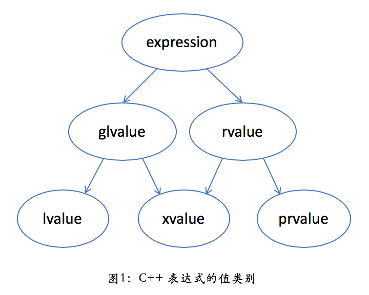
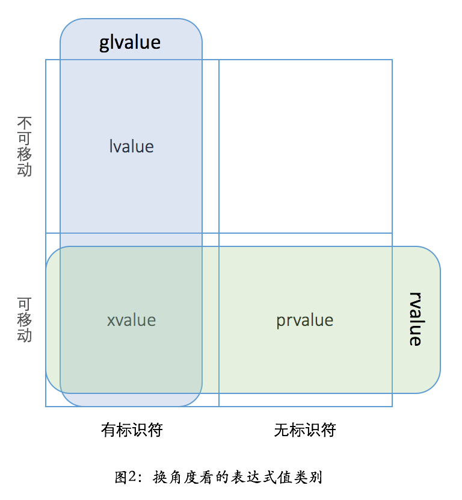

> 移动语义是 C++11 里引入的一个重要概念；理解这个概念，是理解很多现代 C++ 里的优化的基础

##### 值分左右

* C++ 里有左值和右值

* C++ 标准中规定的**值类别**（value categories）

  * 
  * 一个 `lvalue` 是通常可以放在等号左边的表达式，左值
  * 一个 `rvalue` 是通常只能放在等号右边的表达式，右值
  * 一个 `glvalue` 是 `generalized lvalue`，广义左值
  * 一个 `xvalue` 是 `expiring lvalue`，将亡值
  * 一个 `prvalue` 是 `pure rvalue`，纯右值

* 只看其中两个：`lvalue` 和 `prvalue`

  * 左值 `lvalue` 是**有标识符、可以取地址**的**表达式**，最常见的情况有

    * 变量、函数或数据成员的名字
    * 返回左值引用的表达式，如 `++x`、`x = 1`、`cout << ' '`
    * 字符串字面量如 `"hello world"`
    * 函数调用时，左值可以绑定到左值引用的参数，如 `T&`
      * 一个常量只能绑定到常左值引用，如 `const T&`

  * 纯右值 `prvalue` 是**没有标识符**、**不可以取地址**的表达式，一般也称之为**“临时对象”**

    * 返回非引用类型的表达式，如 `x++`、`x + 1`、`make_shared<int>(42)`
    * 除字符串字面量之外的字面量，如 `42`、`true`
    * 在 C++11 之前，右值可以绑定到常左值引用（`const lvalue reference`）的参数，如 `const T&`
      * 但不可以绑定到非常左值引用（`non-const lvalue reference`），如 `T&`

  * 从 C++11 开始，C++ 语言里多了一种引用类型——**右值引用**

    * 右值引用的形式是 `T&&`，比左值引用多一个 `&` 符号

    * 跟左值引用一样，可以使用 `const` 和 `volatile` 进行修饰，最常见情况

      * 不会用 `const` 和 `volatile` 来修饰右值

    * 带来了很多优化的可能性

      * 可以根据不同的引用类型，来选择不同的重载函数，来完成不同的行为

      * ```c++
        template <typename U>
        smart_ptr(const smart_ptr<U>& other) noexcept
        {
          ptr_ = other.ptr_;
          if (ptr_) {
            other.shared_count_->add_count();
            shared_count_ =
              other.shared_count_;
          }
        }
        template <typename U>
        smart_ptr(smart_ptr<U>&& other) noexcept
        {
          ptr_ = other.ptr_;
          if (ptr_) {
            shared_count_ =
              other.shared_count_;
            other.ptr_ = nullptr;
          }
        }
        ```

      * 使用右值引用的第二个重载函数中的变量 `other` 算是左值还是右值呢？

        * `other` 是个变量的名字，变量有标识符、有地址，所以它还是一个左值——虽然它的类型是右值引用

      * 拿这个 `other` 去调用函数时，它匹配的也会是左值引用

        * **类型是右值引用的变量是一个左值！**
        * 毕竟对于一个右值引用的变量，你是可以取地址的，这点上它和左值完全一致

* ```c++
  smart_ptr<shape> ptr1{new circle()};
  smart_ptr<shape> ptr2 = std::move(ptr1);
  ```

  * 第一个表达式里的 `new circle()` 就是一个纯右值
    * 对于指针，通常使用值传递，并不关心它是左值还是右值
  * 第二个表达式里的 `std::move(ptr)`
    * 作用是把一个左值引用强制转换成一个右值引用，而并不改变其内容
      * `std::move(ptr1)` 等价于 `static_cast<smart_ptr<shape>&&>(ptr1)`
    * `std::move(ptr1)` 的结果是指向 `ptr1` 的一个右值引用，这样构造 `ptr2` 时就会选择上面第二个重载
  * 把 `std::move(ptr1)` 看作是**一个有名字的右值**
    * 跟无名的纯右值 `prvalue` 相区别
    * 把这种表达式叫做 `xvalue`
      * 仍然是不能取地址的，这点和 `prvalue`相同
      * 所以 `xvalue` 和 `prvalue` 都被称为右值 `rvalue`
    * 
    * “值类别”（value category）和“值类型”（value type）是两个看似相似、却毫不相干的术语
      * 前者指的是上面这些左值、右值相关的概念
      * 后者则是与引用类型（reference type）相对而言，表明一个变量是**代表实际数值**，还是**引用另外一个数值**

* 在 C++ 里，所有的原生类型、枚举、结构、联合、类都代表值类型，只有引用（`&`）和指针（`*`）才是引用类型

* 在 Java 里，数字等原生类型是值类型，类则属于引用类型

* 在 Python 里，一切类型都是引用类型

##### 生命周期和表达式类型

* 一个变量的**生命周期**在**超出作用域**时结束

  * 一个变量代表一个对象，当然这个对象的生命周期也在那时结束

* 一个临时对象`(prvalue)`会在**包含这个临时对象的完整表达式估值完成后**、按生成顺序的逆序被销毁，除非有生命周期延长发生

  * `process_shape(circle(), triangle());`

  * 生成了临时对象，一个圆和一个三角形，它们会在 `process_shape` 执行完成并生成结果对象后被销毁

  * 插入别的代码，演示这个行为

    * ```c++
      #include <stdio.h>
      
      class shape {
      public:
        virtual ~shape() {}
      };
      
      class circle : public shape {
      public:
        circle() { puts("circle()"); }
        ~circle() { puts("~circle()"); }
      };
      
      class triangle : public shape {
      public:
        triangle() { puts("triangle()"); }
        ~triangle() { puts("~triangle()"); }
      };
      
      class result {
      public:
        result() { puts("result()"); }
        ~result() { puts("~result()"); }
      };
      
      result
      process_shape(const shape& shape1,
                    const shape& shape2)
      {
        puts("process_shape()");
        return result();
      }
      
      int main()
      {
        puts("main()");
        process_shape(circle(), triangle());
        puts("something else");
      }
      ```

    * 输出结果 （两个临时对象的销毁顺序没有规定）

      * ```c++
        main()
        circle()
        triangle()
        process_shape()
        result()
        ~result()
        ~triangle()
        ~circle()
        something else
        ```

    * 为了方便对临时对象的使用，C++ 对临时对象有**特殊的生命周期延长规则**

      * > 如果一个 `prvalue` 被绑定到一个引用上，它的生命周期则会延长到跟这个引用变量一样长。

    * 对上面的代码只要改一行就能演示这个效果。把 `process_shape` 那行改成

      * ```c++
        result&& r = process_shape(
          circle(), triangle());
        ```

    * 结果

      * ```c++
        main()
        circle()
        triangle()
        process_shape()
        result()
        ~triangle()
        ~circle()
        something else
        ~result()
        ```

      * 这里则是延长了 `result` 的生命周期，析构被延长到了main的最后

    * 这条生命期延长规则只对 `prvalue` 有效，而对 `xvalue` 无效

      * `prvalue` 在绑定到引用以前已经变成了 `xvalue`，那生命期就不会延长

      * ```c++
        #include <utility>  // std::move
        …
        result&& r = std::move(process_shape(
          circle(), triangle()));
        ```

    * 代码输出就回到了前一种情况

      * 虽然执行到 something else 那儿我们仍然有一个有效的变量 `r`，但它指向的对象已经不存在了，对 `r` 的解引用是一个未定义行为
      *  `r` 指向的是栈空间，通常不会立即导致程序崩溃，而会在某些复杂的组合条件下才会引致问题……

    * 生命期延长规则，在后面讲到视图（view）的时候会十分有用

      * 有些 C++ 的用法实际上会隐式地利用这条规则

  * 可以把一个没有虚析构函数的子类对象绑定到基类的引用变量上，这个子类对象的析构仍然是完全正常的

    * 因为这条规则只是延后了临时对象的析构而已，不是利用引用计数等复杂的方法，因而只要引用绑定成功，其类型并没有什么影响

##### 移动的意义

* 初学之时，更重要的是理解为什么，和熟练掌握基本的用法
* 