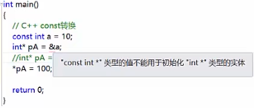
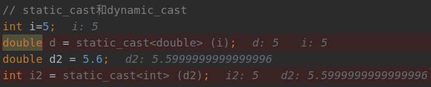
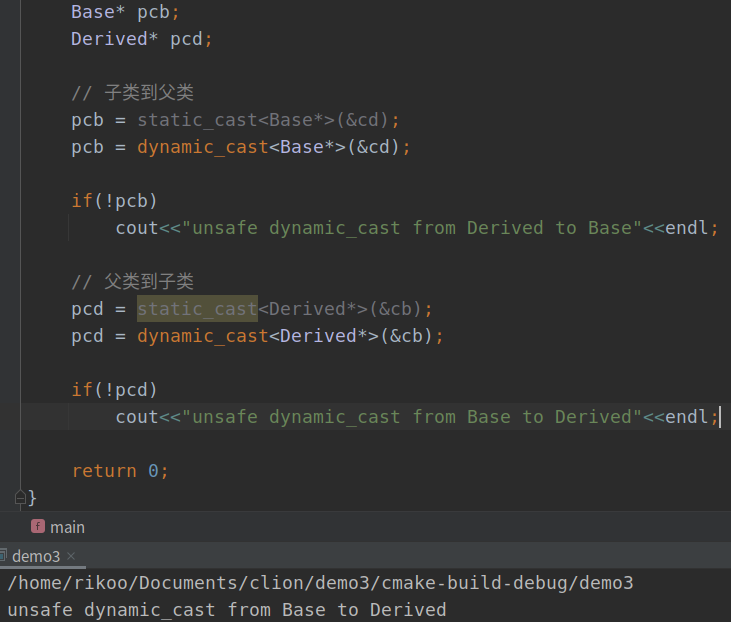
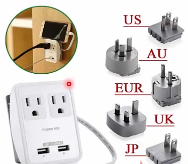

##### 架构 == 将军统领大军

* 模式 == 基于经验总结出的对于一些普通存在的问题提供的通用的方案
  * 单例模式
  * 观察者模式
* 软件中的模式
  * 面向对象常见`23`种设计模式
    * 
  * 反模式
  * 企业应用架构模式

* 单例模式

  * 情景：需要整个程序中只有一个实例

    * 系统日志，`windows`资源管理器窗口，数据库分配主键操作

  * 实现思路

    * `Singleton`拥有一个私有构造函数，确保用户无法通过`new`直接实例化它

    * 包含一个静态私有成员变量`instance`与静态公有方法`Instance()`

    * ```c++
      // .h
      class Singleton {
      public:
          // 只有静态方法才能访问静态变量
          static const Singleton* getInstance();  
          static void DoSomething();
      
      // 不想让外部随意访问构造函数
      private:
          Singleton();
          ~Singleton();
      
          // static静态变量，所在区域：全局区（一开始就会产生），可见区域：私有
          static Singleton *This;  // 静态变量帮助解决资源分配与释放
      
      };
      // .cpp
      #include "Singleton.h"
      #include <iostream>
      
      // 懒汉，需要时再构造
      //Singleton* Singleton::This = nullptr;
      // 饿汉
      Singleton* Singleton::This = new Singleton();
      using namespace std;
      const Singleton *Singleton::getInstance() {
          // 当前不存在实例
          if(!This) {
              This = new Singleton();
          }
          // 当前存在实例，直接返回即可
          return This;
      }
      ...
      void Singleton::DoSomething() {
          cout<<"do something"<<endl;
      }
      ```

* 观察者（Observer）模式

  * **观察者需要直接订阅目标事件；在目标发出内容改变的事件后，直接接收事件并做出响应**，对象常是一对多关系

  * 常见：`MVC`框架，`Model`的变化通知各种类型的`View`时都存在

  * 实现思路

    * 将**问题职责解耦合，将`Observable`和`Observer`抽象开**，分清抽象和 实体

    * ```c++
      // .h
      // 观察者接口
      class Observer {
      public:
          // 实现都在被观察者类中，故此头文件的实现类可以删除
          // 纯虚函数，子类实现；
          // 当被观察者对象发生变化时，通知被观察者调用该方法
          virtual void Update(void* pArg) = 0;
      };
      // .h
      // 被观察接口
      #include <list>
      #include <string>
      #include "Observer.h"
      class Observer;
      using namespace std;
      // 被观察者
      class Observerable {
      public:
          Observerable();
          virtual ~Observerable();
      
          // 注册观察者
          void Attach(Observer *pOb);
          // 反注册观察者
          void Detach(Observer *pOb);
      
          int GetObserverCount() const;
      
          void DetachAll();
      
          virtual void GetSomeNews(string str){
              SetChange(str);
          }
      
      protected:
          // 有变化，需要通知
          void SetChange(string news);
      private:
          bool _bChange;
          // 通知观察者
          void Notify(void *pArg);
          // 被观察者列表
          list<Observer*> _Obs;
      };
      // .cpp
      // 被观察者实现类
      #include "Observerable.h"
      Observerable::Observerable():_bChange(false) {}
      Observerable::~Observerable() {}
      void Observerable::Attach(Observer *pOb) {
          if(!pOb) {
              return ;
          }
      
          // 当前列表是否有这个观察者
          auto it = _Obs.begin();
          for(;it!=_Obs.end();it++)
              if(*it == pOb)
                  return;
      
          _Obs.push_back(pOb);
      }
      
      void Observerable::Detach(Observer *pOb) {
          if(!pOb || _Obs.empty())
              return;
          _Obs.remove(pOb);
      }
      
      void Observerable::SetChange(string news) {
          _bChange = true;
      
          Notify((void*)news.c_str());
      }
      
      int Observerable::GetObserverCount() const {
      
          return _Obs.size();
      }
      
      void Observerable::DetachAll() {
          _Obs.clear();
      }
      
      void Observerable::Notify(void *pArg) {
          if(!_bChange) return;
      
          // 遍历观察者
          for (auto it = _Obs.begin(); it != _Obs.end(); it++)
              (*it)->Update(pArg);
          _bChange = false;
      }
      // 调用
      #include <iostream>
      #include "Observer.h"
      #include "Observerable.h"
      
      using namespace std;
      
      class News:public Observerable{
      public:
          void GetSomeNews(string str){
              SetChange("News:"+str);
          }
      };
      
      class User1:public Observer {
      public:
          void Update(void *pArg) override {
              cout<<"user1 got news:"<<(char*)pArg<<endl;
          }
      };
      
      class User2:public Observer {
      public:
          void Update(void *pArg) override {
              cout<<"user2 got news:"<<(char*)pArg<<endl;
          }
      };
      
      int main() {
          User1 u1;
          User2 u2;
      
      
          News n1;
          n1.GetSomeNews("T0");
          cout<<n1.GetObserverCount()<<endl;
      
          n1.Attach(&u1);
          n1.Attach(&u2);
          n1.GetSomeNews("T1");
          cout<<n1.GetObserverCount()<<endl;
      
          n1.Detach(&u2);
          n1.GetSomeNews("T2");
          cout<<n1.GetObserverCount()<<endl;
      
          n1.DetachAll();
          n1.GetSomeNews("T3");
          cout<<n1.GetObserverCount()<<endl;
          return 0;
      }
      ```

> ###### void*、NULL和nullptr
>
> * `c`语言中
>
>   * `#define NULL ((void *)0)`：`NULL`用来处理空指针
>   * `void*`万能指针
>
> * `c++`中
>
>   * ```c++
>     #ifndef NULL
>     	#ifdef _cplusplus
>     		#define NULL 0
>     	#else
>     		#define NULL ((void *)0)
>     #endif
>     ```
>
>     * 若没有定义`NULL`
>       * **直接定义成`0`**
>     * 若有，则还是使用`c`的定义方法
>
> * **`c++11`中，`nullptr`代替`(void*)0`，`NULL`只表示`0`**
>
> ###### 类型转换
>
> * `c`类型转换
>
>   * 隐式类型转换
>     * `double f = 1.0/2;`
>   * 显式类型转换
>     * `(类型说明符)(表达式)`
>     * `double f = double(1)/double(2);`
>   * 问题
>     * **任何类型都可以互相转换，编译器不判断正确性**
>     * 难以在源码中定位
>
> * `c++`类型转换
>
>   * `const_cast`
>
>     * 用于转换指针或引用，**去掉类型的`const`属性**
>     * 
>
>   * **`reinterpret_cast`：很危险！**
>
>     * 重新解释类型，不会检查指向内容和指针类型本身
>
>     * 要求转换前后类型所占内存大小一致，否则引发编译时错误
>
>     * ```c++
>       int Test() {
>           cout<<"test"<<endl;
>           return 0;
>       }
>       
>       // main.cpp
>       // 定义函数指针 ： 返回值void，参数也是void
>       typedef void(*FuncPtr)();
>       FuncPtr funcPtr;
>       //    funcPtr = &Test;
>       // 这里转换成无返回值的编译器也没有报错！！！
>       funcPtr = reinterpret_cast<FuncPtr>(&Test);
>       // 调用函数
>       funcPtr();
>       ```
>
>   * **`static_cast`：基本类型转换**
>
>     * **有继承关系类对象和类指针之间的转换**，由程序员来**确保转换是安全**的，不会产生动态转换的类型安全检查的开销
>     * 
>     * 从`double`转换到`int`**丢失精度**
>
>   * **`dynamic_cast`：用于继承关系**
>
>     * 只能用于含虚函数的类，必须用于多态体系中，用于类层次间的向上和向下转化；**向下转换时，如果是非法的对于指针返回`NULL`**
>
>     * ```c++
>       class Base{
>       public:
>           Base():_i(0){}
>           virtual void T(){cout<<"Base T"<<_i<<endl;}
>       
>       private:
>           int _i;
>       };
>       
>       class Derived:public Base{
>       public:
>           Derived():_j(1){;}
>           virtual void T(){cout<<"Derived T"<<_j<<endl;}
>       private:
>           int _j;
>       };
>       ```
>
>     * 

* 适配器（Adapter）模式

  * 将类接口转换成客户端期望的另一个接口

  * 使用**适配器可防止类由于接口不兼容而一起工作**

  * 适配器模式的动机是：若可以更改接口，则可以重用现有软件

    * 

  * `c++`多重继承

    * **实体继承**的缺点：钻石继承，出现从两个不同父类中继承的祖先类对象

    * 优化：采用接口继承（虚继承）

      * ```c++
        class LeacyRectangle{
        public:
            LeacyRectangle(double x1,double y1,double x2,double y2){
                _x1 = x1;
                _y1 = y1;
                _x2 = x2;
                _y2 = y2;
            }
        
            void LeacyDraw(){
                cout<<"LeacyRectangle::LegacyDraw()"<<_x1<<" "<<_y1<<" "<<_x2<<" "<<_y2<<endl;
            }
        
        private:
            double _x1;
            double _y1;
            double _x2;
            double _y2;
        };
        
        class Rectangle{
        public:
            virtual void Draw(string str)=0;
        };
        
        // 第一种适配方式：多重继承
        class RectangleAdapter:public Rectangle,public LeacyRectangle{
        public:
            RectangleAdapter(double x,double y,double w,double h):
                    LeacyRectangle(x,y,x+w,y+h){
                cout<<"RectangleAdapter:(int x,int y,int w,int h)"<<endl;
            }
            // 尽量不要改变原来的代码，扩充代码
            // 这里原LeacyRectangle代码没有动，增加一个适配器
            virtual void Draw(string str){
                cout<<"RectangleAdapter::Draw()"<<endl;
                LeacyDraw();
            }
        };
        
        int main() {
            double x=20.0,y=50.0,w=300.0,h=200.0;
            RectangleAdapter ra(x,y,w,h); // 接口外部暴露出来
            Rectangle* pR = &ra;         // 适配器连到接口上
            pR->Draw("helo");
            return 0;
        }
        ```

      * **原来写的代码不动**

      * 增加一个接口暴露出来

      * 使用一个适配器继承于原来的类和接口

      * 在适配器内部初始化原代码和**对原有代码进行扩充**

  * 组合方式的`Adapter`

    * ```c++
      // 组合方式的Adapter
      class RectangleAdapter2:public Rectangle{
      public:
          RectangleAdapter2(double x,double y,double w,double h):
          _IRect(x,y,x+w,y+h){
              cout<<"RectangleAdapter2:(int x,int y,int w,int h)"<<endl;
          }
          // 尽量不要改变原来的代码，扩充代码
          // 这里原LeacyRectangle代码没有动，增加一个适配器
          virtual void Draw(string str){
              cout<<"RectangleAdapter::DrawDraw()"<<endl;
              _IRect.LeacyDraw();
          }
      
      private:
          LeacyRectangle _IRect;
      };
      
      // main
      RectangleAdapter2 ra2(x,y,w,h);
      Rectangle* pR2 = &ra2;
      pR2->Draw("test2");
      ```

* 设计模式总结
  * 分类
    * 创建型、结构型和行为型
  * 建立在**系统变化点**，哪里变化用在哪里
  * 目的是为了**解耦合，扩展，演变过来**，需要演变才能定位
  * 软件设计的方法，不是标准，目前大部分框架中包含大量设计模式思想

##### 泛型编程思想

* 面向对象：**通过间接层调用函数，换取抽象**；泛型编程是**更直接的抽象，不会因为间接层而损失效率**

* 不同于**面向对象的动态期多态**，泛型编程是**静态期多态，通过编译生成最直接代码**

  * 模板编程难点在于对编译器理解，需要知道怎么帮助编译器提供需要生成代码的信息

* 泛型编程将算法与特定类型，结构剥离，尽可能复用代码

  * ```c++
    template<class T>
    T max_(T a,T b)
    {
        return a>b?a:b;
    }
    
    // 特化
    template<>
    char* max_(char* a,char* b){
        return (strcmp(a,b)>0?(a):(b));
    }
    // 特化
    template<class T1,class T2>
    int max_(T1 a,T2 b){
        return static_cast<int>(a>b?a:b);
    }
    
    int main() {
        cout<<max_(2,3)<<endl;
        cout<<max_(1.0,2.0)<<endl;
    
        char* s1 = "hello";
        char* s2 = "world";
        cout<<max_(s1,s2);
        cout<<max_(10,2.5)<<endl;
        return 0;
    }
    ```

  * 案例：求解`1+2+3+...+100`

    * ```c++
      // 编译期推理
      template<int n>
      struct Sum{
          enum Value {N = Sum<n-1>::N+n};  // sum(n) = sum(n-1) + n
      };
      
      template<> // 特例
      struct Sum<1>{
          enum Value {N=1}; // n=1
      };
      
      int main() {
          cout<<Sum<100>::N<<endl;
          return 0;
      }
      ```

