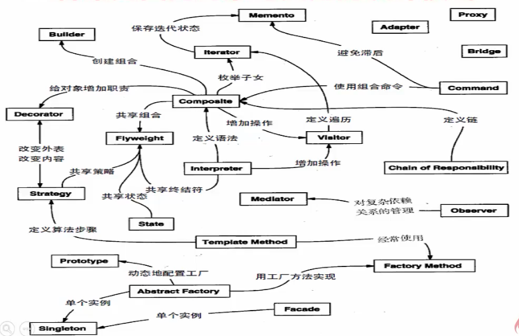

##### 架构 == 将军统领大军

* 模式 == 基于经验总结出的对于一些普通存在的问题提供的通用的方案
  * 单例模式
  * 观察者模式
* 软件中的模式
  * 面向对象常见`23`种设计模式
    * 
  * 反模式
  * 企业应用架构模式

* 单例模式
  * 情景：需要整个程序中只有一个实例
    * 系统日志，`windows`资源管理器窗口，数据库分配主键操作
  * 实现思路
    * `Singleton`拥有一个私有构造函数，确保用户无法通过`new`直接实例化它
    * 包含一个静态私有成员变量`instance`与静态公有方法`Instance()`