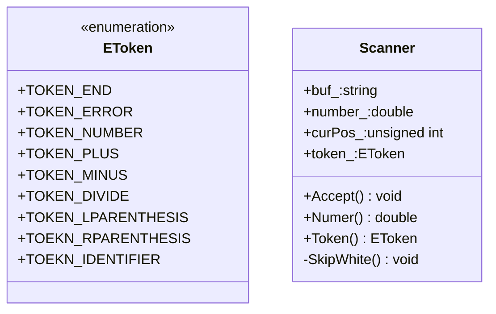

```mermaid
classDiagram
class EToken{
	<<enumeration>>
	+TOKEN_END
	+TOKEN_ERROR
	+TOKEN_NUMBER
	+TOKEN_PLUS
	+TOKEN_MINUS
	+TOKEN_DIVIDE
	+TOKEN_LPARENTHESIS
	+TOEKN_RPARENTHESIS
	+TOEKN_IDENTIFIER
}
class Scanner{
	+buf_:string
	+number_:double
	+curPos_:unsigned int
	+token_:EToken
	+Accept() void
	+Numer() double
	+Token() EToken
	-SkipWhite() void
}
```

