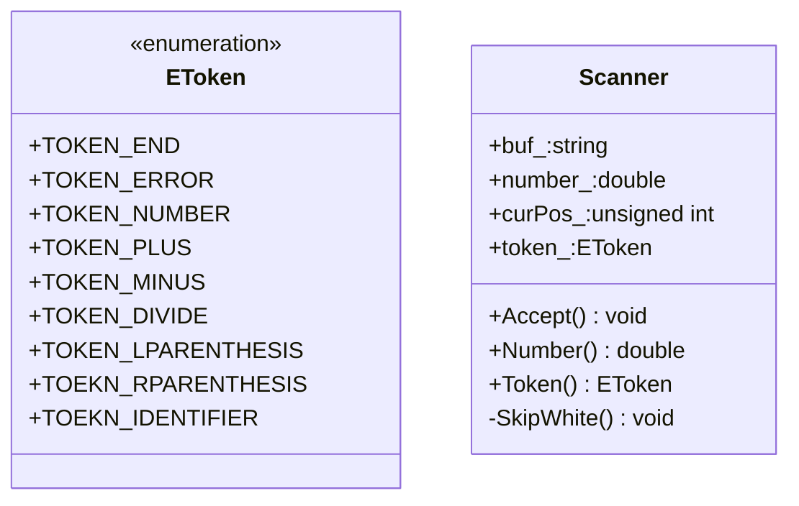

```cpp
// scanner.h
#ifndef _SCANNER_H_
#define _SCANNER_H_

#include <string>

enum EToken
{
    TOKEN_END,
    TOKEN_ERROR,
    TOKEN_NUMBER,
    TOKEN_PLUS,
    TOKEN_MINUS,
    TOKEN_MULTIPLY,
    TOKEN_DIVIDE,
    TOKEN_LPARENTHESIS,
    TOKEN_RPARENTHESIS,
    TOKEN_IDENTIFIER,
    TOKEN_ASSIGN
};

// scanner.cpp
class Scanner
{
public:
    Scanner(const std::string& buf);
    void Accept();         // 每次扫描一个字符
    double Number() const; // 不改变数据成员，只是返回其值
    EToken Token() const;
private:
    void SkipWhite();      // 跳过空字符
    const std::string buf_;
    unsigned int curPos_;  // 当前扫描到的位置
    EToken token_;         // 当前状态
    double number_;
};

#endif // !_SCANNER_H_

#include "scanner.h"

Scanner::Scanner(const std::string& buf):buf_(buf),curPos_(0)
{
    Accept();  // 构造同时扫描
}

double Scanner::Number() const
{
    return number_;
}

EToken Scanner::Token() const
{
    return token_;
}

void Scanner::SkipWhite()
{
    while(isspace(buf_[curPos_]))
        ++curPos_;
}

void Scanner::Accept()
{
    SkipWhite();

    switch (buf_[curPos_])
    {
    case '+':
        token_ = TOKEN_PLUS;
        ++curPos_;
        break;
    case '-':
        token_ = TOKEN_MINUS;
        ++curPos_;
        break;
    case '*':
        token_ = TOKEN_MULTIPLY;
        ++curPos_;
        break;
    case '/':
        token_ = TOKEN_DIVIDE;
        ++curPos_;
        break;
    case '(':
        token_ = TOKEN_LPARENTHESIS;
        ++curPos_;
        break;
    case ')':
        token_ = TOKEN_RPARENTHESIS;
        ++curPos_;
        break;
    case '1':case '2':case '3':case '4':
    case '5':case '6':case '7':case '8':
    case '.':
        token_ = TOKEN_NUMBER;
        // 将字符串转换成数字，并将指针指向第一个不是数字的位置
        char* p;
        number_ = strtod(&buf_[curPos_],&p);
        curPos_ = p - &buf_[0];
        break;
    case '\0':case '\n':case '\r':case EOF:
        token_ = TOKEN_END;
        break;
    default:
        token_ = TOKEN_ERROR;
        break;
    }
}

```

