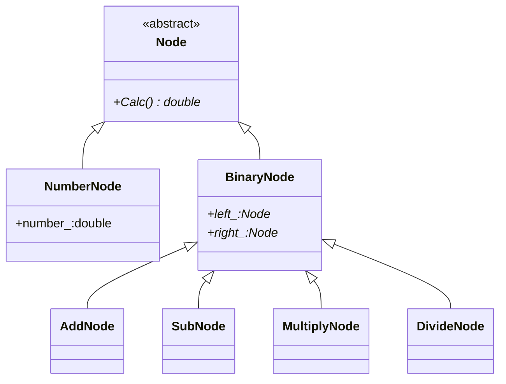

##### 一元运算符

* 

* ```mermaid
  classDiagram
  Node <|-- NumberNode
  Node <|-- BinaryNode
  class Node{
  	<<abstract>>
  	+Calc()* double
  }
  class NumberNode{
  	+number_:double
  }
  class BinaryNode{
  	+left_:Node*
  	+right_:Node*
  }
  BinaryNode <|-- AddNode
  BinaryNode <|-- SubNode
  BinaryNode <|-- MultiplyNode
  BinaryNode <|-- DivideNode
  Node <|-- UnaryNode
  UnaryNode <|-- UMinusNode
  UnaryNode <|-- FunNode
  ```

##### 代码实现

* ```c++
  // node.h
  #ifndef _NODE_H_
  #define _NODE_H_
  
  /**
   * @brief 节点抽象基类
   *
   */
  class Node
  {
  public:
      /**
       * @brief 抽象虚函数，派生类都会实现该虚函数
       * const方法 不会改变任何数据成员
       * @return double 节点值
       */
      virtual double Calc() const = 0;
      /**
       * @brief 基类指针指向派生类时，自动使用派生类析构，基类析构
       *
       */
      virtual ~Node(){};
  };
  
  class NumberNode : public Node
  {
  public:
      NumberNode(double number):number_(number) {}
      double Calc() const;
  private:
      const double number_; // 一经初始化即不会改变
  };
  
  // 继承了抽象类，没有重写纯虚函数，依然是抽象类
  class BinaryNode : public Node
  {
  public:
      BinaryNode(Node* left,Node* right):left_(left),right_(right){}
      ~BinaryNode();  // 释放两个数据成员
  protected:     // 提升权限，让其在派生类中能够访问
      Node* const left_;   // const在*号右边表示指针不能改变，不能再指向其他节点
      Node* const right_;
  };
  
  // 单元运算符
  class UnaryNode : public Node
  {
  public:
      UnaryNode(Node* child):child_(child){}
      ~UnaryNode();
  protected:
      Node* const child_;
  };
  
  class AddNode : public BinaryNode
  {
  public:
      AddNode(Node* left,Node* right)
          : BinaryNode(left,right) {}
      double Calc() const;  // 实现该方法，就成了具体的类
  };
  
  class SubNode : public BinaryNode
  {
  public:
      SubNode(Node* left,Node* right)
          : BinaryNode(left,right) {}
      double Calc() const;  // 实现该方法，就成了具体的类
  };
  
  class MultiplyNode : public BinaryNode
  {
  public:
      MultiplyNode(Node* left,Node* right)
          : BinaryNode(left,right) {}
      double Calc() const;  // 实现该方法，就成了具体的类
  };
  
  class DivideNode : public BinaryNode
  {
  public:
      DivideNode(Node* left,Node* right)
          : BinaryNode(left,right) {}
      double Calc() const;  // 实现该方法，就成了具体的类
  };
  
  class UMinusNode : public UnaryNode
  {
  public:
      UMinusNode(Node* child)
          :UnaryNode(child) {}
      double Calc() const;
  };
  
  #endif // _NODE_H_
  ```
  
* ```c++
  #include "node.h"
  
  #include <iostream>
  #include <math.h>
  
  double NumberNode::Calc() const
  {
      return number_;
  }
  
  // 释放两个数据成员
  BinaryNode::~BinaryNode()
  {
      delete left_;
      delete right_;
  }
  
  // 释放数据成员
  UnaryNode::~UnaryNode()
  {
      delete child_;
  }
  
  double AddNode::Calc() const
  {
      return left_->Calc()+right_->Calc();
  }
  
  double SubNode::Calc() const
  {
      return left_->Calc()-right_->Calc();
  }
  
  double MultiplyNode::Calc() const
  {
      return left_->Calc()*right_->Calc();
  }
  
  double DivideNode::Calc() const
  {
      // 判断除数是否为0
      double divisor = right_->Calc();
      if(divisor != 0.0)
          return left_->Calc()/right_->Calc();
      else 
      {
          std::cout<<"ERROR: Divisor by zero"<<std::endl;
          return HUGE_VAL;
      }
  }
  
  double UMinusNode::Calc() const
  {
      return -child_->Calc();    
  }
  ```

  