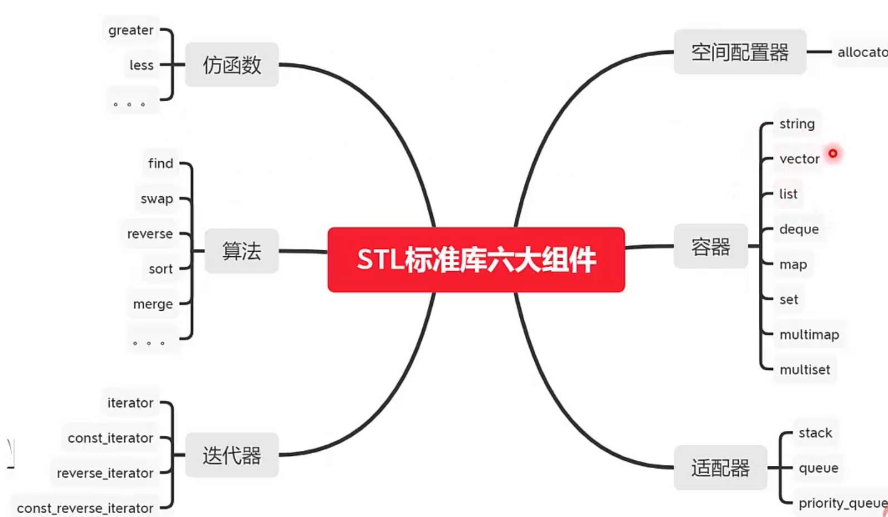
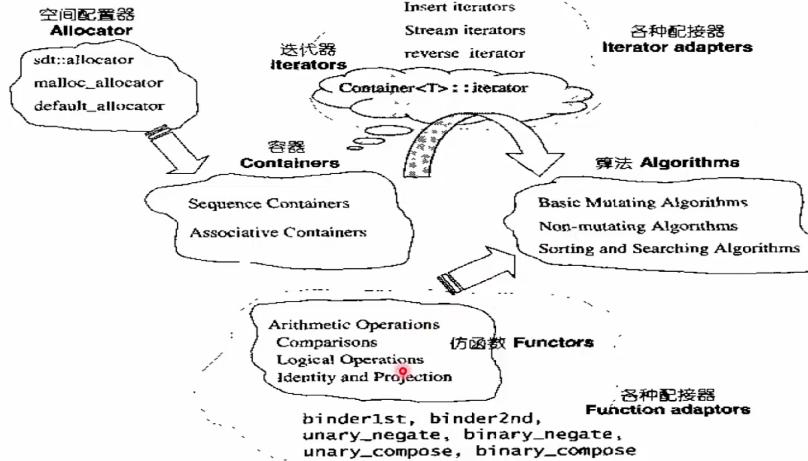

#### STL（Standard Template Library）

* `STL`算法是**泛型的`（generic）`**，不与任何特定数据结构和对象绑定，不必在环境类似的情况下重写代码 -- 灵活
* `STL`算法可以**量身定做，效率很高** -- 高效
* `STL`可进行扩充，编写自己的组件**并与`STL`标准的组件进行很好的配合** -- 通用





###### 容器

* **序列式容器（Sequence Containers）**

  * **元素可排序**，`STL`提供`vector,list,deque`等序列式容器，而`stack,queue,priority_queue`则是容器适配器

  * ```c++
    #include <iostream>
    
    #include <vector>
    #include <list>
    #include <queue>
    #include <algorithm>
    #include <stack>
    
    using namespace std;
    
    // 创建的一个类，本质上是一个仿函数
    struct Display{
        // 重载括号运算符
        // 相当于一个函数 对象，第二个括号填入对象的类型
        void operator()(int i){
            cout<<i<<" ";
        }
    };
    
    int main() {
        int iArr[] = {1,2,3,4,5};
        // 左闭右开，右边取不到
        vector<int> iVector(iArr,iArr+4);
        list<int> iList(iArr,iArr+4);
        deque<int> iDeque(iArr,iArr+4);
    
        // 队列和栈都是用双向队列实现的，只是做了一些适配工作
        queue<int> iQueue(iDeque);         // 队列 先进先出
        stack<int> iStack(iDeque);         // 栈 先进后出
    	// 优先级队列
        priority_queue<int> iPriorityQueue(iArr,iArr+4);
    
        for_each(iVector.begin(),iVector.end(),Display());
        cout<<endl;
        for_each(iList.begin(),iList.end(),Display());
        cout<<endl;
        for_each(iDeque.begin(),iDeque.end(),Display());
        cout<<endl;
    
        while(!iQueue.empty()) {
            // 取出头元素显示，没有出队列
            cout<<iQueue.front()<<endl;
            iQueue.pop();
        }
        while(!iStack.empty()) {
            // 取出栈顶元素显示，没有出栈
            cout<<iStack.top()<<endl;
            iStack.pop();
        }
        while(!iPriorityQueue.empty()) {
            // 取出头元素显示，没有出队列
            cout<<iPriorityQueue.top()<<endl;
            iPriorityQueue.pop();
        }
        return 0;
    }
    ```

* **关联式容器（Associative Containers）**

  * 每个数据元素由**一个键`(Key)`和值`(Value)`组成**，当元素被插入到容器时，按其键以某种特定规则放入适当位置；常见关联容器：`set,multiset,map,multimap`

  * ```c++
    map<string,double> studentScores;
    studentScores["胡搞"] = 83.0;
    studentScores["刘康"] = 23.0;
    studentScores.insert(pair<string,double>("李即可",100.0));
    studentScores.insert(pair<string,double>("黎明",10023.0));
    studentScores.insert(pair<string,double>("胡歌",1020.0));
    // value_type 利用泛型编程的思维，获取到结构体的类型<string,double>
    studentScores.insert(map<string,double>::value_type("礼拜",23.0));
    
    // 在已经有值存在情况 == 修改
    studentScores["胡搞"] = 0.0;
    
    // 此时输出并不是按照输入顺序
    for_each(studentScores.begin(),studentScores.end(),Display());
    cout<<endl;
    
    // 查询操作  返回指针==迭代器
    map<string,double>::iterator it;
    it = studentScores.find("刘康");
    if(it != studentScores.end()) {  // 该迭代器不在最后一个元素后面 == 找到了
        cout<<"find the score is :" << it->second<<endl;
    }
    else cout<<"didn't find the score "<<endl;
    ```

  * 插入删除与迭代器失效

    * ```C++
      // 使用迭代器完成遍历查找
      it = studentScores.begin();
      while(it!=studentScores.end()) {
          if(it->second < 95.0) {
              // 迭代器失效 抹去后丢失位置
              //            studentScores.erase(it);
              studentScores.erase(it++);
          }
          else
              it++;
      }
      for_each(studentScores.begin(),studentScores.end(),Display());
      cout<<endl;
      
      for(it=studentScores.begin();it!=studentScores.end();it++){
          if(it->second <= 100)
              it = studentScores.erase(it); // 这里迭代器会失效，但是返回值是下一个值迭代器
      }
      for_each(studentScores.begin(),studentScores.end(),Display());
      cout<<endl;
      //    // find得到并删除元素
      //    it = studentScores.find("胡歌");
      //    studentScores.erase(it);
      //    for_each(studentScores.begin(),studentScores.end(),Display());
      
      //    int n = studentScores.erase("胡搞");  // 返回去除的个数 不常见
      //    cout<<n<<endl;
      //    for_each(studentScores.begin(),studentScores.end(),Display());
      
          studentScores.erase(studentScores.begin(),studentScores.end());
          for_each(studentScores.begin(),studentScores.end(),Display());
      ```

* 仿函数`(functor)`

  * 搭配`STL`算法使用

  * 函数指针不能满足`STL`对抽象性的要求，不能满足软件积木要求，无法与`STL`其他组件搭配

  * 本质是类重载了一个`operator()`，创建一个行为类似函数的对象

    * ```c++
      bool MySort(int a,int b){
          return a>b;
      }
      void Display(int a){
          cout<<a<<" ";
      }
      int main() {
      
          // C++方式
          int arr[] = {4,3,2,1,7};
          sort(arr,arr+5, MySort);
      
          for_each(arr,arr+5, Display);
          return 0;
      }
      
      // 使用泛型方法
      template<class T>
      inline bool MySortT(T const &a,T const &b){
          return a<b;
      }
      template<class T>
      inline void DisplayT(T const &a){
          cout<<a<<" ";
      }
      // C++泛型
      int arr2[] = {4,3,2,1,7};
      sort(arr2,arr2+5, MySortT<int>);     // 确定类型
      for_each(arr2,arr2+5, DisplayT<int>);
      
      // 仿函数
      struct SortF{
          bool operator()(int a,int b){
              return a<b;
          }
      };
      struct DisplayF{
          void operator()(int a){
              cout<<a<<" ";
          }
      };
      // C++仿函数
      int arr3[] = {4,3,2,1,7};
      sort(arr3,arr3+5, SortF());     // 现在是对象，这里进行实例化（函数调用()）
      for_each(arr3,arr3+5, DisplayF());
      
      
      // 仿函数模板
      template<class T>
      struct SortTF{
          inline bool operator()(T const &a,T const &b)const{
              return a<b;
          }
      };
      template<class T>
      struct DisplayTF{
          inline void operator()(T const &a)const{
              cout<<a<<" ";
          }
      };
      // C++仿函数+模板
      int arr4[] = {4,3,2,1,7};
      sort(arr4,arr4+5, SortTF<int>());     // 现在是对象，这里进行实例化（函数调用()）
      for_each(arr4,arr4+5, DisplayTF<int>());
      ```

* 算法`(algorithm)`
  * 包含于`<algorithm>,<numeric>,<functional>`
  * 非可变序列算法：**不直接修改其操作的容器内容**算法
  * 可变序列算法：可以**修改他们所操作的容器内容**算法
  * 排序算法：包括对**序列进行排序和合并的算法、搜索算法以及有序序列上的集合操作**
  * 数值算法：对容器内容进行**数值计算**

* 常见算法

  * 查找、排序和通用算法，排列组合算法，数值算法，集合算法等等

  * ```C++
    #include <iostream>
    #include <algorithm>
    #include <functional>
    #include <numeric>
    #include <vector>
    
    using namespace std;
    int main() {
        int ones[] = {1,2,3,4,5};
        int twos[] = {10,20,30,40,50};
        int results[5];
    
        transform(ones,ones+5,twos,results,plus<int>());  // 数组元素依次相加并返回
        for_each(results,results+5,
                 [](int a)->void{cout<<a<<endl;});   // 匿名函数 == lambda表达式
                 // [capture list] (params list) -> return type {function body}
                 // [capture list] (params list) {function body}
                 // [capture list] {function body}
    
        // find
        int arr[] = {1,1,1,2,3,4,5,6,7,8};
        int len = sizeof(arr)/sizeof(arr[0]);
        vector<int> iA(arr+2,arr+5);   // 子序列
        cout<<count(arr,arr+len,0)<<endl; // 统计1的个数
        // bind2nd 将变量绑定为右值 < 7
        cout<<count_if(arr,arr+sizeof(arr)/sizeof(arr[0]),bind2nd(less<int>(),7))<<endl; // 统计小于7
        // bind1st 将变量绑定为左值 7 <
        cout<<count_if(arr,arr+sizeof(arr)/sizeof(arr[0]),bind1st(less<int>(),7))<<endl; // 统计小于7
    
        // 二分查找
        cout<<binary_search(arr,arr+len,8);    // 查找8 查找到了1
        cout<<search(arr,arr+len,iA.begin(),iA.end())<<endl;  // 查找子序列，返回第一个位置地址
        cout<<*search(arr,arr+len,iA.begin(),iA.end())<<endl;  // 取该位置存放的值
    
        iA.push_back(189);
        cout<<search(arr,arr+len,iA.begin(),iA.end())<<endl;  // 返回第一个位置地址
        cout<<*search(arr,arr+len,iA.begin(),iA.end())<<endl;  // 取该位置存放的值，为一个很大的负值，代表不存在
    
        return 0;
    }
    ```

* 问题：输入一个不存在重复字符的字符串，打印字符串中字符的全排列

  * 全排列

  * ```c++
    void swap(char* a,char* b){
        char tmp=*a;
        *a = *b;
        *b = tmp;
    }
    
    // 123全排列
    // f(123) = 1 + f(23),f(23) = 2 + f(3) 递归
    void Permutation(char* pStr,char* pPostion){
        // base case
        if(*pPostion == '\0')
            cout<<pStr<<endl;
        else {
            for(char* pChar = pPostion;*pChar !='\0';pChar++){
                // 依次和后面字符交换
                swap(*pChar,*pPostion);
                Permutation(pStr,pPostion+1);
                // 回溯
                swap(*pChar,*pPostion);
            }
        }
    }
    
    int main() {
        char test[] = "123";
        Permutation(test,test);
        return 0;
    }
    ```

  * 使用`STL`来进行全排列

    * ```C++
      // 用STL输出全排列
      // 注意：必须要保证数组顺序（原数组需要有序）char test[]="123"; √ "231" x
      do{
          cout<<test[0]<<test[1]<<test[2]<<endl;
      }while(next_permutation(test,test+3));
      return 0;
      ```

* 迭代器`iterator`

  * **智能指针，用于访问顺序容器和关联容器中的元素**，容器和操纵容器的算法之间的中介

  * 四种

    * 正向迭代：`iterator`
    * **常量正向迭代：`const_iterator`：不允许修改容器内值**
    * 反向迭代：`reverse_iterator`
    * **常量反向迭代：`const_reverse_iterator`：不允许修改容器内值**

  * 不同容器间差距

    * | 容器             | 迭代器功能 |
      | ---------------- | ---------- |
      | `vector`         | 随机访问   |
      | `deque`          | 随机访问   |
      | `list`           | 双向访问   |
      | `set/multiset`   | 双向访问   |
      | `map/multimap`   | 双向访问   |
      | `stack`          | 不支持     |
      | `queue`          | 不支持     |
      | `priority_queue` | 不支持     |

    * ```C++
      list<int> aL={1,2,3};
      
      list<int>::reverse_iterator it;
      for(it=aL.rbegin();it!=aL.rend();it++)
          cout<<*it<<endl;
      ```

* `GC`垃圾回收机制与异常
  * 