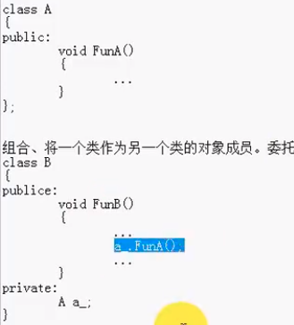
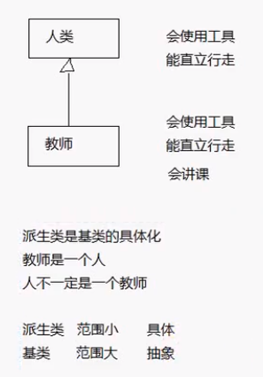
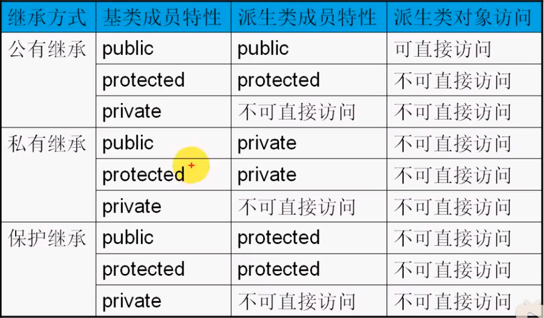
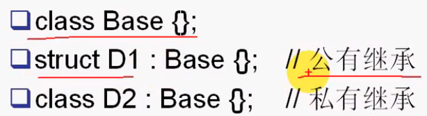

#### 目录

* 代码重用
* 继承
* 公有、私有、保护继承
* 默认继承保护级别
* 接口继承和实现继承
* 继承与重定义
* 继承与组合

##### 代码重用

* `c++`一个重要特征
* `c`语言中重用方式
  * 拷贝代码、修改代码
* 继承与组合
  * **组合或继承**现有的类来**创建新类**，而不是重新创建
  * 

##### 继承

* 使用已编写好的类来创建新类

  * 新类在原有类的所有属性和操作，也可在原有类的基础上做一些修改和增补

* 新类 派生类 或 子类，原有类 基类 或 父类

* 子类 是 基类的**具体化**

  * 

* 语法

  * ```cpp
    class 派生类名:继承方式 基类名
    {
    	派生类新增成员声明;  
    };
    ```

* 公有、私有、保护成员

  * 关键字`public`后声明，**类与外部的接口**，任何外部函数都可访问公有类型数据和函数
  * 关键字`private`后声明，只允许**本类中的函数**访问，类外部的任何函数都不能访问
  * 关键字`protected`后声明，与`private`类似，其差别体现在继承与派生时对派生类的影响不同
    * 继承时，可直接访问

##### 公有、私有、保护继承

* 

```cpp
#include <iostream>
using namespace std;

class Base
{
public:
    int x_;

protected:
    int y_;

private:
    int z_;
};

class PublicInherit : public Base
{
public:
    void Test()
    {
        x_ = 10;
        y_ = 20;
        // z_ = 30; // 基类私有成员在派生类不能访问
    }

private:
    int a_;
};

class PublicPublicInherit : public PublicInherit
{
public:
    void Test()
    {
        y_ = 20;
    }
};

class PrivateInherit : private Base
{
public:
    void Test()
    {
        x_ = 10;
        y_ = 20;
        // z_ = 30;
    }
};

int main()
{
    // Base b;
    // b.x_ = 20;
    // b.y_ = 22; // 保护成员不能直接访问

    PublicInherit pub;
    pub.x_ = 10; // 派生类对象可访问公有继承的数据成员

    PrivateInherit pi;
    // pi.x_ = 10;  // 派生类对象不能访问私有继承

    return 0;
}
```

##### 默认继承保护级别

* 

##### 接口继承与实现继承

* 类的公有成员函数  接口
* **公有继承**，基类的公有成员函数在派生类中仍然公有
  * 基类的接口成为了派生类的接口，接口继承
* **实现继承**，对于**私有、保护继承**
  * 派生类不再支持基类的公有接口
  * 希望能**重用基类的实现**而已，只是实现继承

##### 继承与重定义

```cpp
#include <iostream>
using namespace std;

class Base
{
public:
    Base() : x_(0)
    {
    }
    int GetBaseX() const
    {
        return x_;
    }
    void Show()
    {
        cout << "Base::Show()..." << endl;
    }
    int x_;
};

class Derived : public Base
{
public:
    Derived() : x_(0)
    {
    }
    int GetDerivedX() const
    {
        return x_;
    }
    void Show(int n) // 只有一个时，基类的被隐藏
    {
        cout << "Derived::Show(n)..." << endl;
    }
    void Show()
    {
        cout << "Derived::Show()..." << endl;
    }
    int x_; // 派生类重定义了同名数据成员
};

int main()
{
    Derived d;
    d.x_ = 10;
    d.Base::x_ = 20;
    cout << d.GetDerivedX() << endl;
    cout << d.GetBaseX() << endl;

    d.Show();
    d.Base::Show();
    return 0;
}
```

* 对基类的数据成员重定义

* 对基类成员函数的重定义

  * `overwrite`重定义

    * > `overload`重载
      >
      > 与`overwrite`的区别在于其函数都在同一个作用域
      >
      > 如例中的`Derived`类中的两个`Show`方法

    * 与基类完全相同

    * 与基类成员函数名相同，参数不同

  * `override`覆盖

    * 基类的虚函数与派生类的同名函数

##### 继承与组合

* 本质上都是将子对象放在新类中
  * 使用构造函数的初始化列表构造子对象
* 组合
  * 新类内部具有已存在的类的功能时使用，而不是将已存在类作为其接口
  * 嵌入一个对象来实现新类的功能，新类用户看到新定义的接口，而不是老类的接口
  * `has-a`
* 希望新类与已存在的类有相同的接口（在此基础上增加自己的成员）
  * 使用继承 == 子类型化
  * `is-a`

> `LSP`里氏代换原则 检验继承的质量
>
> 行为