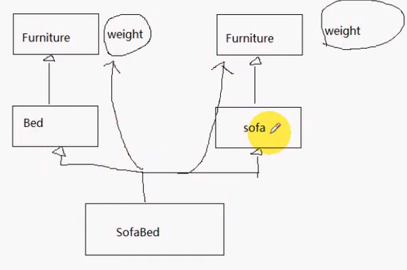
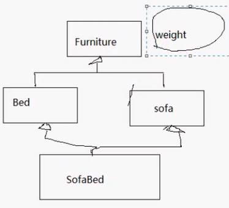

#### 目录

* 多重继承
* 虚继承与虚基类
* 虚基类以及其派生类构造函数

##### 多重继承

* 单重继承  –  一个派生类可以有多个基类
* 多重继承  –  一个派生类可有多个基类
  * `class 类名:继承方式 基类1,继承方式 基类2,...{};`
  * 派生类同时继承多个基类的成员，更好的软件重用性
  * 可能会有大量二义性，多个基类中可能含有同名变量或函数
* 解决歧义的方法
  * `基类名::数据成员名(或成员函数(参数表))`
  * 明确指定要访问定义于哪个基类中的成员

```cpp
#include <iostream>
using namespace std;

class Bed
{
public:
    Bed(int weight) : weight_(weight)
    {
    }
    void Sleep()
    {
        cout << "Sleep..." << endl;
    }
    int weight_;
};

class Sofa
{
public:
    Sofa(int weight) : weight_(weight) {}
    void WatchTV()
    {
        cout << "Watch TV..." << endl;
    }
    int weight_;
};

class SofaBed : public Bed, public Sofa
{
public:
    SofaBed() : Bed(0), Sofa(0)
    {
        FoldIn(); // 默认折叠
    }
    void FoldOut()
    {
        cout << "FoldOut..." << endl;
    }
    void FoldIn()
    {
        cout << "FoldIn..." << endl;
    }
};

int main()
{
    SofaBed sb;
    // sb.weight_ = 20;      // 给哪个基类赋值
    sb.Bed::weight_ = 10;  // 显示指定
    sb.Sofa::weight_ = 20; // 抽象重量这个属性

    sb.WatchTV();
    sb.FoldIn();
    sb.WatchTV();
    return 0;
}
```



* 依然存在二义性

##### 虚继承与虚基类

* 派生类从多个基类派生，而这些基类又从同一个基类派生
  * 访问共同基类的成员时，产生二义性  –  虚基类
* 引入虚基类
  * 有共同基类
* 声明
  * `class B1:virtual public BB`
* 作用
  * 解决二义性
  * 为**最远的派生类**提供**唯一的基类成员**，不重复产生多次拷贝
* 
  * 共享基类的数据成员

##### 虚基类以及派生类构造函数

* 虚基类的成员由最远派生类的构造函数通过调用虚基类的构造初始化
* 整个继承结构中，直接或间接继承虚基类的**所有派生类**，够需在构造函数的成员初始化列表中给出对虚基类的构造函数的调用
  * 若未列出，则表示用的默认构造
* 建立对象时，只有**最远的派生类**调用**虚基类的构造函数**
  * 近一点的派生类对虚基类构造函数的调用**被忽略**

```cpp
#include <iostream>
using namespace std;

class Furniture
{
public:
    Furniture(int weight) : weight_(weight)
    {
        cout << "Furniture..." << endl;
    }
    ~Furniture()
    {
        cout << "~Furniture..." << endl;
    }
    int weight_;
};

class Bed : virtual public Furniture
{
public:
    Bed(int weight) : Furniture(weight)
    {
        cout << "Bed..." << endl;
    }
    ~Bed()
    {
        cout << "~Bed..." << endl;
    }
    void Sleep()
    {
        cout << "Sleep..." << endl;
    }
};

class Sofa : virtual public Furniture
{
public:
    Sofa(int weight) : Furniture(weight)
    {
        cout << "Sofa..." << endl;
    }
    ~Sofa()
    {
        cout << "~Sofa..." << endl;
    }
    void WatchTV()
    {
        cout << "Watch TV..." << endl;
    }
};

class SofaBed : public Bed, public Sofa
{
public:
    // 防止二义性，不知道哪个地方构造
    SofaBed(int weight) : Bed(weight), Sofa(weight), Furniture(weight)
    {
        cout << "SofaBed..." << endl;
        FoldIn(); // 默认折叠
    }
    ~SofaBed()
    {
        cout << "~SofaBed..." << endl;
    }
    void FoldOut()
    {
        cout << "FoldOut..." << endl;
    }
    void FoldIn()
    {
        cout << "FoldIn..." << endl;
    }
};

int main()
{
    SofaBed sb(10);
    // sb.weight_ = 20;      // 给哪个基类赋值
    // sb.Bed::weight_ = 10;  // 显示指定
    // sb.Sofa::weight_ = 20; // 抽象重量这个属性

    sb.weight_ = 20; // 更改重量，不明确

    sb.WatchTV();
    sb.FoldIn();
    sb.WatchTV();
    return 0;
}
```

