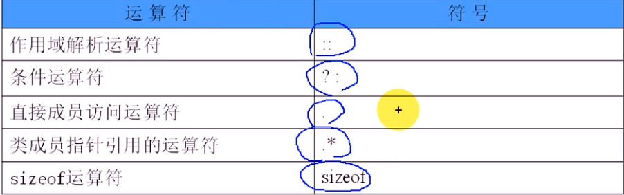
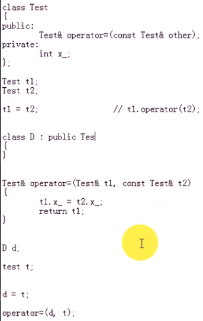

#### 目录

* 运算符重载
* 成员函数重载
* 非成员函数重载
* 运算符重载规则

##### 运算符重载

* 允许把标准运算符（`+,-*,/,<,>等`）应用于**自定义数据类型**的对象
* 提高可读性
* `C++`可扩充性

* 函数调用的一种方式
* 运算符重载 == 函数重载
* 有必要时才去重载

##### 成员函数重载

* `函数类型 operator 运算符(参数表);`

* ```cpp
  函数类型 类名::operator 运算符(参数表)
  {
  	函数体;
  }
  ```

* ```cpp
  // .h
  #ifndef _COMPLEX_H_
  #define _COMPLEX_H_
  
  class Complex
  {
  public:
      Complex(int real, int imag);
      Complex();
      ~Complex();
  
      Complex &Add(const Complex &other);
      void Display() const;
  
      // 类成员函数固定有一个指向当前对象的指针
      Complex operator+(const Complex &other); // 优先级较高
      // 本身不是类成员函数，所以需要两个参数
      friend Complex operator+(const Complex &c1, const Complex &c2);
  
  private:
      int real_;
      int imag_;
  };
  
  #endif // !_COMPLEX_H_
  
  // .cpp
  #include "complex.h"
  #include <iostream>
  using namespace std;
  
  Complex::Complex(int real, int imag) : real_(real), imag_(imag)
  {
  }
  
  Complex::Complex()
  {
  }
  
  Complex::~Complex()
  {
  }
  
  Complex &Complex::Add(const Complex &other)
  {
      real_ += other.real_;
      imag_ += other.imag_;
  
      return *this;
  }
  
  Complex Complex::operator+(const Complex &other)
  {
      int r = real_ + other.real_;
      int i = imag_ + other.imag_;
  
      return Complex(r, i);
  }
  
  // 全局作用域
  Complex operator+(const Complex &c1, const Complex &c2)
  {
      int r = c1.real_ + c2.real_;
      int i = c1.imag_ + c2.imag_;
  
      return Complex(r, i);
  }
  
  void Complex::Display() const
  {
      cout << real_ << "+" << imag_ << endl;
  }
  
  // test.cpp
  #include "complex.h"
  
  int main()
  {
      Complex c1(3, 5);
      Complex c2(4, 6);
  
      c1.Add(c2);
      c1.Display();
  
      Complex c3 = c1 + c2; // c1 和 c2不发生改变 等价于c1.operator(c2); or operator+(c1,c2)
      // Complex c3 = c1.operator+(c2);
      c3.Display();
      c1.Display();
      c2.Display();
  
      return 0;
  }
  ```

##### 非成员函数重载

* 友元函数

  * `friend 函数类型 operator运算符(参数表);`

* ```cpp
  friend 函数类型 类名::operator运算符(参数表)
  {
  	函数体;
  }
  ```

##### 运算符重载规则

* 不允许发明新的运算符
* 不能改变运算符操作对象的个数
* 重载后，优先级和结合性不能改变
*  不能重载
  * 
  * 会导致语法混乱

* 单目运算符   ==>  类成员函数
* 双目运算符   ==>  类的友元函数
  * 特例：不能重载成类的友元
  * `= () [] ->`
  * 
  * 破坏原有的一些功能
* **类型转换**运算符只能用**成员函数**方式
* 流运算符只能用友元重载

