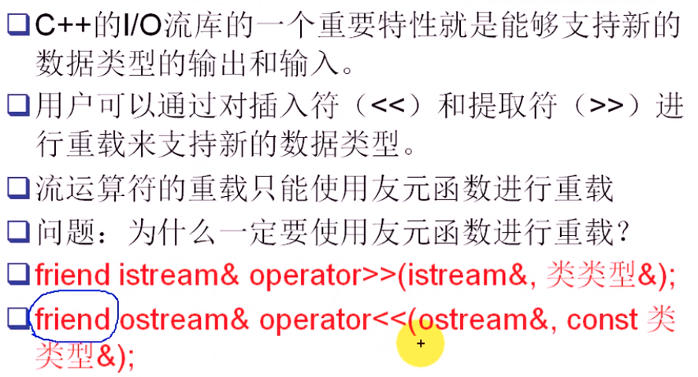

#### 目录

* `[]`
* `+`
* `+=`
* `<<`
* `>>`

##### `[]`运算符重载

* 使用`non const`版本调用`const`版本

  * ```cpp
    char &String::operator[](unsigned int index)
    {
        // return str_[index];
        // 使用non const版本调用const版本
        return const_cast<char &>(static_cast<const String &>(*this)[index]);
    }
    
    const char &String::operator[](unsigned int index) const
    {
        return str_[index];
    }
    ```

  * ```cpp
    #include "String.h"
    #include <iostream>
    using namespace std;
    
    int main()
    {
        String s1("abc");
    
        char ch = s1[2];  // 调用的是non const 版本的[]
        cout << ch << endl;
    
        s1[2] = 'A'; // 返回引用的重要用途，可以作为左值
        s1.Display();
    
        const String s2("xyzabc");
        ch = s2[2];      // 调用的是const版本的[]
        // s2[2] = 'M'; // 希望这个操作不允许  == 将返回值改成const
        s2.Display();
    
        return 0;
    }
    ```

`+`字符串连接操作

* 注意代码复用

  * ```cpp
    #ifndef _STRING_H_
    #define _STRING_H_
    
    class String
    {
    public:
        String(const char *str = "");
        // 提供一个拷贝构造函数，实现深拷贝
        String(const String &other);
        String &operator=(const String &other);
        String &operator=(const char *str);
        bool operator!() const;
    
        char &operator[](unsigned int index);
        const char &operator[](unsigned int index) const;
    
        // 二元运算符，一般使用友元
        friend String operator+(const String &s1, const String &s2);
    
        // 返回值使用引用，避免对象拷贝
        String &operator+=(const String &other);
    
        ~String(void);
    
        void Display() const;
    
    private:
        String &Assign(const char *str);
        char *AllocAndCpy(const char *str);
        char *str_;
    };
    
    #endif // !_STING_H_
    
    // .cpp
    #include "String.h"
    #include <string.h>
    
    #include <iostream>
    using namespace std;
    
    String::String(const char *str)
    {
        str_ = AllocAndCpy(str);
    }
    
    String::String(const String &other)
    {
        str_ = AllocAndCpy(other.str_);
    }
    
    String &String::operator=(const String &other)
    {
        if (this == &other)
            return *this;
        return Assign(other.str_);
    }
    
    String &String::operator=(const char *str)
    {
        return Assign(str);
    }
    
    bool String::operator!() const
    {
        return strlen(str_) != 0;
    }
    
    char &String::operator[](unsigned int index)
    {
        // return str_[index];
        // 使用non const版本调用const版本
    
        return const_cast<char &>(static_cast<const String &>(*this)[index]);
    }
    
    const char &String::operator[](unsigned int index) const
    {
        return str_[index];
    }
    
    String operator+(const String &s1, const String &s2)
    {
        // int len = strlen(s1.str_) + strlen(s2.str_);
        // char *newstr = new char[len];
        // memset(newstr, 0, len);
        // strcpy(newstr, s1.str_);
        // strcat(newstr, s2.str_);
    
        // String tmp(newstr);
        // delete newstr;
    
        String str = s1;
        str += s2;
        return str;
    }
    
    String &String::operator+=(const String &other)
    {
        int len = strlen(str_) + strlen(other.str_);
        char *newstr = new char[len];
        memset(newstr, 0, len);
        strcpy(newstr, str_);
        strcat(newstr, other.str_);
    
        delete[] str_;
        str_ = newstr;
        return *this;
    }
    
    String::~String()
    {
        delete[] str_;
    }
    
    String &String::Assign(const char *str)
    {
        delete[] str_;
        str_ = AllocAndCpy(str);
        return *this;
    }
    
    char *String::AllocAndCpy(const char *str)
    {
        int len = strlen(str) + 1;
        char *newstr = new char[len];
        memset(newstr, 0, len);
        strcpy(newstr, str);
    
        return newstr;
    }
    
    void String::Display() const
    {
        cout << str_ << endl;
    }
    
    // test.cpp
    #include "String.h"
    #include <iostream>
    using namespace std;
    
    int main()
    {
        String s1("abc");
    
        char ch = s1[2]; // 调用的是non const 版本的[]
        cout << ch << endl;
    
        s1[2] = 'A'; // 返回引用的重要用途，可以作为左值
        s1.Display();
    
        const String s2("xyzabc");
        ch = s2[2]; // 调用的是const版本的[]
        // s2[2] = 'M'; // 希望这个操作不允许  == 将返回值改成const
        s2.Display();
    
        String s3 = "xxx";
        String s4 = "yyy";
    
        String s5 = s3 + s4;
        s5.Display();
    
        String s6 = "aaa" + s3 + "dsfakdjlf"; // 有转换构造函数，可以将其转换成String对象；并且用友元方式，可用转换构造（第一个参数可用转换构造
        s6.Display();
    
        s3 += s4;
        s3.Display();
    
        return 0;
    }
    ```

##### 流运算符重载

* 使用`cout<<s<<endl;`来输出

* 
  * 成员函数重载，第一个参数是对象指针

* ```cpp
  // 流运算符重载
  friend ostream &operator<<(ostream &os, const String &str);
  friend istream &operator>>(istream &is, String &str);
  
  // .cpp
  ostream &operator<<(ostream &os, const String &str)
  {
      os << str.str_;
      return os;
  }
  
  istream &operator>>(istream &is, String &str)
  {
      char tmp[1024];
      cin >> tmp;
      str = tmp;
      return is;
  }
  // test.cpp
  cout << s3 << endl;
  
  String s7;
  cin >> s7;
  cout << s7 << endl;
  ```

