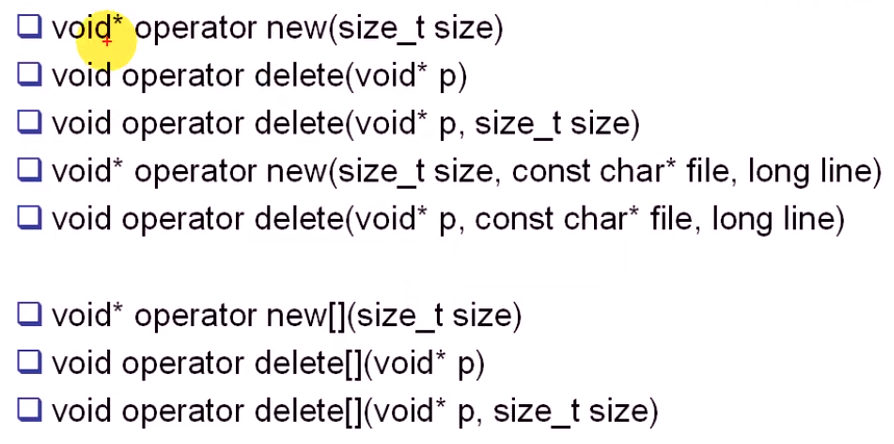

#### 目录

* 类型转换运算符
* `->`运算符
* `operator new、operator delete`

##### 类型转换运算符

* 必须是**成员函数**，不能是友元函数
* 没有参数（操作数是什么）
  * 类对象自身
* 不能指定返回类型（已经指定）
  * 指定的类型就是返回类型
* 函数原型`operator 类型名();`

```cpp
#ifndef _INTEGER_H_
#define _INTEGER_H_

class Integer
{
public:
    Integer(int n);
    ~Integer();

    // 不能同时存在
    // Integer &operator++();
    friend Integer &operator++(Integer &);

    // Integer operator++(int i); // 参数只是为了区分前置与后置
    friend Integer operator++(Integer &i, int n);

    operator int(); // 转换成int类型

    void Display() const;

private:
    int n_;
};

#endif // !_INTEGER_H_

// .cpp
#include "integer.h"
#include <iostream>
using namespace std;

Integer::Integer(int n) : n_(n)
{
}

Integer::~Integer()
{
}

// Integer &Integer::operator++()
// {
// cout << "Integer &Integer::operator++()" << endl;
// ++n_;
// return *this;
// }

Integer &operator++(Integer &i)
{
    cout << "Integer &operator++(Integer &i)" << endl;
    ++i.n_;
    return i;
}

// Integer Integer::operator++(int i)
// {
// cout << "Integer &operator++(Integer &i)" << endl;
// 使用临时对象，返回的对象没有++ （表达式没有++ ）
// Integer tmp(n_);
// n_++;
// return tmp;
// }

Integer operator++(Integer &i, int n)
{
    Integer tmp(i.n_);
    i.n_++;
    return tmp;
}

Integer::operator int()
{
    return n_;
}

void Integer::Display() const
{
    cout << n_ << endl;
}
// test.cpp
#include "integer.h"
#include <iostream>
using namespace std;

int add(int a, int b)
{
    return a + b;
}

int main()
{
    Integer n(100);
    n = 200; // 1.转换构造 2.=重载
    n.Display();

    int sum = add(n, 100); // 函数接收int类型，而n是Integer类型
    cout << sum << endl;

    int x = n;
    int y = static_cast<int>(n); // 显示调用类型转换运算符

    return 0;
}
```

##### `->`运算符

* ```cpp
  #include <iostream>
  using namespace std;
  
  class DBHelper
  {
  public:
      DBHelper()
      {
          cout << "DB..." << endl;
      }
      ~DBHelper()
      {
          cout << "~DB..." << endl;
      }
  
      void Open()
      {
          cout << "Open..." << endl;
      }
  
      void Close()
      {
          cout << "Close..." << endl;
      }
  
      void Query()
      {
          cout << "Query..." << endl;
      }
  };
  
  // 相当于智能指针，包装一个对象
  class DB
  {
  public:
      DB()
      {
          db_ = new DBHelper;
      }
      ~DB()
      {
          delete db_;
      }
  
      DBHelper *operator->()
      {
          return db_;
      }
  
  private:
      DBHelper *db_;
  };
  
  int main()
  {
      DB db;
      db->Open();
      db->Query();
      db->Close();
      return 0;
  }
  ```

##### `operator new and operator delete`


* `new`的三种用法
  * `new operator`
  * `operator new`
  * `placement new`

* 

* ```cpp
  #include <iostream>
  using namespace std;
  
  void *operator new(size_t size)
  {
      cout << "global void *operator new(size_t size)" << endl;
      void *p = malloc(size);
  }
  
  void operator delete(void *p)
  {
      cout << "global void operator delete(void *p)" << endl;
      free(p);
  }
  
  void *operator new[](size_t size)
  {
      cout << "global void *operator new[](size_t size)" << endl;
      void *p = malloc(size);
  }
  
  void operator delete[](void *p)
  {
      cout << "global void operator delete[](void *p)" << endl;
      free(p);
  }
  
  class Test
  {
  public:
      Test(int n) : n_(n)
      {
          cout << "Test(int n):n_(n)" << endl;
      }
      Test(const Test &other)
      {
          cout << "Test(const Test& other)" << endl;
      }
      ~Test()
      {
          cout << "~Test()" << endl;
      }
  
      void *operator new(size_t size)
      {
          cout << "void *operator new(size_t size)" << endl;
          void *p = malloc(size);
      }
  
      void operator delete(void *p)
      {
          cout << "void operator delete(void *p)" << endl;
          free(p);
      }
  
      // 起到跟踪的作用
      void *operator new(size_t size, const char *file, long line)
      {
          cout << file << ":" << line << endl;
          void *p = malloc(size);
      }
  
      void operator delete(void *p, const char *file, long line)
      {
          cout << file << ":" << line << endl;
          free(p);
      }
  
      void operator delete(void *p, size_t size, const char *file, long line)
      {
          cout << file << ":" << line << endl;
          free(p);
      }
  
      // placement new 重载
      void *operator new(size_t size, void *p)
      {
          return p;
      }
      void operator delete(void *, void *)
      {
      }
      int n_;
  };
  
  int main()
  {
      Test *p1 = new Test(100); // new operator = operator new + 构造函数调用
      delete p1;
  
      char *str = new char[100];
      delete[] str;
  
      char chunk[10];
  
      Test *p2 = new (chunk) Test(200); // operator new(size_t,void* _Where)
                                        // placement new在chunk指向的内存上new;不分配内存+构造函数调用
      cout << p2->n_ << endl;
      p2->~Test(); // 显示调用析构来释放placement new的构造
  
      // Test *p3 = (Test *)chunk;
      Test *p3 = reinterpret_cast<Test *>(chunk);
      cout << p3->n_ << endl; // 在同一块内存上创建，强制转换后是同一个对象
  
  #define new new (__FILE__, __LINE__)
      Test *p4 = new Test(300);
      delete p4;
  
      return 0;
  }
  ```

  