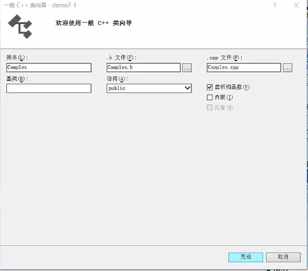
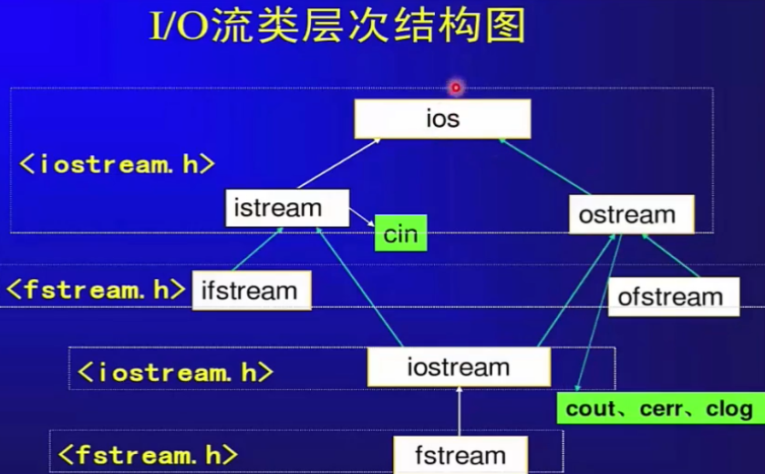
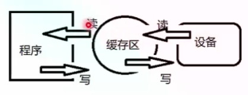
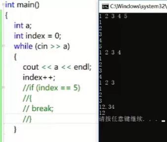
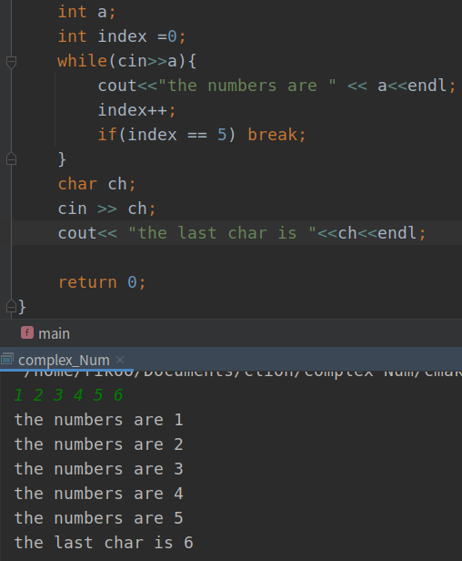
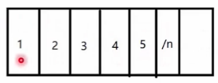
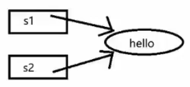
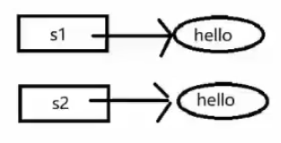

##### 抽象是一种认识事物本质的方法

* 面向对象 -- 类

  * `struct、class`定义一个类

    * `struct`默认成员权限是`public`
    * `class`默认成员权限是`private`
    * 此外没有区别

  * 举例

    * ```c++
      class Student{
          private:  // 成员变量
          	string name;
          	double score;
          public:
          	double GetScore(){
                  return score;
              }
      };
      ```

  * 误区
    * 对象是对现实世界中具体物体的反映，继承是对物体分类的反映
      * 正方形是一个特殊的长方形

* 抽象 -- 具体类型

  * 一个`int`型的变量，可以完成`+、-、*、/、比较、输出、++`等一系列操作

  * 有一个**自定义的复数类型**，操作模仿`int`类型，希望能像是使用`int`一样使用它，同时它也是**一个黑盒，一种抽象**

  * 

    * 选上虚析构函数`virtual ~FunctionName();`

      * ```c++
        // const修饰在它前面的东西
        double getReal() const; // getReal()函数 函数体内部成员变量值不能改变
        void setReal(double real);
        double getImage() const;
        void setImage(double image);
        ```

  * 运算符重载

    * ```c++
      Complex operator+(const Complex& x);  // in .h
      ```

      * `const`修饰左边，左边没有看右边`Complex&`类型，从外部传入另外一个对象，这里不想产生一个内存副本（直接用引用 -- 限制的指针，具体看前一章），`const`不允许修改引用中的值

    * ```c++
      Complex(double r,double i);  // 创建了自定义的默认函数后，默认构造函数就不会自己生成
      Complex();
      
      // .cpp
      Complex::Complex() {
          _real = 0.0;
          _image = 0.0;
      }
      
      Complex::Complex(double r, double i) {
          _real = r;
          _image = i;
          cout<<"Complex::Complex()"<<endl;
      }
      
      Complex Complex::operator+(const Complex &x) {
          Complex tmp;  // 在栈空间创建的中间变量，出了函数体就消亡
          tmp._real = _real + x._real;
          tmp._image = _image + x._image;
          return tmp;
      }
      ```

  * 问题：**返回临时变量，怎么接收，并且出了函数体，临时变量就会消亡**

    * 在主函数定义一个对象接收（类比`int a = b+c;`）
      * `Complex m = c+d;`这里`m`是怎么正确捕获到值的呢？（这里没有对`=`定义）
        * 存在一个默认的运算符重载

  * 重载自己的`=`运算符

    * ```c++
      Complex Complex::operator=(const Complex &x) {
          _real = x._real;
          _image = x._image;
          return *this;      // this指针指向当前对象本身，对其间接引用返回当前对象
      }
      
      // main.cpp
      // Complex c = a+b;    // 这里并不是赋值，而是定义
      Complex c;
      c = a+b;
      
      // 这里返回引用比较合适
      Complex& Complex::operator=(const Complex &x) {
          if(this != &x) {     // 二者不相等时，才进行赋值操作
              _real = x._real;
              _image = x._image;
          }
          return *this;      // this指针指向当前对象本身，对其间接引用返回当前对象
      }
      ```

  * 拷贝构造及临时对象优化

    * ```c++
      Complex Complex::operator+(const Complex &x) {
          Complex tmp;  // 在栈空间创建的中间变量，出了函数体就消亡
          tmp._real = _real + x._real;
          tmp._image = _image + x._image;
          return tmp;  // 产生拷贝构造 要将临时对象返回，就生成一个对象
      }    // 这里返回临时对象，很快被销毁，没有意义
      Complex c；
      c = a + b;  // 这里调用+，产生拷贝对象，返回给主函数
      ```

    * 容易引发问题

      * ```c++
        Complex(const Complex& x);  // 拷贝构造
        Complex::Complex(const Complex& x) {
            _real = x._real;
            _image = x._image;
            cout<<"Complex::Complex(const Complex& x)"<<endl;
        }
        ```

      * 此时构造函数和析构函数的数量能对应上

      * **临时对象优化**

        * ```c++
          Complex Complex::operator+(const Complex &x) {
          //    Complex tmp;  // 在栈空间创建的中间变量，出了函数体就消亡
          //    tmp._real = _real + x._real;
          //    tmp._image = _image + x._image;
          //    return tmp;
              return Complex(_real+x._real,_image+x._image);
          }  // 临时对象没有必要产生，不创建栈上的临时对象
          ```
      
    
  * 前置与后置操作符

    * ```c++
      // .h
      // 前置与后置++,--
      Complex& operator++();    // 前置++
      Complex operator++(int);  // 后置++  这里使用`int`来区分
      
      // .cpp
      Complex &Complex::operator++() {  // 前置++
          _real ++;
          _image ++;
          return *this;    // 返回对象的引用，很常见
      }
      
      Complex Complex::operator++(int) {  // 后置++
          // 先返回当前对象，然后对其进行自增
          Complex tmp(*this);
          _real ++;
          _image ++;
          return tmp;
      }
      // --> 优化去掉拷贝构造
      Complex Complex::operator++(int) {  // 后置++
          // 先返回当前对象，然后对其进行自增
          // 优化
          return Complex(_real++,_image++);
      }
      ```

    *  **前置操作效率 高于 后置操作**

      * **后置需要产生临时副本**

  * 标准输入输出`IO`重载

    * 标准输出

      * `cout<<(Complex)e<<endl;`

      * ```c++
        // .h
        #include <ostream>
        using namespace std;
        // friend机制 ： 在大括号外部也能访问类中私有成员
        // cout标识符重载
        // 这里使用标准输出运算符，让其在外部访问类中私有成员
        // 其本身是外部的，不属于类中成员，重载的是标准输出函数（std的）
        friend ostream& operator<<(ostream& os,const Complex &x);
        
        // .cpp
        // 这里没有Complex限制符（其本身也不是Complex成员）
        // 实际上是全局函数
        ostream &operator<<(ostream &os, const Complex &x) {
            os<<"real value is "<<x._real<<" image value is "<<x._image<<endl;
            return os;   // 最后还需要返回标准输出，另做他用
        }
        ```

    * 标准输入

      * 类似

        ```c++
        int i;
        cin >> i;
        cout<<i;
        
        // .h
        #include <istream>
        friend istream& operator>>(istream& is,Complex &x);  // 这里需要改变传入的complex，故无const
        // .cpp
        // 箭头所指的方向是数据流向方向
        istream &operator>>(istream &is, Complex &x) {
            is>>x._real >> x._image;
            return is;
        }
        
        // main.cpp
        Complex f;
        cin>>f;
        cout<<f;
        ```

      * 这里通过**空格或回车隔开输入信息**

> ##### IO流基础
>
> * 类似一种**水流**的状态（**一个地方 --> 另外一个地方**）
>
>   * `c`中`I/o`有`printf,scanf,getch,gets`等等函数，问题在于
>     * 不可编程，仅仅识别固有的数据类型
>     * 可移植性差，很多坑
>   * `c++`中`I/O`流`istream,ostream`
>     * 可编程，对于类库的设计者很有用
>     * 简化编程，能使得`I/O`风格一致
>   * 
>
> * `IO`缓存区：平衡速度差异，统一读写方式
>
>   * 
>
>   * 标准`IO`提供的三种类型的缓存模式
>
>     * 按块缓存：如文件系统
>     * 按行缓存：`\n`  √
>     * 不缓存
>
>   * ```c++
>     int main(){
>         int a;
>         int index = 0;
>         while(cin>>a){    // 内部也有重载，转换成bool值
>             cout<<a<<endl;
>             index++;
>             if(index==5)
>                 break;
>         }
>         return 0;
>     }
>     ```
>
>   * 
>
>     * 退出条件是遇到非法输入（`double`类型输入）‘
>
>   * 
>
>     * `ch`没有输入就退出了，缓冲区存在**脏数据**
>       * 这里直接到`index=5`就退出了输入，两行代码没有执行
>
> * 当前缓冲区
>
>   * 
>   * 数据按行录入缓冲区，结束输入后，依次进行判断
>     * **`ch`直接取到缓冲区中最后的值**
>
> * **问题解决（清空缓冲区）**
>
>   * ```c++
>     #include <limits>
>     // 清空缓存区脏数据，这里不知道缓冲区开了多大，这里设置常量
>     cin.ignore(numeric_limits<std::streamsize>::max(),'\n');  
>     ```
>
> ---
>
> ##### 文件操作
>
> * 输入输出流的终点都可以是磁盘文件
>
> * `C++`把每个文件都看做一个**有序的字节序列**，每个文件都**以文件结束符结束**
>
>   * 以块的缓存方式处理
>
> * 按照**数据组织形式**分类
>
>   * 文本文件：文件中信息形式为`ASCII`码文件，每个字符占一个字节
>   * **二进制文件：文件中信息形式与其在内存中的形式相同**
>
> * 文件操作
>
>   * 打开文件用于读写 `open`
>   * 检查打开是否成功`fail`
>   * 读或写`read,write`
>   * 检查是否读完`EOF(end of file)`
>   * 使用完文件关闭`close`
>
> * 文件打开方式
>
>   * `ios::in`：打开文件进行**读**操作（`ifstream`默认）
>   * `ios::out`：打开文件进行**写**操作（`ofstream`默认）
>   * `ios::ate`：打开一个已有输入或输出文件并查找到文件尾部
>   * `ios::app`：打开文件并**定位到尾部方便添加数据**
>   * `ios::nocreate`：若文件不存在，打开操作失败
>   * `ios::trunc`：若文件存在，清除文件原有内容（默认）
>   * `ios::binary`：以二进制方式打开
>
> * ```c++
>   #include <fstream>
>   int main() {
>       int a;
>       int index =0;
>       fstream fout;
>       // 这里如果写相对路径，默认在debug目录下生成
>       fout.open("/home/rikoo/Documents/clion/complex Num/testBuffer.txt",ios::app);
>       if(!fout)
>           cout<<"open file failed"<<endl;
>       while(cin>>a){
>           fout<<"the numbers are " << a<<endl;
>           index++;
>           if(index == 5) break;
>       }
>       // 清空缓存区脏数据，这里不知道缓冲区开了多大，这里设置常量
>       cin.ignore(numeric_limits<std::streamsize>::max(),'\n');
>       char ch;
>       cin >> ch;
>       fout<< "the last char is "<<ch<<endl;
>       fout.close();
>   
>       return 0;
>   }
>   ```
>
> * 二进制文件
>
>   * ```c++
>     #include <fstream>
>     #include <istream>
>     
>     static const int bufferLen = 2048;
>     bool CopyFile(const string& str,const string& dst){
>         // 打开源文件和目标文件
>         // 源文件以二进制读方式打开
>         // 目标文件以二进制写方式打开
>         ifstream in(str.c_str(),ios::in | ios::binary);
>         ofstream out(dst.c_str(),ios::out | ios::binary | ios::trunc);
>     
>         // 判断文件是否成功 失败返回false
>         if(!in||!out)
>             return false;
>     
>         // 从源文件读取数据，写到目标文件中
>         // 通过读取源文件的EOF判断是否读写结束
>         char tmp[bufferLen];
>         while(!in.eof()) {
>             in.read(tmp,bufferLen);
>     
>             streamsize count = in.gcount();
>     
>             out.write(tmp,count);
>         }
>     
>         // 关闭源文件和目标文件
>         in.close();
>         out.close();
>         
>         return true;
>     }
>     ```

* 头文件重复包含

  * 避免同一个文件被`include`多次，两种方式

    * ```c++
      #ifndef _SOMEFILE_H_
      #define _SOMEFILE_H_
      ...
      #endif
          
          
      #ifndef COMPLEX_NUM_COMPLEX_H
      #define COMPLEX_NUM_COMPLEX_H
      ...
      #endif //COMPLEX_NUM_COMPLEX_H
      ```

      * 使用宏防止同一个文件被多次包含
        * 优点：可移植性好
        * 缺点：**无法防止宏名重复，难以排错**

    * `#pragma once`

      * 使用编译器来防止同一个文件被多次包含
        * 优点：**可以防止宏名重复，易排错**
        * 缺点：**可移植不好，目前只有`windows`有**

* 深浅拷贝，写时复制

  * 浅拷贝：**只拷贝指针地址**，`c++`**默认拷贝构造函数与赋值运算符重载**都是浅拷贝

    * 节省空间，容易引发多次释放
    * 

  * 深拷贝：重新分配内存，拷贝指针指向内容

    * 浪费空间，但不会多次释放
    * 

  * 兼有两者的优点？

    * 引用计数

    * `C++`新标准的**移动语义**

      * 不用时候，引渡权限

      * ```c++
        // .h
        String(String&& other);                 // 移动构造函数
        String& operator=(String&& rhs)noexcept;// 移动赋值运算符
        // .cpp
        String(String&& other) {  // 两个&表示右值引用
            if(other.m_data != NULL) {
                // 资源让渡
                m_data = other.m_data;
                other.m_data = NULL;
            }
        }
        String& operator=(String&& rhs)noexcept {
            if(this != &rhs) {
                delete[] m_data;
                m_data = rhs.m_data;
                rhs.m_data = NULL;
            }
            return *this;
        }
        ```

* 抽象 -- 抽象类型

  * 面对变化，尽可能少修改原来的逻辑，扩充逻辑

    * ```c++
      #include <iostream>
      
      using namespace std;
      
      class Shape{
      public:
          virtual double Area() const{ return 0;} //  子类方法实现不一致 + virtual
          void Display() {
              cout<<Area()<<endl;
          }
      };
      
      class Square:public Shape{
      public:
          Square(double len):_len(len){}  // 初始化参数
          double Area() const {
              return _len * _len;
          }
      
      private:
          double _len;
      };
      
      class Circle:public Shape{
      public:
          Circle(double radius):_radius(radius){}
          double Area() const{
              return 3.14159 * _radius * _radius;
          }
      
      private:
          double _radius;
      };
      
      int main() {
          // 面对变化，尽量少修改原来的逻辑，扩充逻辑
          const int shapeNum = 2;
          Square s1(2.0);
          Circle c1(2.0);
          Shape* shapes[shapeNum];
          shapes[0] = &s1;
          shapes[1] = &c1;
      
          for (int i = 0; i < shapeNum; ++i) {
              shapes[i]->Display();
          }
      
          return 0;
      }
      ```

  * `virtual`

    * 子类对象中存在本类成员变量信息和`virtual`的虚表（虚函数的头地址）
      * 没有存普通函数地址，通过存在寄存器中的`this`指针寻找对象模型，最终调用虚函数

* 面向对象

  * 封装：数据和代码捆绑，避免外界干扰和不确定性访问，封装使得代码模块化
  * 继承：让某种类型对象获得另一个类型对象的属性和方法，继承可以扩展已存在的代码
  * 多态：同一事物表现出不同事物的能力，即向不同对象会产生不同行为，目的是为了接口重用

* 含义

  * 软件工程发展到一定阶段为了管理代码和数据提出的一种方法
  * 不是对现实世界的映射，但
    * 封装可以把问题简化，便于抽象
    * 继承可以减少代码重复，避免重复造轮子
    * 多态可以实现灵活功能扩充，提升开发效率
  * 为我们便携的开发适应变化的软件提供了可能，但还不够
