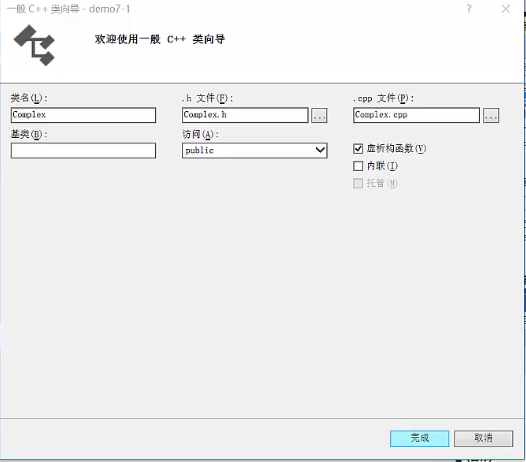

##### 抽象是一种认识事物本质的方法

* 面向对象 -- 类

  * `struct、class`定义一个类

    * `struct`默认成员权限是`public`
    * `class`默认成员权限是`private`
    * 此外没有区别

  * 举例

    * ```c++
      class Student{
          private:  // 成员变量
          	string name;
          	double score;
          public:
          	double GetScore(){
                  return score;
              }
      };
      ```

  * 误区
    * 对象是对现实世界中具体物体的反映，继承是对物体分类的反映
      * 正方形是一个特殊的长方形

* 抽象 -- 具体类型

  * 一个`int`型的变量，可以完成`+、-、*、/、比较、输出、++`等一系列操作

  * 有一个**自定义的复数类型**，操作模仿`int`类型，希望能像是使用`int`一样使用它，同时它也是**一个黑盒，一种抽象**

  * 

    * 选上虚析构函数`virtual ~FunctionName();`

      * ```c++
        // const修饰在它前面的东西
        double getReal() const; // getReal()函数 函数体内部成员变量值不能改变
        void setReal(double real);
        double getImage() const;
        void setImage(double image);
        ```

  * 运算符重载

    * ```c++
      Complex operator+(const Complex& x);  // in .h
      ```

      * `const`修饰左边，左边没有看右边`Complex&`类型，从外部传入另外一个对象，这里不想产生一个内存副本（直接用引用 -- 限制的指针，具体看前一章），`const`不允许修改引用中的值

    * ```c++
      Complex(double r,double i);  // 创建了自定义的默认函数后，默认构造函数就不会自己生成
      Complex();
      
      // .cpp
      Complex::Complex() {
          _real = 0.0;
          _image = 0.0;
      }
      
      Complex::Complex(double r, double i) {
          _real = r;
          _image = i;
          cout<<"Complex::Complex()"<<endl;
      }
      
      Complex Complex::operator+(const Complex &x) {
          Complex tmp;  // 在栈空间创建的中间变量，出了函数体就消亡
          tmp._real = _real + x._real;
          tmp._image = _image + x._image;
          return tmp;
      }
      ```

  * 问题：**返回临时变量，怎么接收，并且出了函数体，临时变量就会消亡**

    * 在主函数定义一个对象接收（类比`int a = b+c;`）
      * `Complex m = c+d;`这里`m`是怎么正确捕获到值的呢？（这里没有对`=`定义）
        * 存在一个默认的运算符重载

  * 重载自己的`=`运算符

    * ```c++
      Complex Complex::operator=(const Complex &x) {
          _real = x._real;
          _image = x._image;
          return *this;      // this指针指向当前对象本身，对其间接引用返回当前对象
      }
      
      // main.cpp
      // Complex c = a+b;    // 这里并不是赋值，而是定义
      Complex c;
      c = a+b;
      
      // 这里返回引用比较合适
      Complex& Complex::operator=(const Complex &x) {
          if(this != &x) {     // 二者不相等时，才进行赋值操作
              _real = x._real;
              _image = x._image;
          }
          return *this;      // this指针指向当前对象本身，对其间接引用返回当前对象
      }
      ```

  * 拷贝构造及临时对象优化

    * ```c++
      Complex Complex::operator+(const Complex &x) {
          Complex tmp;  // 在栈空间创建的中间变量，出了函数体就消亡
          tmp._real = _real + x._real;
          tmp._image = _image + x._image;
          return tmp;  // 产生拷贝构造 要将临时对象返回，就生成一个对象
      }    // 这里返回临时对象，很快被销毁，没有意义
      Complex c；
      c = a + b;  // 这里调用+，产生拷贝对象，返回给主函数
      ```

    * 容易引发问题

      * ```c++
        Complex(const Complex& x);  // 拷贝构造
        Complex::Complex(const Complex& x) {
            _real = x._real;
            _image = x._image;
            cout<<"Complex::Complex(const Complex& x)"<<endl;
        }
        ```

      * 此时构造函数和析构函数的数量能对应上

      * **临时对象优化**

        * ```c++
          Complex Complex::operator+(const Complex &x) {
          //    Complex tmp;  // 在栈空间创建的中间变量，出了函数体就消亡
          //    tmp._real = _real + x._real;
          //    tmp._image = _image + x._image;
          //    return tmp;
              return Complex(_real+x._real,_image+x._image);
          }  // 临时对象没有必要产生，不创建栈上的临时对象
          ```

* to be continued
