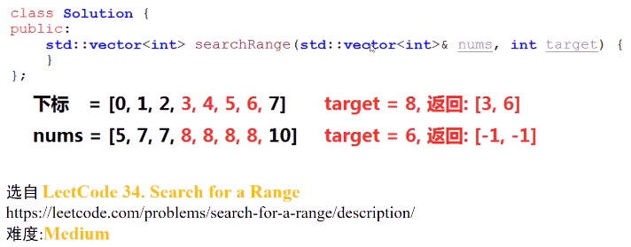
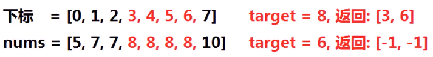
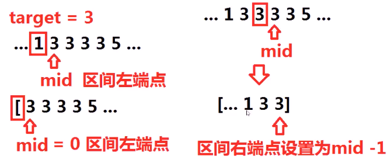
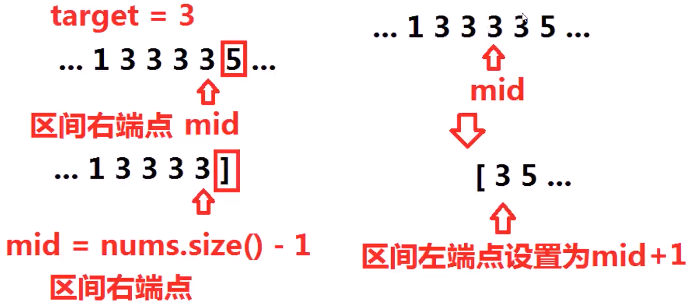
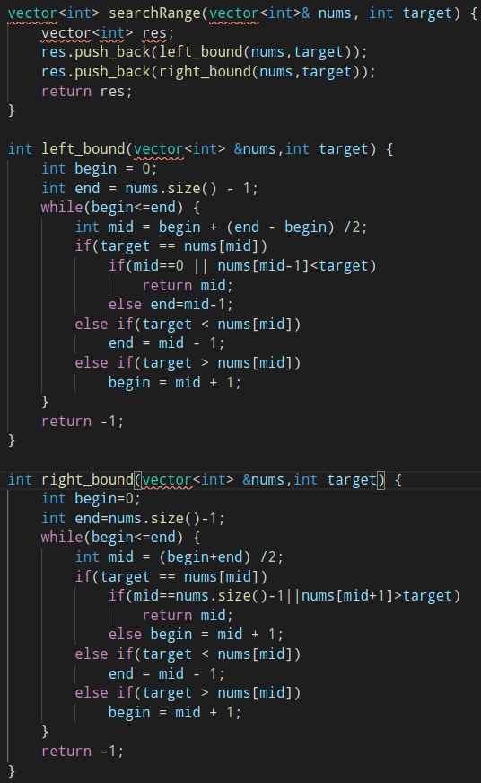
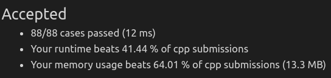

#### 给定一个排序数组nums（有重复元素）与目标值target，如果target在nums中出现，则返回target所在区间的左右端点下标。[左端点，右端点]，若target在nums未出现，则返回[-1,-1]。

* 

* 思考

  * 能否**直接**通过二分查找，容易**同时求出**目标target所在区间的**左右端点**？

  * 若**无法同时求出**区间左右端点，将对目标target的二分查找增加**怎样的限制条件**，就可**分别求出**目标target所在区间的**左端点**和**右端点**

    * 

  * > 找**左端点**，**限制条件**：
    >
    > 当target==nums[mid]，若此时mid==0或nums[mid-1] < target，说明mid为区间左端点，返回；否则设置区间右端点为mid-1
    >
    > 
    >
    > 找**右端点**，增加**限制条件**：
    >
    > 当target==nums[mid]时，若此时mid==nums.size()-1或nums[mid+1]>target，则说明mid即为区间右端点；否则设置区间右端点为mid+1
    >
    > 

* 代码实现
  * 
  * 

#### 方法2：巧妙使用函数

```c++
// 寻找target的下标值抽象出一个函数，然后使用这个函数解答新问题
    vector<int> searchRange(vector<int>& nums, int target) {
        int index1 = target_index(nums,target);
        int index2 = target_index(nums,target+1) -1; // 巧妙的使用了函数返回该在位置的特性
        if(index1 < nums.size() && nums[index1] == target) return {index1,index2};
        else return {-1,-1};        
    }

    // 函数返回target下标，若无则返回target第一个该在的地方
    int target_index(vector<int>& nums,int target){
        int i = 0,j = nums.size() - 1;
        while(i <= j){
            int mid = i + (j - i) /2;
            if(nums[mid] < target) i = mid+1;
            // 这里将mid不断向前推
            else j = mid -1;
        }
        return i;
    }
```

