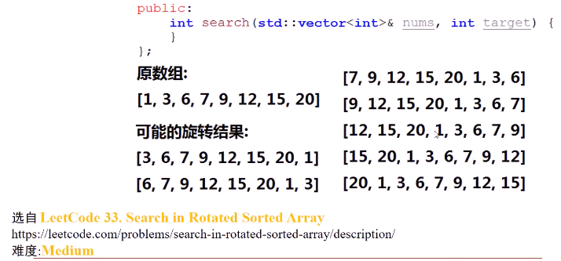
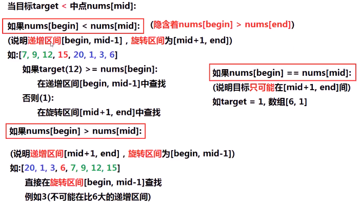
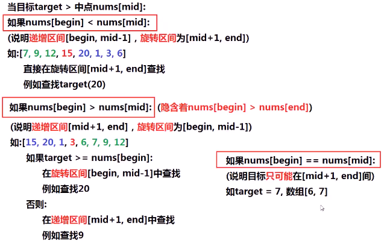
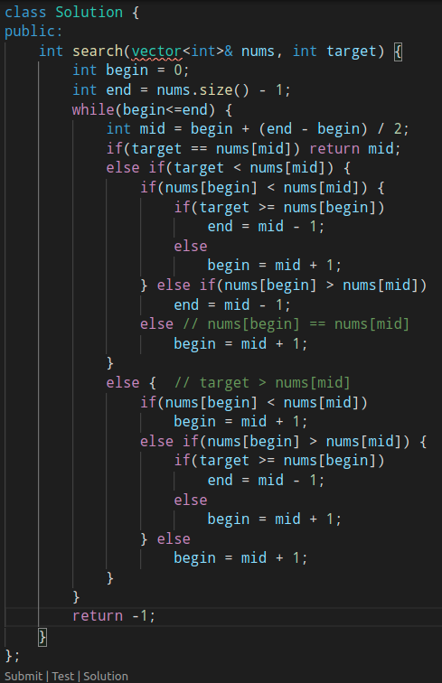
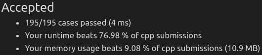

##### 给定一个排序数组nums（无重复元素），nums可能以某个位置下标旋转，求target是否在nums中出现，出现返回下标，未出现返回-1

* 

* 思考

> 旋转数组：[**7**,9,12,15,20,1,3,**6**],nums[**begin**] > nums[**end**]
>
> 还是使用二分查找的框架，但需要
>
> 将**旋转区间**考虑进去
>
> 当nums[begin] < nums[mid]时，递增区间为[begin,mid-1]，旋转区间[mid+1,end]
>
> 当nums[begin] > nums[mid]时，递增区间为[mid+1,end]，旋转区间为[begin,mid-1]
>
> 当nums[begin] == nums[mid]时，begin和mid重叠了（不存在重复元素）target是后元素

* 算法思路
  * 
  * 

* 代码实现
  * 
  * 

