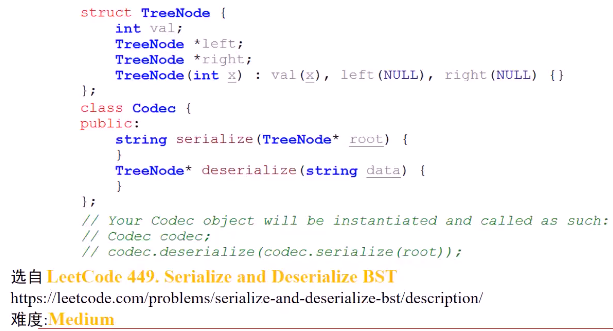

#### 二叉查找树的编码和解码功能。编码：将二叉树转换成字符串，解码：将字符串转回二叉查找树。希望其能够相互转换

* 
* 预备知识

> 二叉查找树**前序遍历**和**还原**
>
> 
>
> ###### 中序和后序可以吗？
>
> * 中序==顺序，插入成了一个链表
> * 后序：根节点最后插入，肯定错误

* 算法思路（**编码**成字符串）
  * 将二叉查找树进行**前序遍历**，遍历同时将**整型数据转换成字符串**，并且将这些字符串数据**进行连接**，连接时使用**特殊符号**分隔
    * 
* 算法思路（**解码**成二叉查找树）
  * 将字符串按照编码时**分隔符“#”**，将各个数字**逐个拆分**出来，将**第一个数字**构建成二叉查找树的**根节点**，后面各个数字构建出的节点按**解析时顺序**插入根节点中，返回根节点，就完成**解码**工作
    * 

> ###### 整型转字符串
>
> 对整数10**取余**，**逐个循环**的将一个整数**从最低位到最高位**拆分出来，在这个过程中每取出一个最低位，就将该数字**除以10**。每拆分出一个字符，就将这个字符**添加**到string中，直到该数字为0时结束。最后将string进行**反转**，就完成了整数转字符串
>
> 
>
> ```c++
> void change_int_to_string(int val,string &str_val) {
>     string tmp;
>     while(val) {
>         tmp += val / 10 - '0';
>         val /= 10;
>     }
>     for(int i=tmp.size()-1;i>=0;--i) 
>         str_val += tmp[i];
>     str_val += '#';
> }
> ```

* 代码实现
  * 
  * 