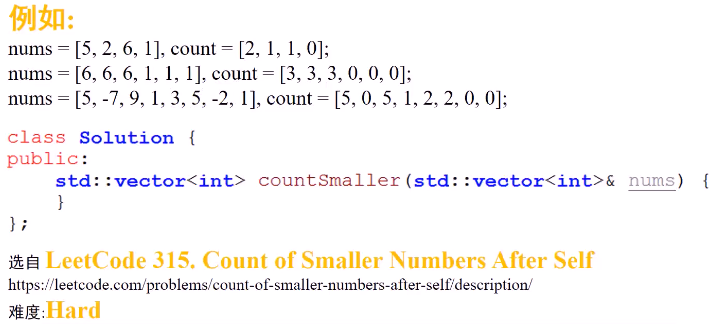
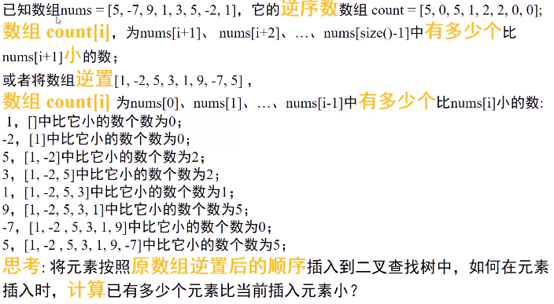
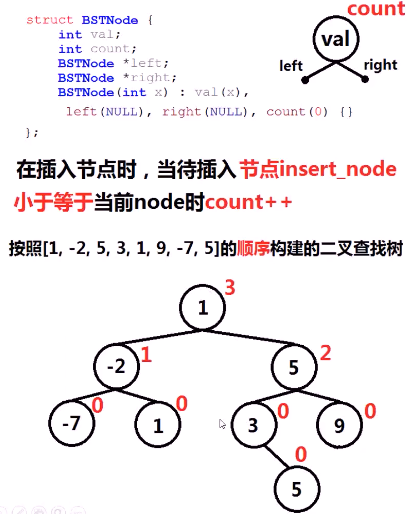
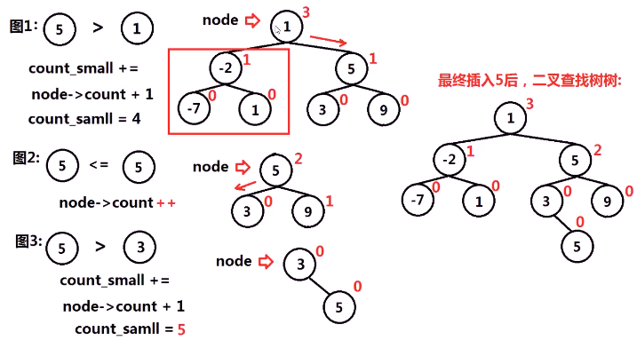
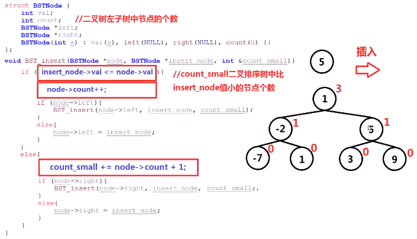
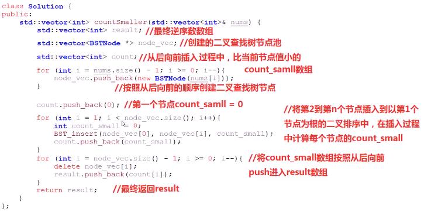

#### 给定数组nums，求新数组count，count[i]代表nums[i]右侧比nums[i]小的元素个数

* 

* 思考
  * 

> 

* 将元素按照原数组逆序顺序插入到二叉排序树中，在插入时，**计算**已有多少个元素比当前插入元素小？
* 算法
  * 设置变量count_small=0，记录在插入过程中，有多少个元素比插入节点值小
  * 若待插入节点值**小于等于**当前节点node值，node->count++，递归将该节点插入到当前节点左子树
  * 若待插入节点值**大于**当前节点node值，count_small += node->count+1（当前节点左子树数量+1）；**递归**将该节点插入到当前节点**右子树**
    * 

* 代码实现
  * 
  * 

