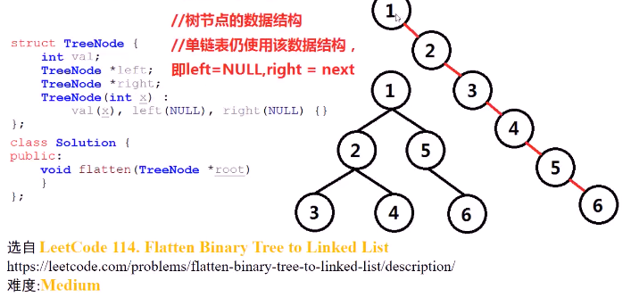
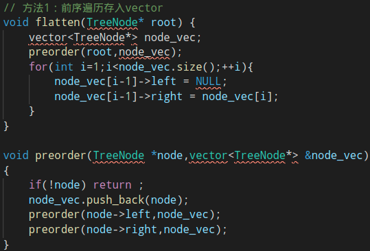
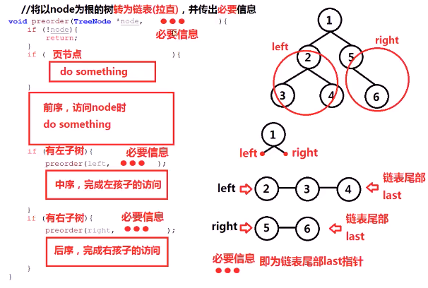
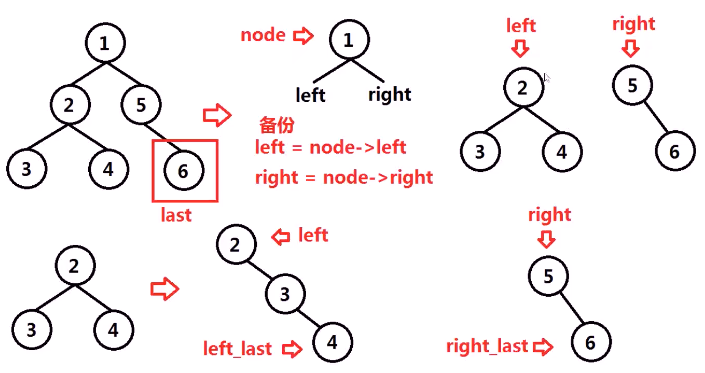
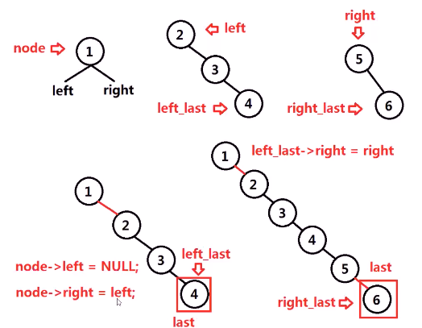
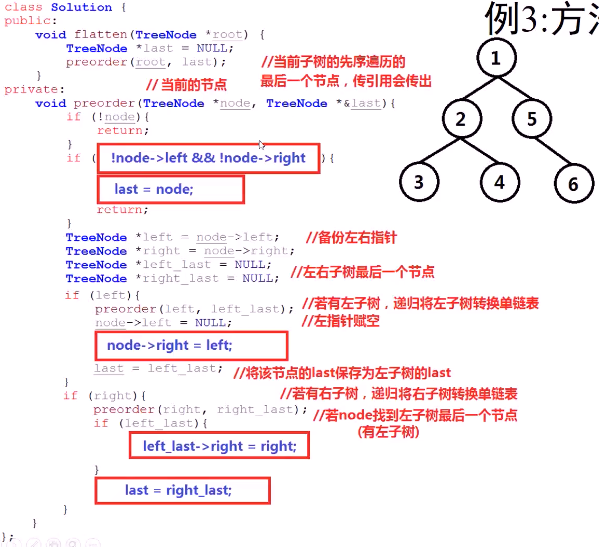

#### 就地转换二叉树为单链表。单链表节点顺序为前序遍历顺序

* 
* 思考
  * **前序遍历**二叉树，将节点指针push进vector，顺序**遍历**vector中节点，链接相邻两节点，形成单链表（**投机**）但不满足**就地转换**条件
    * 
    * 
  * **就地（in-place）转换**应该怎么做
    * 需要在前中后都进行一些操作
    * 考虑递归过程中应该做的事情
      * 只需要弄清完成的做法
      * 
        * 
        * 
* 代码实现
  * 
    * 假设有左子树，将其视为一个单链表