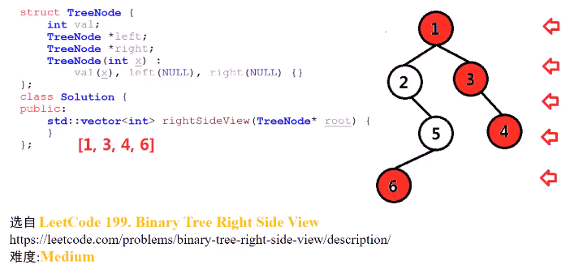
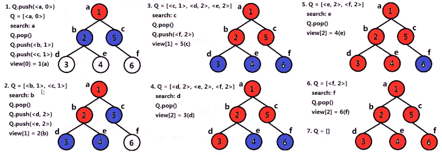

#### 从二叉树右侧观察它，将观察到的节点按照从上到下的顺序输出

* 
* 思考
  * **层次遍历二叉树**，找出**每层中最后一个节点**
  * 
  * 如何记录每层中**最后一个节点**
    * **层次遍历**时，将**节点和层数**绑定为pair，压入队列时，将节点和层数同时压入队列，记录每一层中**最后一个节点**
    * 在**层次遍历**中，每层中**最后一个节点最后遍历到**，**随时更新**对每层的最后一个节点即可
    * 
* 代码实现
  * 
  * 

