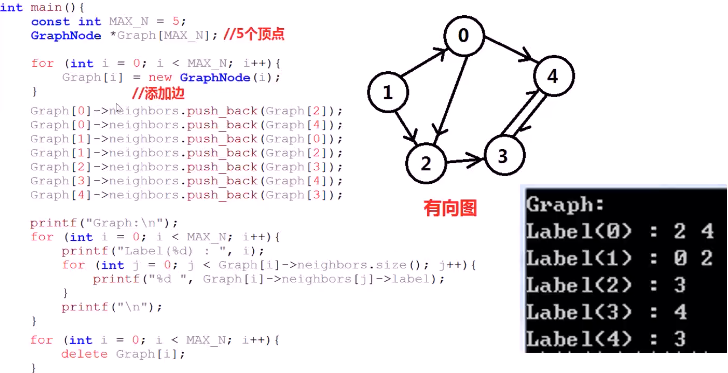
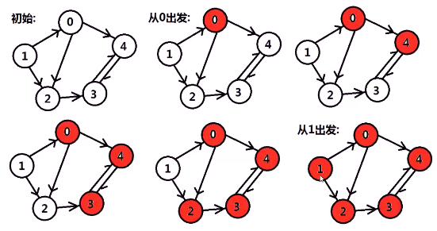
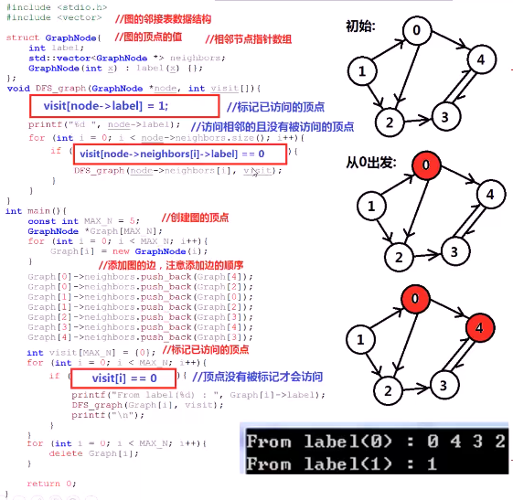
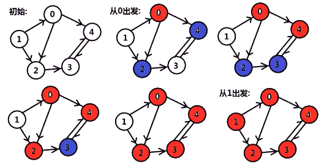
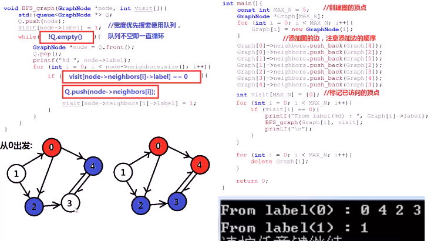

#### 图的构造与表示（临接表）

```c++
struct GraphNode{
    int label;
    vector<GraphNode *> neighbors;
    GraphNode(int x):label(x){};
};
```

* 

##### 图的深度优先遍历

> 从图中**某个顶点v**出发，首先访问该顶点，然后**依次**从它的各个未被访问的**邻接点**出发**深度优先搜索**遍历图，直到图中所有和v**有路径相通且未被访问**的顶点都被访问到。若此时还有其他顶点**未被访问**到，则另选一个未被访问的顶点作为**起始点**，**重复**以上过程，直到图中**所有顶点**都被访问到为止。

* 
* 代码实现
  * 

#### 图的宽度优先遍历

> 从图中**某个顶点v**出发，在访问了v之后依次访问v的各个**未被访问过**的邻接点，然后**分别**从这些邻接点出发**依次访问**它们的邻接点，并使得**先被访问**的顶点的邻接点**先于后被访问**的顶点的邻接点被访问，直到图中所有**已被访问的顶点的邻接点**都被访问到。如果此时图中还有顶点**未被访问**，则需要**另选**一个未曾被访问过的顶点作为新的起始点，**重复**上述过程，直到图中**所有顶点**都被访问到为止

* 
* 代码实现
  * 
