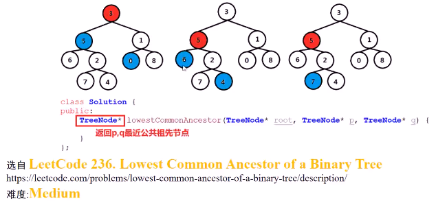
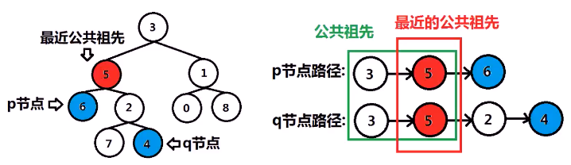
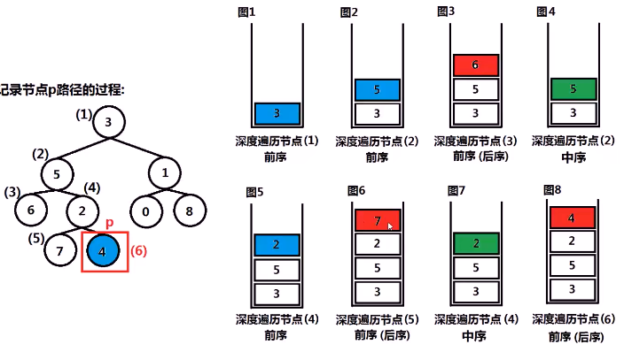

#### 求二叉树中两个节点的最近公共祖先

> 最近公共祖先：两节点v和w的最近公共祖先u，满足**树上最低（离根最远）**，且v，w两个节点都是u的**子孙**

* 

* 思考

  * 满足条件
    * 公共祖先
      * 一定在从根节点到这两个节点的路径上
      * 求**最近**公共祖先，即**同时出现**在这两条路径上的**离根节点最远**的节点（或离两个最近）
    * 树上最低
  * 最终算法
    * 求p节点路径，q节点路径，两路径上最后一个相同的节点
      * 求出**较短**路径的**长度n**
      * 同时遍历p节点的路径与q节点的路径，遍历n个节点，**最后一个**发现的相同节点，即**最近公共祖先**
    * 
  * 求从根节点到某节点的路径（深度搜索）
    * 从根节点**遍历搜索**到该节点，**找到**该节点后就**结束搜索**
    * 将遍历过程中遇到的节点**按照顺序**存储，这些节点即路径节点
    * 

  

* 代码实现
  * 
  * 

[207.课程安排](./note/二叉树与图/课程安排.md)
