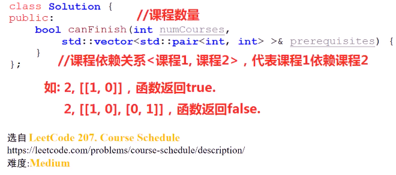
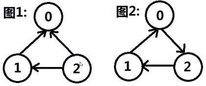
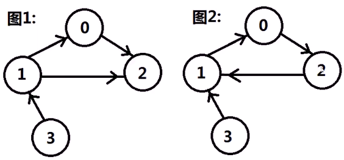
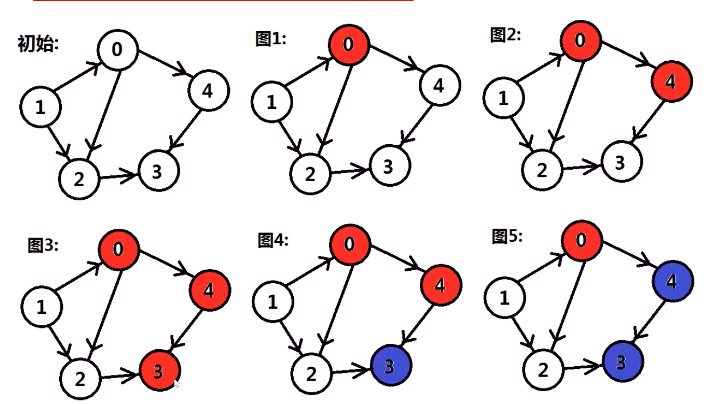
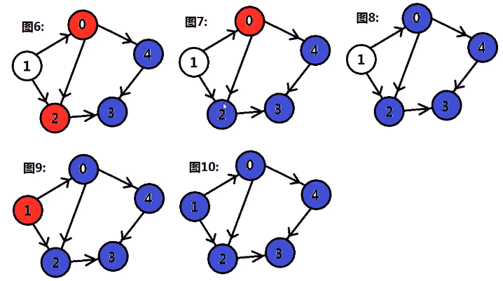
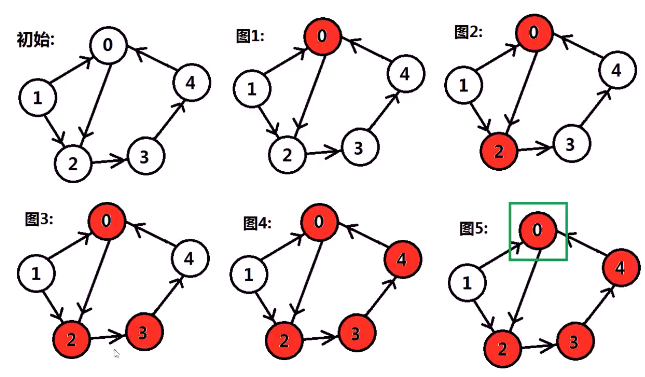
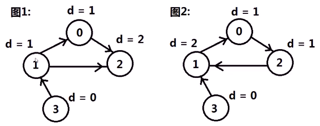
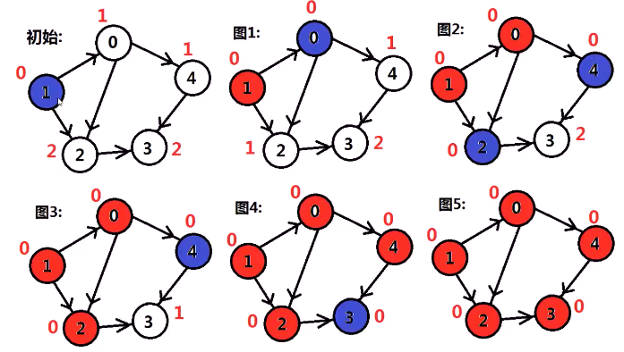
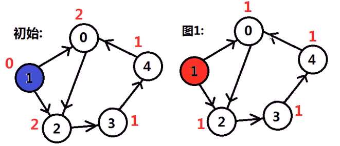

#### n个课程，标记从0到n-1，课程之间有依赖关系，例如希望完成A课程，可能需要先完成B课程。已知n个课程的依赖关系，求是否可以将n个课程全部完成

* 

* 思考

  * > n个课程，m个依赖关系，可以看做顶点个数为n，边个数为m的**有向图**
    >
    > 图1：n=3，m=[[0,1] , [0,2] , [1,2]] ; **可以**完成
    >
    > 图2：n=3，m=[[0,1] , [1,2] , [2,0]]；**不能**完成
    >
    > 所以，若**有向图存无环**，则可以完成全部课程，否则不能。问题转换为，构建图，并**判断图是否有环**
    >
    > 这里的箭头正反画法都一样效果
    >
    > 

#### 方法1：DFS

* DFS时，如果正在搜索某一顶点（还没有退出该顶点的递归深度搜索），又**回到**该顶点，即证明图有环
  * 
  * 
  * 
  * 有环
    * 
* 代码实现

```cpp
bool canFinish(int numCourses, vector<vector<int>> &prerequisites)
{
  vector<GraphNode *> graph;
  vector<int> visit; // -1没访问过，0正在访问，1已完成访问
  for (int i = 0; i < numCourses; ++i)
  {
    graph.push_back(new GraphNode(i));
    visit.push_back(-1);
  }
  for (int i = 0; i < prerequisites.size(); ++i)
  {
    GraphNode *begin = graph[prerequisites[i][1]];
    GraphNode *end = graph[prerequisites[i][0]];
    begin->neighbors.push_back(end);
  }
  for (int i = 0; i < graph.size(); ++i)
  {
    if (visit[i] == -1 && !dfs(graph[i], visit))
      return false;
  }
  for (int i = 0; i < numCourses; ++i)
    delete graph[i];
  return true;
}

struct GraphNode
{
  int label;
  vector<GraphNode *> neighbors;
  GraphNode(int x) : label(x){};
};

bool dfs(GraphNode *node, vector<int> &visit)
{
  visit[node->label] = 0;
  for (int i = 0; i < node->neighbors.size(); ++i)
  {
    if (visit[node->neighbors[i]->label] == -1)
      if (dfs(node->neighbors[i], visit) == 0)
        return false;
    if (visit[node->neighbors[i]->label] == 0)
      return false;
  }
  visit[node->label] = 1;
  return true;
}
```


#### 方法2：拓扑排序（宽度优先搜索）

> 将**入度为0**的点添加到队列。当完成一个顶点的搜索时（从队列中取出），它指向的所有顶点**入度都减1**，若此时某顶点入度为0则**添加**到队列，若完成宽度搜索后，所有点入度都为0，则**图无环**，否则**有环**
>
> 
>
> * 模拟**学习过程**

* 思路（无环）
  * 
    * 蓝色表示正在队列中（准备宽搜）
    * 红色表示完成宽搜
* 思路（有环）
  * 
* 代码实现

```cpp
struct GraphNode
{
  int label;
  vector<GraphNode *> neighbors;
  GraphNode(int x) : label(x){};
};

bool canFinish(int numCourses, vector<vector<int>> &prerequisites)
{
  vector<GraphNode *> graph;
  vector<int> degree; // 入度
  for (int i = 0; i < numCourses; ++i)
  {
    degree.push_back(0);
    graph.push_back(new GraphNode(i));
  }
  for (int i = 0; i < prerequisites.size(); ++i)
  {
    GraphNode *begin = graph[prerequisites[i][1]];
    GraphNode *end = graph[prerequisites[i][0]];
    begin->neighbors.push_back(end);
    degree[prerequisites[i][0]]++;
  }
  queue<GraphNode *> q;
  for (int i = 0; i < numCourses; ++i)
    if (degree[i] == 0)
      q.push(graph[i]);
  while (!q.empty())
  {
    GraphNode *node = q.front();
    q.pop();
    for (int i = 0; i < node->neighbors.size(); ++i)
    {
      degree[node->neighbors[i]->label]--;
      if (degree[node->neighbors[i]->label] == 0)
        q.push(node->neighbors[i]);
    }
  }
  for (int i = 0; i < graph.size(); ++i)
  {
    delete graph[i];
  }
  for (int i = 0; i < degree.size(); ++i)
  {
    if (degree[i])
      return false;
  }
  return true;
}
```

